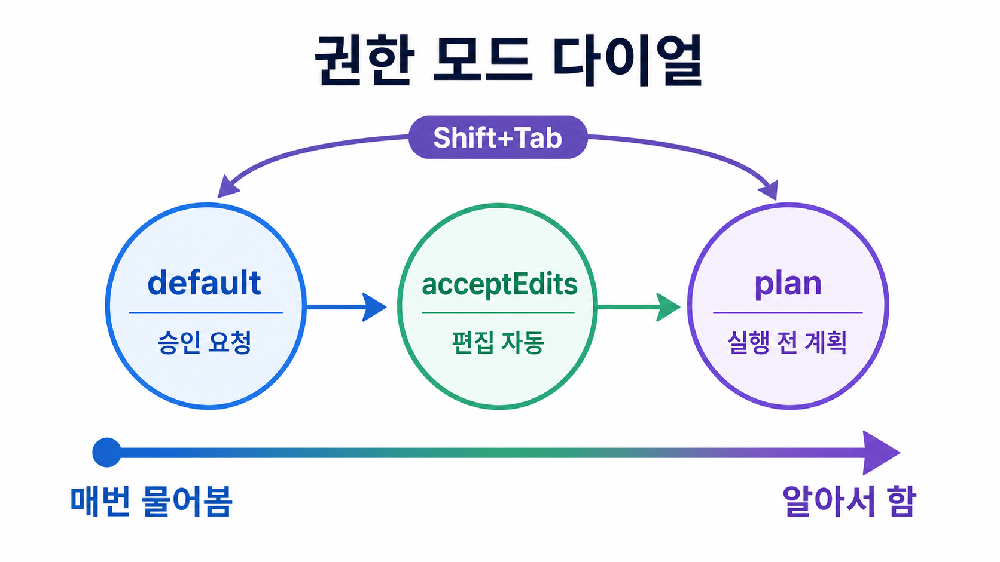

# 권한 모드와 슬래시 명령

**권한 모드**는 에이전트가 도구를 쓸 때마다 사용자에게 승인을 구할지, 스스로 판단해 실행할지를 정하는 설정입니다.

[Harness Engineering](../concepts/harness-engineering.md) 에서 말하는 하네스 조작 중
가장 먼저 만지게 되는 것입니다.

## 권한 모드 6종

권한 모드는 "얼마나 물어보고 얼마나 알아서 할지" 를 단계별로 정해 두는 설정입니다.

사용자는 `Shift+Tab` 으로 순환하거나 `--permission-mode` / `/permissions` 로 지정합니다.

| 모드 | 동작 |
|---|---|
| `default` (Manual) | 읽기만 자동 승인, 나머지는 위험한 동작마다 매번 승인 요청 |
| `acceptEdits` | 파일 편집 + 기본 파일시스템 명령(`mkdir` · `touch` · `mv` · `cp` · `sed`)을 작업 디렉터리 내에서 자동 승인 |
| `plan` | **읽기 전용** - 계획만 세우고 실행하지 않음. 승인 후 편집 시작 |
| `auto` | classifier 모델이 백그라운드에서 액션을 검토, 위험한 작업(`curl \| bash` · 프로덕션 배포 · force push 등)만 차단하고 나머지는 프롬프트 없이 실행 |
| `dontAsk` | `permissions.allow` 에 명시된 도구만 실행, 나머지는 자동 거부 - CI/CD · 잠긴 환경용 |
| `bypassPermissions` | 모든 승인 건너뜀(`--dangerously-skip-permissions`). **샌드박스 전용** |

- `Shift+Tab` 순환은 default → acceptEdits → plan 3개가 기본이고, `auto` / `bypass` 는
  조건이 맞으면 순환 목록에 추가됩니다.
- `auto` 모드는 특정 모델 세대 이상에서만 지원됩니다.

여기서 `classifier 모델` 은 사람 대신 "이 작업이 위험한가" 를 1차로 판단하는 별도의 자동 분류 모델입니다.
`auto` 모드는 이 모델이 위험한 것만 막고 나머지는 통과시킵니다.

### 언제 어떤 모드를 쓰나

| 상황 | 권장 모드 |
|---|---|
| 처음 써보거나 민감한 저장소 | `default` |
| 방향이 이미 정해진 반복 편집 | `acceptEdits` |
| 새 코드베이스 탐색 · 멀티파일 리팩토링 직전 | `plan` |
| CI/CD · 무인 실행 | `dontAsk` |
| 격리 컨테이너 / VM 안에서의 대량 작업 | `bypassPermissions` |

## 슬래시 명령 지도

세션 안에서 쓰는 명령은 12개 카테고리 · 약 90개에 이릅니다.

아래는 실무에서 반복해 쓰는 것만 목적별로 묶은 것입니다.

| 목적 | 명령 |
|---|---|
| 대화 관리 | `/clear`(초기화) · `/compact [지시문]`(수동 압축) · `/rewind`(체크포인트 되감기) · `/export` |
| 맥락 점검 | `/context`(무엇이 로드됐나) · `/memory` · `/add-dir` |
| 실행 통제 | `/model` · `/permissions` · `/plan [설명]` · `/effort` |
| 확장 관리 | `/agents` · `/hooks` · `/mcp` · `/plugin` · `/init` |
| 상태 · 비용 | `/status` · `/usage` · `/doctor` |
| 코드 워크플로 | `/review`(`--fix` 로 즉시 적용) · `/security-review` · `/diff` · `/batch <지시문>` |

!!! tip "커스텀 명령도 같은 자리에 붙는다"
    `.claude/commands/*.md` 에 마크다운 파일을 두면 그대로 `/파일명` 슬래시 명령이 됩니다.
    플러그인이 제공하는 명령과 MCP 프롬프트도 같은 목록에 합쳐집니다.
    최종 근거는 항상 세션 내 `/help` 입니다.

## (심화) 조직 정책이 실제 사용 가능 범위를 정한다

!!! note "지금은 건너뛰어도 됩니다"
    회사에서 쓰는 계정이라 일부 모드가 안 보이거나 막혀 있을 때 이 부분을 봅니다.

앞의 6개 모드가 항상 다 열려 있는 것은 아닙니다.

조직 관리자가 정해 둔 규칙(managed settings)이 개인이 켤 수 있는 모드의 범위를 먼저 정합니다.

개인은 그 안에서만 고를 수 있습니다.

- `default` · `acceptEdits` · `plan` · `dontAsk` 4개는 요금제와 무관하게 항상 사용 가능합니다.
- 나머지 두 모드(`auto` · `bypassPermissions`)는 조직 관리자의 설정에 좌우됩니다.(특히 `bypassPermissions` 경우 사내에서는 막혀있습니다.)

!!! warning "Enterprise 환경에서 주의할 점"
    `default` · `acceptEdits` · `plan` · `dontAsk` 4개는 플랜과 무관하게 항상 사용
    가능합니다. 반면 아래 두 모드는 **조직 관리자의 managed settings 에 좌우**됩니다.

    - `auto` - Team / Enterprise 에서 기본 활성이지만 `permissions.disableAutoMode` 로 차단 가능
    - `bypassPermissions` - 개인이 임의로 켤 수 없고 `permissions.disableBypassPermissionsMode`
      로 완전 차단 가능. 막혀 있으면 `--dangerously-skip-permissions` 를 줘도 실행되지 않습니다

    현재 조직에서 무엇이 열려 있는지는 `/doctor` 로 먼저 확인하세요.

## (심화) 권한을 좁히는 다른 수단

!!! note "지금은 건너뛰어도 됩니다"
    모드만으로 부족해서 "이 명령만 허용" 처럼 더 촘촘하게 조일 때 봅니다.

권한 모드는 승인 방식을 전체 단위로 정하고, 아래 네 가지는 도구·경로 단위로 더 세밀하게 허용 범위를 제한하는 수단입니다.

평소에는 몰라도 되지만, 특정 작업만 허용하거나 특정 폴더 밖으로 못 나가게 막고 싶을 때 씁니다.

- **권한 규칙** - 도구별 · 파라미터별 allow / deny. `Bash(git *)` 같은 와일드카드 사용 가능.
  예를 들어 "`git` 으로 시작하는 명령은 다 허용, 나머지는 물어봐" 처럼 규칙을 정할 수 있습니다.
- **도구 목록 제한** - `--allowedTools` / `--disallowedTools` / `--tools`.
  사용자는 에이전트가 아예 손댈 수 있는 도구의 목록 자체를 켜고 끕니다.
- **작업 폴더 경계** - 기본은 실행 디렉터리(명령을 실행한 그 폴더)이고, `--add-dir` 로 다른 폴더까지 넓힙니다.
  이 경계 밖의 파일은 건드리지 못합니다.
- **샌드박스** - 파일시스템 · 네트워크가 격리된 bash. 바깥과 차단된 실습실 안에서만 명령이 돌게 하는 방식입니다.
