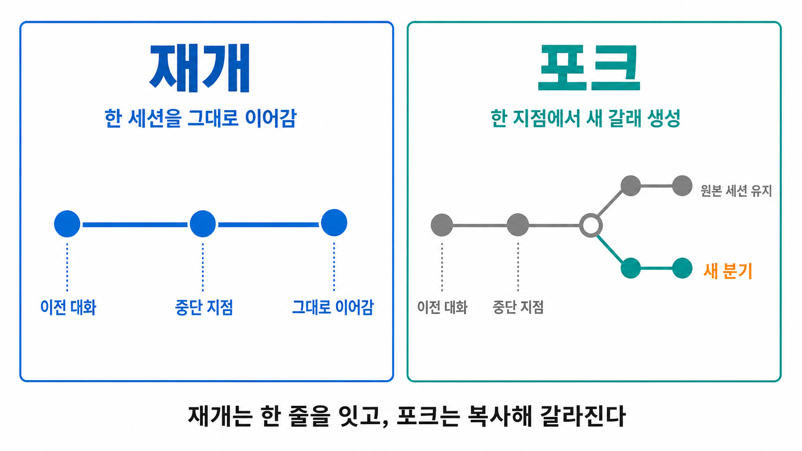

# 세션 이름짓기·재개

세션은 한 번 쓰고 버리는 게 아닙니다.

이름을 붙여 두면 나중에 이름으로 찾아 이어서 쓸 수 있고, 현재까지의 대화를 복사해 다른 갈래로 갈라 쓸 수도 있습니다.

이 문서는 세션에 이름을 붙이는 방법, 이전 세션을 재개하는 방법, 재개와 포크가 어떻게 다른지를 다룹니다.

세션을 처음 여닫고 재개·포크를 실습으로 익히는 입문 안내는 [Claude Code 첫 실행](../warmup/claude-code-start.md)에 있습니다.

이 문서는 그보다 깊은 레퍼런스입니다.

## 세션에 이름 붙이기

세션에 이름을 붙이는 경로는 네 가지입니다.

| 방법 | 언제 |
|---|---|
| `claude -n <name>` | 세션을 시작할 때 |
| `/rename <name>` | 세션 도중에 |
| 선택기에서 강조한 뒤 `Ctrl+R` | 이미 있는 세션을 고를 때 |
| plan 모드에서 계획 수락 시 자동 이름 지정 | 계획 내용에서 이름을 뽑습니다. 이미 이름이 있으면 덮어쓰지 않습니다 |

이름이 없는 세션도 `<작업디렉토리명>-<2글자>` 형태의 기본 표시 이름을 받습니다.

다만 이 표시 이름은 재개 핸들이 아닙니다.

`--resume`·`/resume`는 **명시적으로 지정한 이름만** 인식하므로, 나중에 이름으로 찾을 세션이라면 위 네 방법 중 하나로 직접 이름을 붙여 두세요.

## resume 과 fork

- **resume**는 같은 세션을 그대로 이어 갑니다. 타임라인이 하나입니다.

- **fork**는 현재까지의 대화를 복사해 새 갈래를 만듭니다. 원본 세션은 건드리지 않고 그대로 남습니다. 포크는 한 지점에서 서로 다른 방향을 시험해 볼 때 씁니다.

### resume 명령어

| 명령 | 무엇을 재개하나 |
|---|---|
| `claude --continue` (`-c`) | 현재 폴더의 가장 최근 세션 |
| `claude --resume` (`-r`) | 선택기를 열어 고르기 |
| `claude --resume <name>` | 이름으로 직접 재개 |
| `claude --from-pr <number>` | PR에 연결된 세션 |
| `/resume` | 세션 안에서 다른 대화로 전환 |

### fork 명령어

| 명령 | 무엇을 하나 |
|---|---|
| `/branch [이름]` | 세션 안에서 현재까지의 대화를 복사해 분기로 전환 |
| `--fork-session` (`--continue`·`--resume`와 함께) | CLI에서 같은 동작 |

`/branch`로 만든 분기는 선택기에서 루트 세션 아래에 묶여 보입니다. \

"이 세션에 대해서만 허용"한 권한은 분기로 이월되지 않으므로, 분기에서는 권한을 다시 승인해야 할 수 있습니다.

## 선택기 단축키

`claude --resume` 또는 `/resume`로 세션 선택기를 열면 다음 키를 씁니다.

| 키 | 동작 |
|---|---|
| `↑` / `↓` | 세션 사이 이동 |
| `→` / `←` | 그룹 펼치기 / 접기 |
| `Space` | 미리보기 |
| `Ctrl+R` | 이름 바꾸기 |
| `Ctrl+A` | 이 머신의 전체 프로젝트로 확장 |
| `Ctrl+W` | 이 저장소의 전체 worktree로 확장 |
| `Ctrl+B` | 현재 git 분기로 필터 |

인쇄 가능한 문자를 입력하면 검색이 됩니다.

PR·MR URL을 붙여 넣어 찾을 수도 있습니다.

위·아래 화살표와 `Space`(미리보기)만 알아도 세션을 찾아 여는 데 충분합니다.

아래 세 개(`Ctrl+A`·`Ctrl+W`·`Ctrl+B`)는 목록에 보이는 세션의 범위를 넓히거나 좁히는 필터로, 여러 프로젝트나 git 저장소를 오가며 개발할 때 쓰는 고급 기능입니다. 처음에는 몰라도 됩니다.

여기서 worktree는 같은 프로젝트를 여러 폴더에 동시에 펼쳐 두는 개발용 작업 공간을, git 분기는 코드의 서로 다른 작업 갈래를 뜻합니다.

## 세션 안에서 컨텍스트 다루기

한 세션 안에서 대화 상태를 다루는 명령이 따로 있습니다.

- `/clear` - 빈 컨텍스트로 새로 시작합니다. 이전 대화는 저장되어 다시 재개할 수 있습니다.
- `/compact [instructions]` - 대화를 요약해 자리를 줍니다. 포커스를 지정할 수 있습니다.
- `/context` - 현재 컨텍스트 사용량을 봅니다.

이 명령들과 `/rewind`의 자세한 동작은 [권한 모드와 슬래시 명령](permissions-and-commands.md)에서,
컨텍스트가 턴마다 쌓이는 원리는 [턴](turn-concept.md)에서 다룹니다.

## (심화) 세션은 어디에 저장되나

!!! note "지금은 건너뛰어도 됩니다"
    세션 파일을 직접 찾아보거나, 보관 기간·저장 위치를 바꿔야 할 때만 필요합니다.

세션은 대화를 나누는 동안 Claude Code가 컴퓨터 안의 한 폴더에 자동으로 파일로 저장합니다.

그래서 나중에 이름으로 다시 불러올 수 있습니다.

- 저장 경로는 `~/.claude/projects/<project>/<session-id>.jsonl`입니다.
  대화 한 건마다 확장자가 `.jsonl`인 파일 하나가 만들어진다고 보면 됩니다.
- 손대지 않으면 Claude Code가 기본 30일 동안 보관했다가 자동으로 지웁니다.
  이 보관 기간을 늘리거나 줄이려면 `cleanupPeriodDays` 설정을 바꾸세요.
- 파일이 쌓이는 위치 자체를 다른 폴더로 옮기려면 `CLAUDE_CONFIG_DIR` 설정을 바꾸세요.

대화 내용을 이 파일 밖으로 꺼내고 싶을 때는 `/export`로 클립보드나 파일에 내보내세요.
