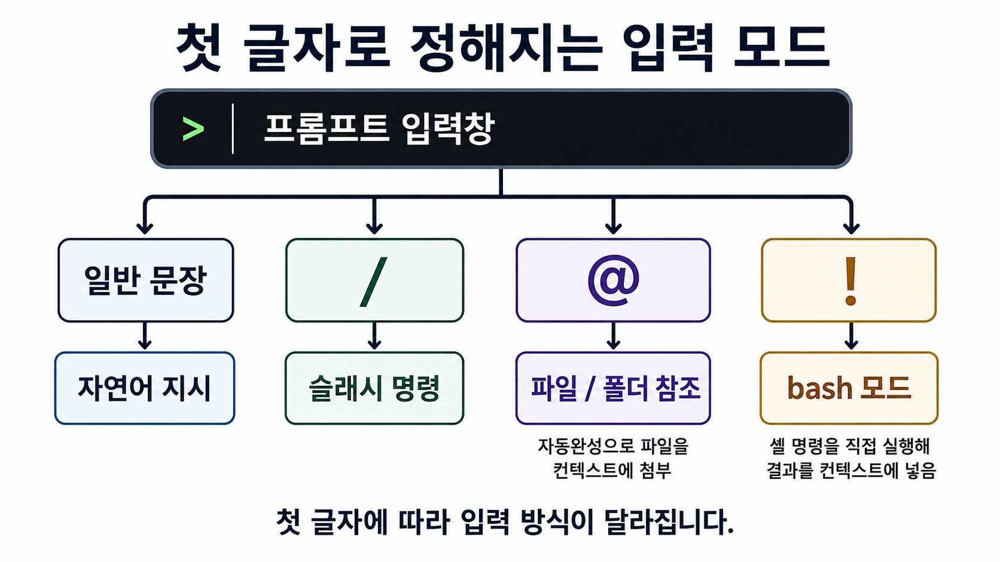
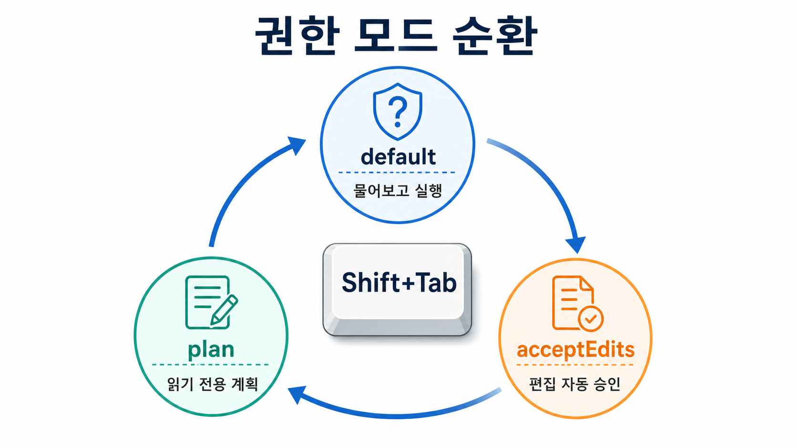
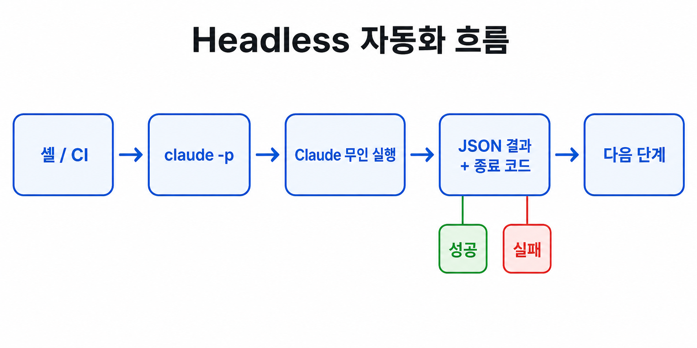

# 터미널 기능 총정리

**터미널(CLI/TUI)에서 쓸 수 있는 기능만** 카테고리별로 정리한 레퍼런스입니다.

웹 · 데스크톱 · IDE · Slack · 모바일 등 다른 실행 환경은 다루지 않습니다.

!!! info "기준 버전"
    v2.1.205 (`claude --help` 실측). 최종 근거는 항상 세션 내 `/help` 와
    `claude --help` / `claude <명령> --help` 입니다.

앞쪽은 처음 쓰는 분이 순서대로 읽기 좋은 기본 기능이고,

뒤쪽 **(심화)** 로 표시된 절은 필요할 때 찾아 쓰는 레퍼런스입니다

**지금 다 읽지 않으셔도 됩니다.**

## 1. 실행 / 세션 재개

Claude Code 를 어떤 방식으로 켤지 고르는 명령들입니다.

대부분은 그냥 `claude` 하나면 충분하고, 나머지는 "이어서 하기"·"결과만 뽑기" 같은 상황에 씁니다.

| 명령 | 의미 |
|---|---|
| `claude` | 대화형 세션 시작 (기본) |
| `claude "프롬프트"` | 초기 프롬프트와 함께 대화형 시작 |
| `claude -p "프롬프트"` | 비대화형(headless) 실행, 결과만 출력 |
| `cat file \| claude -p "..."` | stdin 파이프로 입력 전달 |
| `claude -c` / `--continue` | 현재 폴더의 최근 대화 이어가기 |
| `claude -r` / `--resume [id]` | 세션 ID 로 재개 (없으면 피커) |
| `claude --fork-session` | 재개 시 새 세션 ID 로 분기 |
| `claude -w` / `--worktree [name]` | 새 git worktree 에서 세션 시작 (격리 작업) |

## 2. 대화형 입력 문법

세션 프롬프트 창에서 **첫 글자로 모드가 갈립니다.**

그냥 말을 걸면 자연어 지시가 되고, `/` , `@` , `!` 로 시작하면 각각 다른 기능으로 바뀝니다.

| 첫 글자 | 동작 |
|---|---|
| (없음) | 자연어 지시. Claude 가 도구를 호출하며 작업 |
| `/` | 슬래시 명령 |
| `@` | 파일 / 폴더 참조(자동완성) - 해당 파일을 컨텍스트에 첨부 |
| `!` | bash 모드 - 셸 명령을 직접 실행해 결과를 컨텍스트에 넣음 |

## 3. 키보드 단축키

`Shift+Tab` 으로 도는 **권한 모드**는 Claude 가 얼마나 자유롭게 손댈지를 정하는 단계입니다 - 아래 그림처럼 세 단계를 한 바퀴 돕니다.

그 외

| 구분 | 키 | 동작 |
|---|---|---|
| 기본 | `Enter` | 제출 |
| 기본 | `\`+Enter (또는 `/terminal-setup` 후 `Shift+Enter`) | 줄바꿈 |
| 기본 | `Esc` | 현재 작업 중단 |
| 기본 | `Esc` `Esc` | 입력 중이면 현재 입력을 히스토리에 저장, **빈 입력이면 rewind 메뉴**(이전 메시지 편집 · 되감기) |
| 권한 | `Shift+Tab` | **권한 모드 순환** (default → acceptEdits → plan) |
| 히스토리 | `Tab` | 자동완성 |
| 히스토리 | `↑` / `↓` | 입력 히스토리 |
| 히스토리 | `Ctrl+R` | 히스토리 역방향 검색 |
| 화면 · 세션 | `Ctrl+L` | 화면 지우기 |
| 화면 · 세션 | `Ctrl+C` | 입력 취소 |
| 화면 · 세션 | `Ctrl+D` | 세션 종료 |
| readline | `Ctrl+K` | 줄끝까지 삭제 |
| readline | `Ctrl+U` | 줄시작까지 삭제 |
| readline | `Ctrl+W` | 앞 단어 삭제 |
| readline | `Ctrl+Y` | 붙여넣기(yank) |
| readline | `Ctrl+Y` 후 `Alt+Y` | 붙여넣기 히스토리 순환 |
| 편집 | `Ctrl+S` | **입력 stash** - 작성 중이던 프롬프트를 치워두고, 다른 작업 후 다시 `Ctrl+S` 로 복원. 세션 전체에서 유지됩니다 |
| 편집 | `Ctrl+G` / `Ctrl+X Ctrl+E` | 긴 초안을 기본 텍스트 에디터에서 작성 |

## 4. 슬래시 명령 (요약)

여기서는 자주 쓰는 것만 간추렸습니다. 전체 목록과 권한 모드는
[권한 모드와 슬래시 명령](permissions-and-commands.md) 을 참고하세요.

- **기본** - `/help` · `/clear` · `/compact` · `/config` · `/exit`
- **컨텍스트 · 메모리** - `/context` · `/memory` · `/rewind` · `/add-dir`
- **모델 · 권한** - `/model` · `/permissions` · `/plan [설명]`
- **확장 관리** - `/agents` · `/hooks` · `/mcp` · `/plugin` · `/init`
- **진단 · 상태** - `/doctor` · `/status` · `/debug` · `/usage` · `/export` · `/bug`
- **리뷰 · 워크플로** - `/review`(`--fix`) · `/security-review` · `/diff` · `/batch <지시문>`

플러그인과 `.claude/commands/` 의 커스텀 명령, MCP 프롬프트도 슬래시 명령으로 합쳐집니다.

## 5. 컨텍스트 · 메모리 · 세션 관리

- **CLAUDE.md** - 세션 시작 시 자동 로드되는 지침 (프로젝트 / 사용자 / 조직 레벨, `@import`)
- **`.claude/rules/`** - `paths` frontmatter 로 특정 파일 패턴에서만 로드되는 조건부 규칙
- **auto memory / `#`** - 대화 중 메모리 추가, `/memory` 로 편집
- **`/context`** - 실제 로드된 컨텍스트 확인
- **`/compact` · auto-compact** - 컨텍스트 압축 · **`/rewind`** - 코드 · 대화 체크포인트 복원
- **세션** - 재개(`-c`/`-r`) · 포크(`--fork-session`) · 이름(`-n`) · 내보내기(`/export`)

상세 설계는 [Context Engineering](../concepts/context-engineering.md) 을 보세요.

## 6. Claude 가 쓰는 내장 도구

세션 안에서 Claude 가 자동 호출하는 도구들입니다.

사용자가 직접 부르지는 않지만 **권한 · 동작의 단위**가 됩니다.

`Bash`(백그라운드 실행 포함) · `Read` · `Write` · `Edit` · `Glob` · `Grep` · `WebFetch` ·
`WebSearch` · `NotebookEdit` · `Task`(서브에이전트 실행) · `TodoWrite` · `AskUserQuestion` ·
MCP 도구(`mcp__서버__도구` 형태) · Skill 호출

## 7. 모델 · 추론 제어

- `/model`, `--model` - 별칭(`opus` / `sonnet` / `haiku` …) 또는 풀네임
- `opusplan` - **plan 모드에서는 Opus, 실행에서는 Sonnet** 을 자동으로 쓰는 복합 별칭.
  계획은 비싼 모델로 신중하게, 실행은 저렴한 모델로
- `--fallback-model` - 과부하 시 대체 모델 체인
- `--effort <low|medium|high|xhigh|max>` - 추론 노력 수준
- extended thinking - 프롬프트의 "think" / "ultrathink" 류 키워드로 사고량 조절

절감 관점의 활용은 [토큰 절약 기법](../reference/token-saving.md) 에서 다룹니다.

## 8. 인터페이스 편의

터미널 테마 · Vim 모드(`/vim`) · 키바인딩 · `/terminal-setup`(줄바꿈 키 설정) ·
스크린리더(`--ax-screen-reader`) · 세션 이름 / 터미널 타이틀(`-n`) · 자동 갱신

## (심화) 9. Claude Code 실행시 CLI 플래그

!!! note "지금은 건너뛰어도 됩니다"
    사용자가 모델 · 권한 · 출력 형식 등을 명령 한 줄에서 세밀하게 지정하고 싶을 때 찾아 씁니다.

플래그는 명령 뒤에 붙여 동작을 바꾸는 **옵션**입니다.

`claude` 실행시 뒤에 `--model` 같은 값을 붙여 세부 동작을 지정합니다.

아래 표는 자주 쓰는 것들을 분류별로 모은 것이니, 필요할 때 찾아 쓰면 됩니다.

| 분류 | 플래그 |
|---|---|
| 세션 | `--session-id <uuid>` · `-n/--name` · `--no-session-persistence` · `--from-pr` |
| 컨텍스트 주입 | `--add-dir` · `--system-prompt` / `--append-system-prompt` · `--settings` / `--setting-sources` |
| 도구 제어 | `--tools` (`""`=전체 비활성, `default`=전체) · `--allowedTools` / `--disallowedTools` |
| 권한 | `--permission-mode <mode>` · `--dangerously-skip-permissions` (샌드박스 전용) |
| 모델 · 추론 | `--model <alias\|full>` · `--fallback-model` · `--effort <low\|medium\|high\|xhigh\|max>` |
| MCP | `--mcp-config <json...>` · `--strict-mcp-config` |
| 에이전트 | `--agent` · `--agents <json>` (인라인 커스텀 에이전트 정의) |
| headless 출력 | `--output-format <text\|json\|stream-json>` · `--input-format` · `--json-schema` · `--max-budget-usd` |
| 문제해결 | `--safe-mode` (커스터마이징 전부 비활성) · `--bare` · `-d/--debug [filter]` · `--debug-file` · `--verbose` |
| 연동 | `--ide` · `--chrome` / `--no-chrome` · `--remote-control` · `--tmux` |

## (심화) 10. 서브커맨드

!!! note "지금은 건너뛰어도 됩니다"
    사용자가 대화 세션이 아니라 인증 · 설치 점검 · MCP 설정 같은 특정 관리 작업만 처리할 때 씁니다.

서브커맨드는 `claude` 뒤에 붙는 **기능 이름**으로, 대화 세션을 여는 대신 정해진 작업 하나만 처리하고 끝납니다.

예를 들어 `claude doctor` 는 설치가 정상인지 검사만 하고 빠져나옵니다.

| 명령 | 용도 |
|---|---|
| `claude auth` / `setup-token` | 인증 관리 / 장기 토큰 발급 |
| `claude mcp …` | MCP 서버 설정 · 관리 |
| `claude agents` | 백그라운드 에이전트 관리 |
| `claude plugin` / `plugins` | 플러그인 관리 |
| `claude project` | 프로젝트 상태 관리 |
| `claude doctor` | 설치 상태 점검 |
| `claude update` / `upgrade` / `install` | 갱신 · 네이티브 빌드 설치 |
| `claude gateway` | 기업용 auth / telemetry 게이트웨이 실행 |

## (심화) 11. 확장

!!! note "지금은 건너뛰어도 됩니다"
    사용자가 기본 기능만으로 부족해, 반복 작업이나 사내 시스템 연동을 직접 붙이고 싶을 때 씁니다.

확장은 Claude Code 에 없던 기능을 나중에 더해 넣는 방법입니다.

스마트폰에 앱을 깔아 기능을 늘리는 것과 비슷합니다.

아래 다섯 가지 방식이 있고, 각각 파일을 두는 위치와 부르는 방법이 다릅니다.

| 확장 | 위치 / 명령 |
|---|---|
| **Skills** | `.claude/skills/<name>/SKILL.md` - 자동 로드 또는 `/name` 직접 호출 |
| **Subagents** | `.claude/agents/` 또는 `--agents`, `/agents` - 격리 컨텍스트 워커 |
| **Hooks** | `.claude/settings.json` + `/hooks` - 이벤트 기반 결정론적 실행 |
| **MCP** | `claude mcp add <name> <cmd\|url>` · `--transport http` · `-e KEY=val` · `--header` |
| **커스텀 슬래시 명령** | `.claude/commands/*.md` |
| **Plugins / 마켓플레이스** | `claude plugin` - Skill · Agent · Hook · MCP 를 번들로 배포 |

MCP 상세는 [MCP 로 외부 데이터 연결](../mcp/what-is-mcp.md), 훅 상세는
[Loop Engineering](../concepts/loop-engineering.md) 을 참고하세요.

## (심화) 12. 자동화 · 무인 실행 (headless)

!!! note "지금은 건너뛰어도 됩니다"
    사용자가 사람이 지켜보지 않아도 Claude 가 혼자 돌게 만들어, 자동화 스크립트나 CI 에 끼워 넣을 때 씁니다.

**무인 실행(headless)** 은 사람이 옆에서 대화하지 않아도 Claude 가 지시를 받아 혼자 실행하고 결과만 내놓는 방식입니다.

자동화 스크립트나 CI(코드가 바뀔 때마다 자동으로 도는 검사 시스템)에 끼워 넣을 때 씁니다.

- `claude -p` + `--output-format json` / `stream-json` - 파이프 · CI 통합, 구조화 출력
- `--json-schema` 로 출력 구조 검증 · `--input-format stream-json` 으로 실시간 스트리밍 입력
- `--max-budget-usd` 로 비용 상한
- **종료 코드로 성공 / 실패 판정** → 셸 루프 · CI 에서 활용
  ([Loop Engineering L4](../concepts/loop-engineering.md))
- 백그라운드 에이전트: `--background`, `claude agents`

## (심화) 13. 진단 · 상태 · 문제해결

!!! note "지금은 건너뛰어도 됩니다"
    동작이 이상하거나 설정이 꼬였을 때, 원인을 찾고 되살리려고 씁니다.

뭔가 이상하게 동작하거나 설정이 꼬였을 때, 원인을 찾고 되살리는 도구들입니다.

평소엔 쓸 일이 없다가 문제가 생겼을 때 꺼내 씁니다.

| 도구 | 용도 |
|---|---|
| `/doctor` · `claude doctor` | 설치 · 설정 건강 검진 |
| `/status` · `/context` | 세션 상태 · 컨텍스트 점유 확인 |
| `/usage` | 사용량 · 비용 |
| `--verbose` · `-d/--debug` · `--debug-file` | 디버그 로그 |
| `--safe-mode` · `--bare` | 설정이 깨졌을 때 커스터마이징을 끄고 기동 |
| statusline · `/bug` | 하단 상태줄 커스터마이징 · 이슈 신고 |
