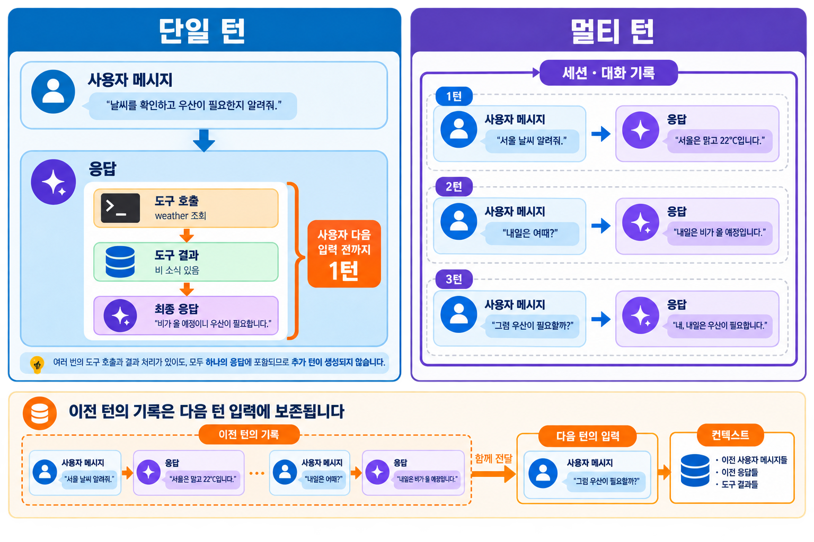
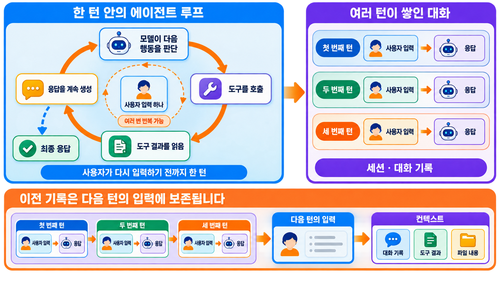
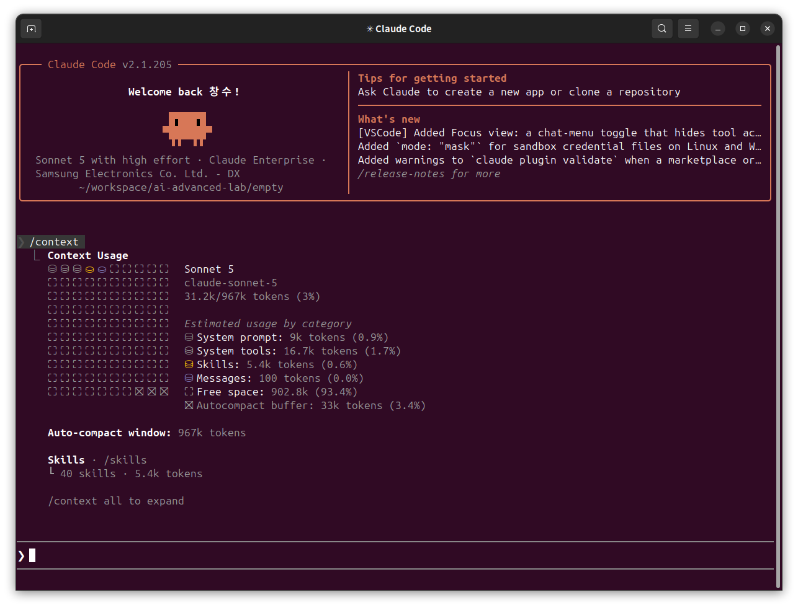

# Turn 이란?

Turn은 사용자 입력 하나에 대해 모델이 응답을 한 번 내놓는 단위입니다.

응답 한 번 안에서 도구 호출과 그 결과가 여러 차례 오가더라도, 사용자가 다시 입력하기 전까지는 여전히 한 Turn입니다.

## Turn을 왜 구분하는가

Turn은 세션보다 작은 단위입니다.

이후 살펴볼, hook 내용에서 turn 과 session 에 대한 개념 분리가 되어 있지 않으면 hook 에 대한 정확한 이해를 하기가 어렵습니다.

이 둘을 뭉뚱그리면 "언제 컨텍스트가 쌓이는가"와 "무엇이 진행 중인 응답 하나를 끝내는가"를 헷갈리게 됩니다.

## Single Turn과 Multi Turn

- **Single Turn** - 사용자 입력 하나와 그에 대한 응답 하나. 응답 도중 도구를 여러 번 부르고 그 결과를 다시 받아도 한 Turn입니다.
- **Multi Turn** - 이런 Turn이 여러 번 쌓인 대화 전체입니다. 세션은 Multi Turn의 기록입니다.

Multi Turn에서는 새 Turn마다 이전 대화 전체가 그대로 함께 들어갑니다.

Turn 1 이 끝나고 Turn 2의 입력에는 Turn 1의 입력과 응답이 그대로 포함되고, Turn 3의 입력에는 Turn 1·2가 모두 포함됩니다. 앞서

오간 말이 사라지지 않고 매 Turn마다 **누적**되는 것이 Multi Turn의 핵심입니다.

## Agent loop - Turn 안에서 반복되는 것

Turn 하나 안에서 모델이 도구를 여러 번 부르는 동작에는 이름이 있습니다.

바로  **agent loop**입니다.

모델이 응답을 생성하면서 도구 호출(`tool_use`)을 포함하면, 하네스가 그 도구를 실행하고 결과(`tool_result`)를 대화에 붙여 모델을 다시 부릅니다.

모델은 이 결과를 보고 도구를 더 부르거나, 부를 도구가 없으면 텍스트 응답으로 마무리합니다.

그래서 Turn과 agent loop은 포함 관계입니다.

Turn 하나가 agent loop 여러 iteration을 담을 수 있고, 도구 호출 없이 텍스트로 끝나는 마지막 iteration이 곧 Turn의 끝입니다.

## Turn마다 컨텍스트가 쌓이는 방식

Context Window는 대화 기록, 파일 콘텐츠, 명령 출력, CLAUDE.md, 자동 메모리, 로드된 skills, 시스템 지침을 담습니다.

작업하면서 이 공간이 채워집니다.

Turn 하나는 입력 단계와 출력 단계로 나뉩니다.

- **입력**
    - 이전 대화 기록 전체와 이번 사용자 메시지.
    - 시스템 프롬프트, `messages`에 담긴 모든 메시지(도구 결과·이미지·문서 포함), 도구 정의가 모두 컨텍스트에 계산됩니다.

- **출력**
    - 모델이 생성한 응답.
    - 확장 사고까지 계산되며, 이 출력은 다음 Turn 입력의 일부가 됩니다.

그래서 Turn이 쌓일수록 컨텍스트도 비례하여 늘어납니다. 요청에 들어가는 모든 것이 토큰으로 계산되기 때문입니다.

컨텍스트가 많다고 해서 결과가 좋아지지는 않습니다.

토큰 수가 늘면 오히려 정확도와 재현율이 떨어지는 **컨텍스트 부패(context rot)**가 나타납니다. [Context rot 참고](../concepts/context-engineering.md#참고-input-token-증가에-따른-context-rot)

한계에 가까워지면 Claude Code는 먼저 이전 도구 출력을 지우고, 그래도 모자라면 대화를 요약(compact)합니다.

!!! note "참고"
    세션 안에서 이 누적을 다루는 명령(`/clear`·`/compact`·`/context`)과 재개·포크는 [세션 이름짓기·재개](session-lifecycle.md)에서 다룹니다.

## 시뮬레이터 - 컨텍스트 윈도우 실시간 재생

Claude Code 공식 문서의 인터랙티브 위젯입니다.

세션 시작부터 `/compact`까지, 무엇이 언제 컨텍스트에 들어오고 얼마나 차지하는지를 타임라인으로 재생합니다.

재생 버튼을 누르면 진행되고, 각 이벤트를 클릭하면 오른쪽 패널에서 자세한 설명과 토큰 수를 볼 수 있습니다.

[시뮬레이터 보기 →](assets/context-window-simulator.html){ .md-button .md-button--primary }
