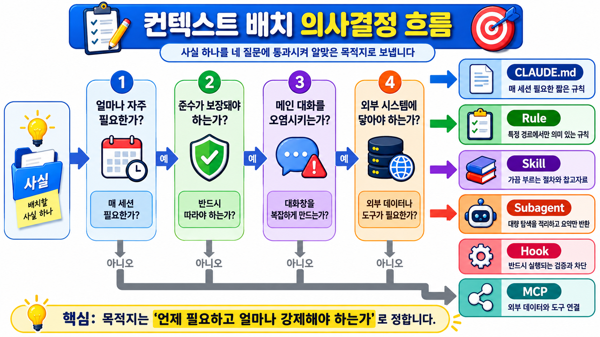
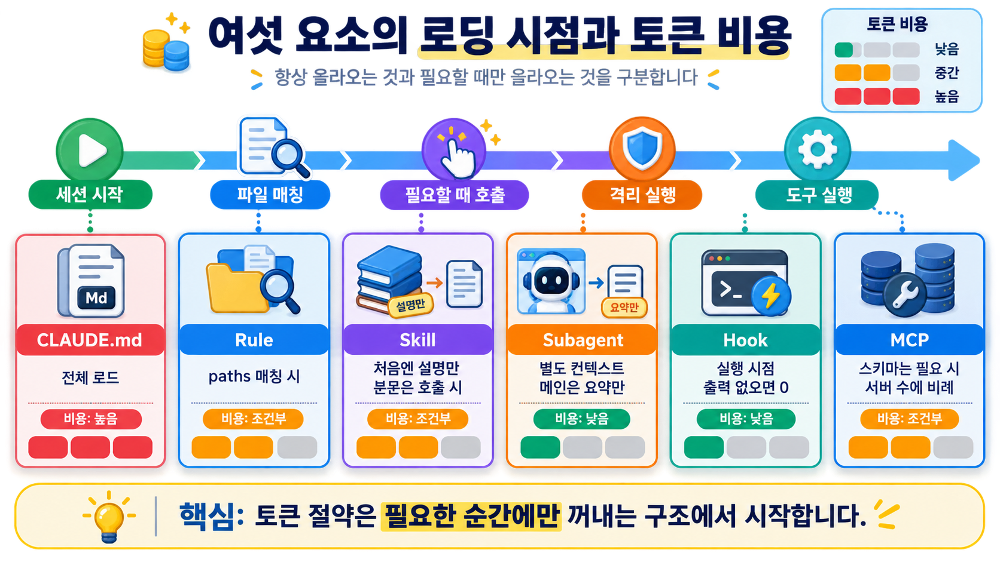
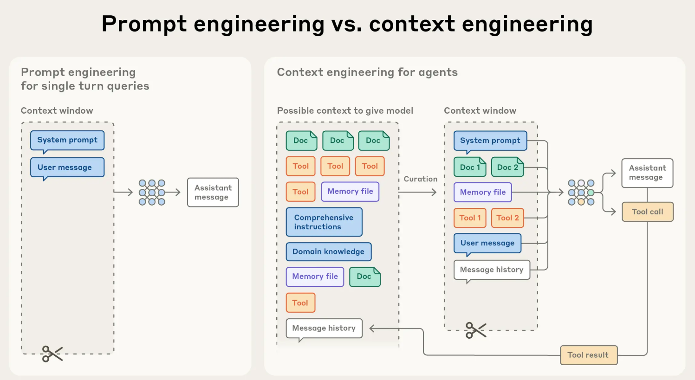

# Context Engineering

- 무엇을 언제 어디에 넣을 것인가

앞 절에서 맥락을 담는 여섯 요소 **CLAUDE.md, Rule, Skill, Subagent, Hook, MCP **를 하나씩 익혔습니다(각 요소의 문서는 맨 아래 표에서 연결합니다).

이 문서는 그 요소들을 **개별 사용법이 아니라 배치 결정으로** 다룹니다.

컨텍스트 엔지니어링은 결국 **어떤 정보를, 언제, 어디로 넣을 것인가를 파일과 설정으로 고정하는 작업**입니다.

Context 요소들(skill, subagent, hook, rule 등)은 이미 알고 있으니, 여기서는 **주어진 사실 하나를 어느 요소에 넣을지 고르는 기준**을 세웁니다.

## 배치를 고르는 네 가지 질문

**① 얼마나 자주 필요한가.**

- 매 세션 필요하면 `CLAUDE.md`
- 특정 파일을 만질 때만 필요하면 `.claude/rules/`
- 가끔 절차로 필요하면 Skill

**항상 필요**가 아닌 것을 `CLAUDE.md` 에 넣으면 관계없는 모든 세션의 토큰을 계속 태웁니다.

**② 준수가 보장돼야 하는가.**

- 반드시 지켜져야 하는 규칙이라면 Hook에 넣어야 합니다. 입니다. 지침은 부탁이고 훅은 강제입니다(아래 참조).

**③ 메인 대화를 오염시키는가.**

- 수십 개 파일을 읽거나 장황한 중간 출력을 내는 작업이라면 Subagent 로 격리해, 메인 대화는 **요약만** 돌려받습니다.
- 넘길 컨텍스트를 프롬프트에 명시적으로 적는 훈련이 곧 컨텍스트 엔지니어링입니다.

**④ 외부 시스템에 닿아야 하는가.**

- DB·API 같은 외부 데이터·도구가 필요하면 MCP 로 연결합니다.
- **MCP 는 연결을 제공하고, Skill 은 그 연결을 잘 쓰는 법을 가르칩니다** - 데이터 모델·자주 쓰는 쿼리 패턴·어떤 테이블을 언제 쓸지는 Skill 이 담습니다.

| Task 성격 | 목적지 |
|---|---|
| 매 세션 지켜야 할 짧은 규칙 | `CLAUDE.md` |
| 특정 경로에서만 의미 있는 규칙 | `.claude/rules/` (`paths` 스코프) |
| 가끔 부르는 절차·참조 자료 | Skill |
| 메인 컨텍스트에 남기면 안 되는 대량 탐색 | Subagent |
| 반드시 실행돼야 하는 검증·차단 | Hook |
| 외부 데이터·도구 연결 | MCP |

## Context 를 Engineering 단계로 관리하기 위해 구분해야 할 것

!!! warning "지침 = 부탁, 훅 = 강제"
    CLAUDE.md·Rule·Skill 은 모두 시스템 프롬프트가 아니라 그 뒤에 오는 컨텍스트로 전달됩니다.

    **준수가 보장되지 않습니다.** 반드시 지켜져야 하는 규칙은 지침이 아니라

    [Hook](what-is-hook.md)으로 만들어야 합니다.

쉽게 말하면, 지침은 **이렇게 해 주세요**라는 부탁이라 AI 가 못 지킬 수도 있습니다.

이러한 작업의 성격을 **비결정론적(non-deterministic) 작업** 이라고 합니다.

Hook은 아예 코드로 막거나 검사하는 강제 장치라 반드시 실행됩니다.

Hook 을 통해 수행되는 작업의 성격을 **결정론적(deterministic) 작업** 이라고 합니다.

## 실습 아이디어 - 컨텍스트 6칸 배치 연습

수강생이 자기 업무 맥락 10개(판정 기준, 장비 명령 목록, 보고서 양식, 금지사항, 로그 포맷 …)를 적어 봅니다.

각각을 **CLAUDE.md / Rule / Skill / Subagent 프롬프트 / Hook / MCP** 중 어디에 넣을지 배치해 봅니다.

구체적인 실습은 개인 프로젝트 시간에 해보도록 합니다.

---

## (심화) 전체 지도 - 레이어별 로딩 시점과 비용

!!! note "지금은 건너뛰어도 됩니다"
    배치가 익숙해진 뒤, 토큰을 아끼려 "각 요소가 언제 메모리에 올라오고 얼마나 자리를 차지하는가"를 따질 때 봅니다.

여섯 요소는 하는 일은 비슷해 보여도, **언제 AI 의 작업 기억에 올라오고 그때마다 자리를 얼마나 차지하는지**가 다릅니다.

여기서 "컨텍스트 비용"은 그 자료가 차지하는 토큰(AI 가 한 번에 읽을 수 있는 분량)의 크기를 뜻합니다.

어떤 요소는 세션 시작부터 컨텍스트에 계속 남아 매 요청마다 토큰 비용이 들고, 어떤 요소는 필요한 시점에만 불러와 그 전까지는 비용이 들지 않습니다.

늘 펼쳐 둔 메모지처럼 계속 자리를 차지하는 것도 있고, 서랍에 넣어 둔 자료처럼 필요할 때만 꺼내 쓰는 것도 있습니다.

아래 표는 각 요소가 그중 어느 쪽인지 정리한 것입니다.

| 레이어 | 로딩 시점 | 컨텍스트 비용 | 개별 문서 |
|---|---|---|---|
| `CLAUDE.md` | 세션 시작 시 전체 로드 | 매 요청마다 발생 | [CLAUDE.md 배치](../claude-code/claude-md-placement.md) |
| `.claude/rules/` | `paths` 매칭 파일을 읽을 때 | 조건부 | [Rule](what-is-rule.md) |
| Skills | 시작 시 **설명만**, 사용될 때 본문 | 지연 로딩 | [Skill 개념](what-is-skill.md) |
| Subagents | 별도 격리 컨텍스트 | 메인 대화에는 요약만 | [Subagent 개념](what-is-subagent.md) |
| Hooks | 실행 시점 | 출력을 반환하지 않으면 **0** | [Hook](what-is-hook.md) |
| MCP | 도구 이름 먼저, 스키마는 필요할 때 | 서버 수에 비례 | [MCP](../mcp/what-is-mcp.md) |

## (심화) 컨텍스트 예산 관리 - 진단 도구

배치를 해 두어도, 사용자는 그것이 실제로 어떻게 로드됐는지 눈으로 확인해야 합니다. 아래 세 명령이 그 확인용 도구입니다.

| 명령 | 용도 |
|---|---|
| `/context` | 실제로 무엇이 로드됐는지 확인. CLAUDE.md 로드 여부는 **Memory files** 항목에서 확인 |
| `/memory` | 메모리 파일 목록 · 편집, auto memory 토글 |
| `/doctor` | CLAUDE.md 의 트림 제안 - 코드베이스에서 유추 가능한 내용은 잘라내고, 함정 · 근거 · 관례는 유지 |

쉽게 풀면 이렇습니다.

- `/context` 는 지금 이 순간 AI 가 실제로 들고 있는 자료 목록을 펼쳐 보여 줍니다. CLAUDE.md 가 잘 올라왔는지는 **Memory files** 칸에서 확인합니다.
- `/memory` 는 그 메모리 파일들을 목록으로 보여 주고 바로 고치게 해 줍니다.
- `/doctor` 는 CLAUDE.md 가 너무 길어졌을 때 어디를 줄이면 좋을지 짚어 줍니다.

!!! tip "Memory file 종류"

    - 프로젝트 루트 CLAUDE.md (그리고 상위 디렉터리로 올라가며 있는 조상 CLAUDE.md)
    - 사용자 전역 ~/.claude/CLAUDE.md
    - 조직이 강제하는 managed policy CLAUDE.md
    - CLAUDE.local.md(개인용, 커밋 안 되는 파일)
    - .claude/rules/의 규칙 파일
    - auto memory 인덱스 (MEMORY.md - 앞 200줄 혹은 25KB까지만)

!!! warning "압축(compact) 후 동작"
    프로젝트 루트 CLAUDE.md 는 `/compact` 후에도 디스크에서 다시 읽혀 재주입되지만,
    **하위 디렉터리의 중첩 CLAUDE.md 는 자동 재주입되지 않습니다.**
    대화에서만 준 지침은 사라집니다.

토큰을 실제로 아끼는 방법론은 [토큰 절약 기법](../reference/token-saving.md) 에서 다룹니다.

## (참고) Prompt Engineering VS Context Engineering

## (참고) Input token 증가에 따른 context rot

- [Anthropic 에서 25년 9월 29일에 발행한 article](https://www.anthropic.com/engineering/effective-context-engineering-for-ai-agents) 에 처음으로 **context rot** 이라는 개념이 등장했습니다.

- 사람은 유한한 기억력으로 인해 특정 주제에 대하여 긴 시간 작업을 할 경우 집중력이 흐트러집니다.

- LLM 도 마치 사람처럼 작업이 지속될 수록 집중력이 흐트러지는 현상을 발견했고, 이를 **Context Rot** 이라 명명했습니다.

- 이후 Chroma 에서 Closed / Open LLM model 18종을 대상으로 대규모 실험을 하였고, 모든 llm 모델에서 공통된 현상이 발생함을 발견하였습니다.[논문 보기](https://www.trychroma.com/research/context-rot)

