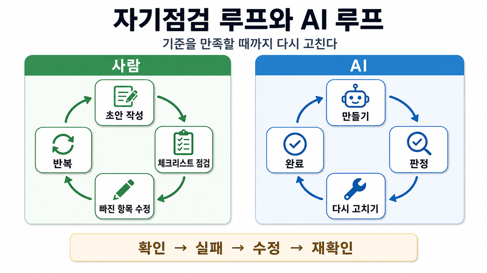
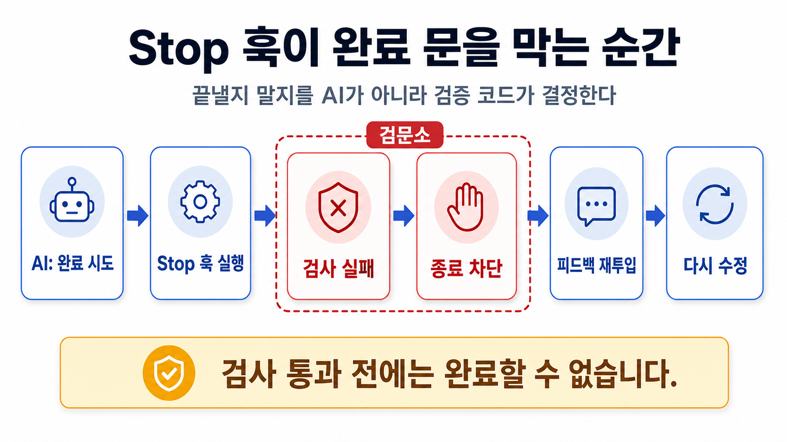

# Loop Engineering

<p class="ailab-title-subtitle">- AI가 스스로 판정하고 고치는 Loop</p>

Loop Engineering 은 AI 에이전트가 한 번의 답변으로 끝나지 않고, 실행 → 결과 확인 → 수정 → 재실행을 반복하는 순환 구조를 의도적으로 설계하는 작업을 말합니다.

Claude Code 에서는 Loop 가 **네 개의 부품**으로 분해됩니다. 각 부품이 어떤 기능에 매핑되는지가 설계의 뼈대입니다.

## Loop가 무엇이고 왜 필요한가요

"Loop" 는 **AI 스스로가 결과를 확인하고 기준에 못 미치면 다시 고치는 과정을 반복**하는 구조입니다.

사람에 비유하면 이렇습니다.

사람은 보고서 초안을 쓰고, 체크리스트로 스스로 점검하고, 빠진 항목이 있으면 다시 손보고, 기준을 다 맞출 때까지 이 과정을 되풀이합니다.

AI 에게 한 번만 시키면 기준을 대충 넘기거나 "다 했습니다" 하고 스스로 판단해 멈춰 버릴 수 있습니다.

Loop를 걸어 두면 사람이 매번 지켜보지 않아도, 결과가 기준을 만족할 때까지 AI 가 스스로 고치게 만들 수 있습니다.



## Loop의 네 부품

Loop를 Claude Code 로 만들 때 필요한 네 가지 부품은 다음과 같습니다.

| 부품 | 역할 | Claude Code 구현체 |
|---|---|---|
| ① 맥락 / 기준 | AI 가 지켜야 할 규칙 · 루브릭 | `CLAUDE.md`, `.claude/rules/*.md`, Skill |
| ② 실행 | 작업 수행 | 메인 에이전트 / Subagent |
| ③ 판정(oracle) | 결과가 기준을 만족했는지 **결정론적으로** 판단 | Hook (`PostToolUse`, `Stop`) |
| ④ 피드백 재투입 | 실패 사유를 다시 주고 재시도 | Hook 의 `exit 2` / `decision: "block"` |

<details class="ailab-code" markdown="1">
<summary>다이어그램 펼치기 - Loop 부품 순환도</summary>

<div class="ailab-code-window">
<div class="ailab-code-titlebar">
<span class="ailab-code-dots"><span></span><span></span><span></span></span>
<span class="ailab-code-filename">loop-diagram.txt</span>
</div>

```text
  ① 맥락/기준  ──▶  ② 실행  ──▶  ③ 판정(oracle)
       ▲                              │
       │                       pass ──┴── fail
       │                        │          │
       │                        ▼          ▼
       │                     ✅ 완료   ④ 피드백 재투입
       └──────────────────────────────────┘
              실패 사유 재투입 + 규칙 자산화
```

</div>
</details>

!!! success "핵심은 '③ 판정' 과 '④피드백 재투입' 입니다"
    Prompt로 "검증해줘" 라고 하면 모델이 판정을 건너뛸 수 있습니다.

    Hook은 **결정론적 코드를 실행**하므로 환각이 불가합니다.


## (심화) 단계별 구현 방법

!!! note "지금은 건너뛰어도 됩니다"
    Loop를 실제 코드로 만들 때 필요한 단계별 방법입니다 - 훅 스크립트를 직접 짜야 할 때 돌아와 읽으면 됩니다.

여기서부터는 Loop를 **실제로 구현하는 방법**을 쉬운 것부터 어려운 것 순서(Step 1 ~ 6)로 봅니다.

스크립트가 낯설면 각 단계의 제목만 읽어도 전체 흐름을 익힐 수 있습니다.

### Step 1. 프롬프트 내 자기비평 Loop - 스크립트 없음

**가장 단순한 형태입니다.**

별도 프로그램 없이, AI 에게 주는 지시문(Skill) 안에 "만들고 → 기준(루브릭)과 대조하고 → 스스로 흠을 찾고 → 고쳐라" 는 절차를 글로 적어 둡니다.

필자가 Skill 파일 안에 "생성 → 루브릭 대조 → 자기비평 → 수정" 을 절차로 못 박습니다.

<details class="ailab-code" markdown="1">
<summary>예시 펼치기 - report-writer SKILL.md</summary>

<div class="ailab-code-window">
<div class="ailab-code-titlebar">
<span class="ailab-code-dots"><span></span><span></span><span></span></span>
<span class="ailab-code-filename">.claude/skills/report-writer/SKILL.md</span>
</div>

```
---
name: report-writer
description: 주간 성능 보고서 작성
---
1. 초안 작성
2. 아래 루브릭 5개 항목을 표로 만들어 각각 통과/실패 판정
   - 수치 출처가 원본 로그 경로로 명시되었는가
   - 전주 대비 증감률이 계산되었는가 ...
3. 실패 항목이 하나라도 있으면 2번으로 돌아가 수정 (최대 3회)
4. golden-example.md 와 형식이 일치하는지 대조
```

</div>
</details>

가장 쉽지만, Loop를 도는 주체가 AI 자신이라 **AI 가 스스로 "이만하면 됐다" 며 Loop를 끊어 버릴 수 있습니다.** 입문 세션용입니다.

### Step 2. PostToolUse - 편집 즉시 피드백 Loop

**AI 가 파일을 고칠 때마다 하네스가 자동으로 검사 프로그램을 돌려, 그 결과를 곧바로 AI 에게 되돌려 주는 방식입니다.**

"편집" 이라는 사건이 일어나면 검사가 딸려 실행됩니다.

파일이 수정될 때마다 하네스가 검증기를 돌려 결과를 되먹입니다.

<details class="ailab-code" markdown="1">
<summary>설정 예시 펼치기 - PostToolUse hook</summary>

<div class="ailab-code-window">
<div class="ailab-code-titlebar">
<span class="ailab-code-dots"><span></span><span></span><span></span></span>
<span class="ailab-code-filename">.claude/settings.json</span>
</div>

```json
{
  "hooks": {
    "PostToolUse": [
      {
        "matcher": "Edit|Write",
        "hooks": [
          {
            "type": "command",
            "command": "${CLAUDE_PROJECT_DIR}/.claude/hooks/check.sh"
          }
        ]
      }
    ]
  }
}
```

</div>
</details>

PostToolUse 는 이미 실행된 동작을 막을 수는 없지만, 다음 행동에 영향을 줍니다.
피드백은 stderr + `exit 2`, 또는 `additionalContext` 로 넣습니다.

여기서 `exit 2` 는 프로그램이 "문제가 있으니 다시 보라" 고 보내는 신호이고, `additionalContext` 는 AI 가 다음 행동에서 참고하도록 지적 내용을 담아 주는 칸입니다.

<details class="ailab-code" markdown="1">
<summary>예시 펼치기 - hook 출력(additionalContext)</summary>

<div class="ailab-code-window">
<div class="ailab-code-titlebar">
<span class="ailab-code-dots"><span></span><span></span><span></span></span>
<span class="ailab-code-filename">hook-output.json</span>
</div>

```json
{
  "hookSpecificOutput": {
    "hookEventName": "PostToolUse",
    "additionalContext": "설계서 §3.2 규칙 위반: 파라미터명 대문자 표기 필요"
  }
}
```

</div>
</details>

### Step 3. Stop 훅 - "환각"을 막는 자율 Loop

보통은 AI 가 작업을 끝내고 나면 **작업이 완료되었습니다** 하고 스스로 대화를 끝냅니다.

Stop 훅은 바로 그 끝내려는 순간에 끼어들어, 검사에 통과하지 못하면 "아직 아니다" 며 종료를 되돌려 계속 일하게 만듭니다.**

Stop 훅은 Claude 가 턴을 끝내려는 순간 실행되어 **종료를 거부할 수 있는 유일한 훅**입니다.

제어권을 뒤집는다(**끝낼지 말지를 AI 가 아니라 내가 정한 코드가 결정한다**)는 점에서 가장 핵심입니다.



#### Stop hook 예시

<details class="ailab-code" markdown="1">
<summary>코드 예시 펼치기 - verify-before-stop.sh</summary>

<div class="ailab-code-window">
<div class="ailab-code-titlebar">
<span class="ailab-code-dots"><span></span><span></span><span></span></span>
<span class="ailab-code-filename">.claude/hooks/verify-before-stop.sh</span>
</div>

```bash
#!/bin/bash
# .claude/hooks/verify-before-stop.sh
INPUT=$(cat)
# 무한Loop 방지: 이미 강제 계속 상태면 종료 허용
if [ "$(jq -r '.stop_hook_active' <<<"$INPUT")" = "true" ]; then exit 0; fi

if ! ./run_testcases.sh > /tmp/result.log 2>&1; then
  echo "검증 실패. 아래 로그의 FAIL 항목을 수정한 뒤 재검증하라:" >&2
  tail -20 /tmp/result.log >&2
  exit 2      # 종료 차단 → Claude 가 계속 작업
fi
exit 0
```

</div>
</details>

`exit 2` 대신 JSON 으로도 됩니다: `{"decision":"block","reason":"..."}`.

!!! warning "무한 Loop 함정"
    `stop_hook_active` 를 확인하지 않으면 매 종료 시도를 차단해, 세션이 타임아웃될 때까지 토큰을 태웁니다.

    실무에서는 **카운터 파일로 N회 상한**을 함께 겁니다.

<details class="ailab-code" markdown="1">
<summary>코드 예시 펼치기 - verify-before-stop.sh (카운터 추가)</summary>

<div class="ailab-code-window">
<div class="ailab-code-titlebar">
<span class="ailab-code-dots"><span></span><span></span><span></span></span>
<span class="ailab-code-filename">.claude/hooks/verify-before-stop.sh (이어서)</span>
</div>

```bash
CNT_FILE=/tmp/loop_$(jq -r '.session_id' <<<"$INPUT")
N=$(( $(cat $CNT_FILE 2>/dev/null || echo 0) + 1 ));echo $N > $CNT_FILE
[ $N -gt 5 ] && { echo "5회 재시도 초과. 사람 검토 필요." >&2; exit 0; }
```

</div>
</details>

### Step 4. 판정 자체를 LLM 에게 - prompt / agent 훅

**"통과/실패" 를 숫자나 규칙으로 딱 잘라 판단할 수 없는 품질도 있습니다.**

보고서의 논리가 매끄러운지, 빠뜨린 검토가 없는지 같은 것입니다.

이럴 때는 판정을 다시 AI(LLM)에게 맡깁니다.

수치로 떨어지지 않는 품질(보고서 논리성, 검토 누락 등)을 판정하려면 훅 타입을 바꿉니다.

- **prompt 훅** - 모델에게 단일 턴 판정을 시켜 yes/no 를 JSON 으로 받습니다.
- **agent 훅** - Read · Grep · Glob 을 쓸 수 있는 서브에이전트를 띄워 검증합니다(실험적).

<details class="ailab-code" markdown="1">
<summary>설정 예시 펼치기 - prompt 훅</summary>

<div class="ailab-code-window">
<div class="ailab-code-titlebar">
<span class="ailab-code-dots"><span></span><span></span><span></span></span>
<span class="ailab-code-filename">.claude/settings.json</span>
</div>

```json
{
  "hooks": {
    "Stop": [
      {
        "hooks": [
          {
            "type": "prompt",
            "prompt": "다음 턴 결과가 rubric.md 의 5개 기준을 모두 만족하는가? $ARGUMENTS",
            "model": "claude-haiku-4-5-20251001"
          }
        ]
      }
    ]
  }
}
```

</div>
</details>

이런 사례는  **Golden Master(모범 정답) + Rubric file(채점표)**을 판정 근거로 물리는 형태입니다.

 정답이 스크립트로 안 떨어지는 업무(마케팅 · 영업 · 기획)에 적합합니다.

### Step 5. 세션 밖 Loop - headless 반복 실행

**지금까지의 Loop는 한 번의 대화(세션) 안에서 도는 Loop였습니다.** 훅은 세션이 열려 있는 동안만 동작하고, 세션이 끝나면 같이 사라집니다.

- 밤새 테스트케이스 여러 개를 하나씩 자동으로 돌리는 야간 배치 작업
- 같은 시험을 여러 번 반복해 결과가 일관되는지 보는 회귀시험

등의 작업은 세션 하나가 아니라 **세션 자체를 여러 번 새로 여는** 반복이 필요합니다.

세션을 여러 개 만드는 이 반복은 hook이 대신할 수 없으므로, Claude Code 외부에서 동작하는 스크립트를 통해 반복 작업을 구현해야 합니다.

아래 코드 예시 처럼 코드의 `for` 문이 매번 새 세션을 열었다 닫았다 하며 그 사이를 채우는 것입니다.

<details class="ailab-code" markdown="1">
<summary>코드 예시 펼치기 - run-nightly.sh</summary>

<div class="ailab-code-window">
<div class="ailab-code-titlebar">
<span class="ailab-code-dots"><span></span><span></span><span></span></span>
<span class="ailab-code-filename">run-nightly.sh</span>
</div>

```bash
for i in $(seq 1 10); do
  claude -p "TC_$i 실행 후 실패 원인 분석하여 report_$i.md 작성" \
    --output-format json >> run.log
  ./validate.sh report_$i.md || claude -p "report_$i.md 를 rubric 기준으로 보완"
done
```

</div>
</details>

### Step 6. 팀 전파 - Plugin 으로 패키징

**잘 만든 Loop를 나 혼자만 쓰지 않고 팀 전체가 쓰도록 하나로 묶어 배포하는 단계입니다.**

사용자가 스킬 · 서브에이전트 · 훅 · 출력 스타일을 플러그인으로 묶어 팀원이나 프로젝트 간에 공유합니다.

플러그인 훅은 사용자가 `hooks/hooks.json` 에 정의하며, 활성화 시 사용자 · 프로젝트 훅과 병합됩니다.

스킬 / 서브에이전트 frontmatter 에 훅을 직접 넣으면 해당 컴포넌트가 활성일 때만 동작하고 끝나면 정리되므로, **"이 작업을 할 때만 도는 검증 Loop"** 를 만들 수 있습니다.

## (심화) 반드시 다뤄야 할 실패 모드

!!! note "지금은 건너뛰어도 됩니다"
    Loop를 직접 만들 때 자주 마주치는 상황들입니다.

    훅을 만들기 시작할 때, 이 표를 점검표로 사용하세요.

Loop를 잘못 만들면 AI 가 영영 멈추지 못하거나, 반대로 검증을 건너뛰고 끝내 버립니다.

아래는 실제로 자주 나오는 실패 유형과 그 결과입니다.

| # | 실패 모드 | 결과 |
|---|---|---|
| 1 | `stop_hook_active` 미체크 | 무한 Loop - 타임아웃까지 토큰 소모 |
| 2 | 만족 불가능한 판정 조건 | 세션 잠김 |
| 3 | `exit 1` 로 차단 시도 | 대부분의 이벤트에서 **비차단** 오류로 처리되어 그대로 진행. 차단하려면 `exit 2` |
| 4 | 종료코드와 JSON 을 섞어 씀 | JSON 출력은 `exit 0` 일 때만 처리됨. 둘 중 하나만 선택 |
| 5 | 피드백을 명령형 시스템 지시처럼 작성 | 프롬프트 인젝션 방어가 발동해 컨텍스트로 쓰이지 않고 사용자에게 노출. **사실 서술형**으로 작성 |
