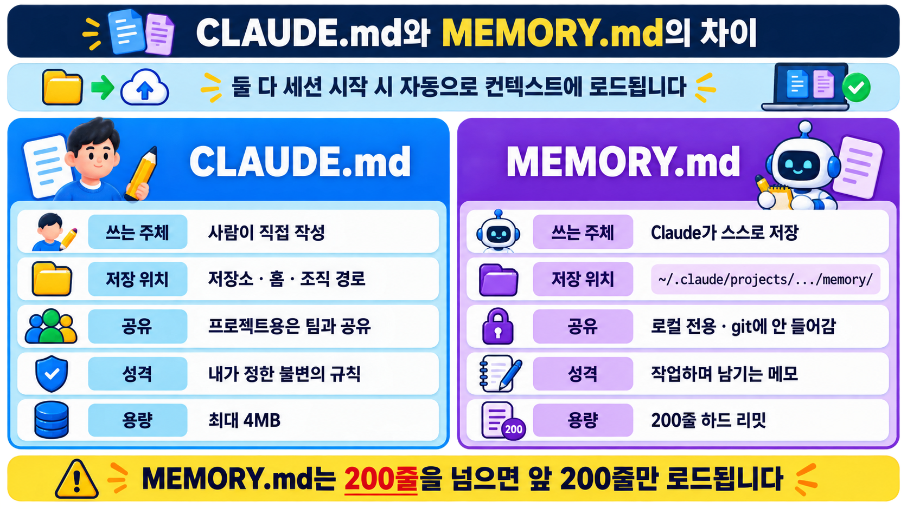

# MEMORY.md

<p class="ailab-title-subtitle">- Claude가 스스로 쌓는 기억</p>

MEMORY.md는 AI 에이전트가 작업 중간중간 중요한 진행 상황이나 결정 사항을 텍스트 파일로 따로 저장해두고, 나중에 다시 그 파일을 읽어와서 이전 맥락을 되살리는 방식인 structured note-taking(구조화된 메모 기법)의 한 형태입니다.

Claude Code가 긴 작업을 하다가 대화 내용이 너무 길어져 Context Window(모델이 한 번에 기억할 수 있는 범위)를 넘어가면, 그동안 진행한 핵심 내용을 이 파일에 요약해 남겨두고, 이후 작업을 이어갈 때 파일을 다시 불러와 **어디까지 했는지** 파악하는 식입니다.

마치 사람이 프로젝트 노트를 써두고 며칠 뒤 다시 열어보며 이어서 일하는 것과 비슷한 원리로, AI가 매번 모든 대화를 처음부터 기억할 필요 없이 필요한 정보만 꺼내 쓰도록 해줍니다.

## 왜 필요한가

같은 저장소에서 반복하는 작업일수록 매번 같은 설명을 다시 하게 됩니다.

**이 프로젝트의 배경은 XXX 이다.** 와 같은 사실을 세션마다 다시 알려 주는 것은 낭비입니다.

MEMORY.md는 이런 지식을 Claude가 스스로 축적해, 다음 세션 시작 때 [컨텍스트](what-is-context.md)로 다시 불러옵니다.

사용자가 관리하지 않아도 작업 경험이 쌓인다는 점이 CLAUDE.md와 구별되는 핵심입니다.

## 어디에 저장되나

MEMORY.md는 다음 경로에 저장됩니다.

- 리눅스/Mac OS
```bash
~/.claude/projects/<프로젝트경로>/memory/MEMORY.md
```

- Window
```powershell
~\.claude\projects\<프로젝트경로>\memory\MEMORY.md
```

저장 단위는 프로젝트, 정확히는 git 저장소입니다.

로컬에만 저장되며 git에는 들어가지 않습니다 - 개인의 작업 기록이기 때문입니다.

기록되는 Memory 범위는 저장소 단위로 분리됩니다.

같은 저장소라면 worktree나 하위 디렉터리는 이 기억을 공유합니다.

## CLAUDE.md와의 차이

`CLAUDE.md`, `MEMORY.md` 둘 다 세션 시작 시 자동으로 컨텍스트에 로드됩니다.

하지만 파일 작성 주체 / 위치 / 무엇이 남겨지는지가 다릅니다.




## (심화) `#` 단축키로 대화 중 CLAUDE.md 파일 업데이트

!!! note "지금은 건너뛰어도 됩니다"
    `#`으로 메모를 직접 추가해 본 뒤, 그것이 자동 메모리와 무엇이 다른지 궁금할 때 읽습니다.

`#` 은 Claude Code CLI 프롬프트에서 **메모리를 즉시 수동으로 추가**하는 단축키입니다.

**사용법**

프롬프트 맨 앞에 `#`을 붙이고 바로 저장하고 싶은 내용을 씁니다.

```
# 이 프로젝트는 uv로 패키지를 관리한다. pip 대신 uv add를 쓸 것
```

Enter를 치면 Claude Code가 어느 메모리 파일에 저장할지 선택하라고 물어봅니다(보통 프로젝트용 `CLAUDE.md` 또는 개인용 `CLAUDE.local.md` 중 선택).

별도 대화나 확인 절차 없이 한 줄 입력만으로 즉시 저장되는 게 핵심입니다.

**MEMORY.md(auto memory)와 다른 점**

| 구분 | `#` 단축키 | MEMORY.md (auto memory) |
|---|---|---|
| 저장 주체 | 사람이 직접 입력 | Claude가 대화 중 스스로 판단해서 저장 |
| 저장 대상 파일 | `CLAUDE.md` / `CLAUDE.local.md` | `~/.claude/projects/.../memory/MEMORY.md` |
| 트리거 시점 | 사용자가 원하는 그 순간 | Claude가 "이건 기억할 만하다"고 판단한 순간 |
| 용도 | 팀 규칙, 코딩 컨벤션처럼 확실한 지시사항을 즉석에서 박아넣을 때 | 작업하다 발견한 잡다한 패턴/교훈을 알아서 축적할 때 |

즉 `#`은 "지금 이 규칙은 확실히 기억해줘"라고 사용자가 능동적으로 지시하는 기능이고, MEMORY.md는 Claude가 스스로 알아서 남기는 수동적 축적 기능입니다.

`MEMORY.md` 파일을 고치고 싶으면 `/memory` 명령으로 해당 파일을 에디터에서 직접 열어 편집할 수도 있습니다.
