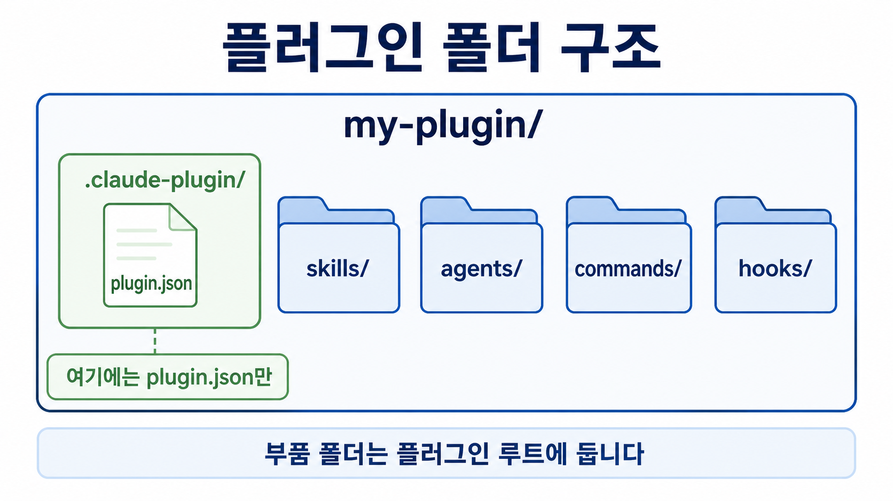
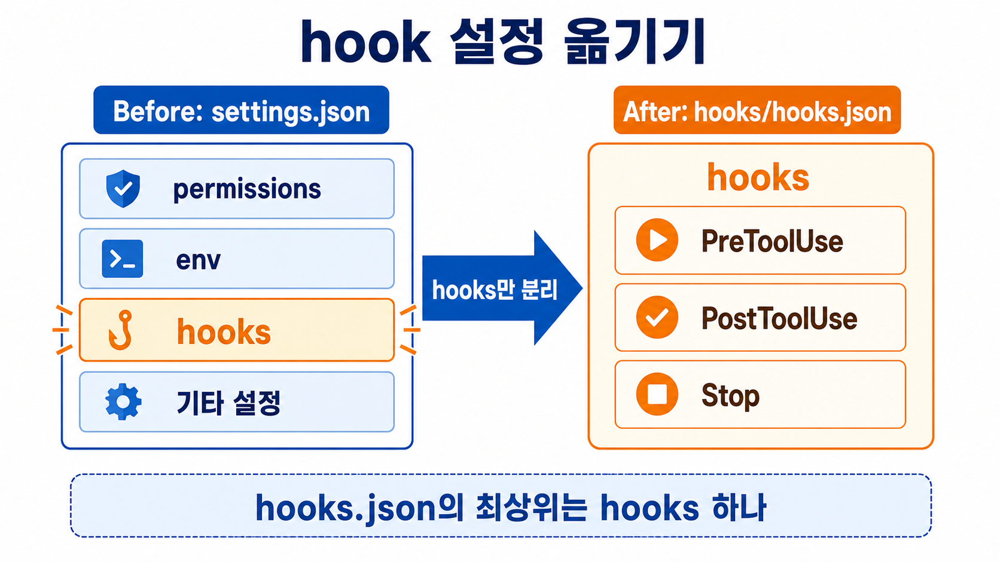

# Plugin 만들고 배포하기

이 문서를 끝내면 흩어져 있던 skill·agent·hook·MCP 설정을 플러그인 하나로 묶고, 그 패키지를 다른 사람의 Claude Code에 배포할 수 있습니다.

플러그인은 skill·agent·hook·MCP 설정 등 여러 확장을 하나의 폴더 구조로 모아 배포하는 단위입니다.

플러그인 작성자는 각 부품을 따로 나눠 주는 대신 패키지 하나를 건네면 됩니다.

플러그인이 담는 부품의 개념은 [Skill 개념](what-is-skill.md),
[Subagent 개념](what-is-subagent.md), [Hook](what-is-hook.md),
[MCP](../mcp/what-is-mcp.md)에서 먼저 확인하세요.


## 전제 조건

- 묶을 재료가 이미 있어야 합니다.
    - `.claude/skills`
    - `.claude/agents`
    - `.claude/commands`에 만들어 둔 부품
    - `.claude/settings.json`의 hook 설정 등

- 로컬 테스트에는 Claude Code CLI가 필요합니다.

- 부품이 외부 실행 런타임 쓰면(예: `python`, `node` 등) plugin 을 설치할 pc 에 동일 런타임도 준비하세요.

## 만드는 절차

### 1. 플러그인 폴더와 매니페스트를 만드세요

플러그인 루트 아래에 `.claude-plugin` 폴더를 만들고 그 안에 `plugin.json`을 두세요.

```
mkdir -p my-plugin/.claude-plugin
```

`plugin.json`은 이 플러그인의 매니페스트(이름표 역할을 하는 설정 파일)입니다. 여기에는 `name`만 필수입니다.

나머지 `description`·`version`·`author`는 적어도 되고, 비워 두어도 됩니다.

`name`이 부품 이름 앞에 어떻게 붙는지와 `version`을 비웠을 때의 동작은 이 문서 맨 아래 심화 항목 **plugin.json의 네임스페이스와 버전**에서 다룹니다.

### 2. 부품을 루트에 배치하세요

만들어 둔 부품 폴더를 플러그인 루트로 그대로 복사하세요.

```
cp -r .claude/skills my-plugin/
cp -r .claude/agents my-plugin/
cp -r .claude/commands my-plugin/
```

완성된 구조는 다음과 같습니다.

```
my-plugin/
├── .claude-plugin/
│   └── plugin.json          # name · description · version · author (매니페스트)
├── skills/
│   └── <skill-name>/SKILL.md
├── agents/
│   └── <agent-name>.md
├── hooks/
│   └── hooks.json
├── .mcp.json                 # MCP 서버 설정 (있으면)
├── settings.json             # 플러그인 기본 설정 (선택)
└── README.md
```



`commands/`·`agents/`·`skills/`·`hooks/`는 플러그인 **루트**(맨 바깥 `my-plugin/` 폴더) 바로 아래에 두세요.

헷갈리기 쉬운 지점이 하나 있습니다. `.claude-plugin/` 폴더 안에는 `plugin.json` **한 파일만** 넣습니다.

부품 폴더를 이 안에 함께 넣으면 Claude Code가 부품을 찾지 못합니다. 이름이 비슷해서 자주 틀리는 부분입니다.

### 3. (쓴다면) hook과 MCP 설정을 옮기세요

묶을 부품에 hook이나 MCP 서버가 있으면 그 설정 파일도 함께 옮겨야 합니다.

skill·agent·command만 묶는다면 이 단계는 건너뛰어도 됩니다.

옮기는 방법은 손이 조금 더 갑니다. 이 문서 맨 아래 심화 항목 **hook과 MCP 설정 옮기기**에서 다룹니다.

### 4. README를 채우세요

패키지를 받는 사람이 무엇을 어떻게 쓰는지 `README.md` 하나로 알 수 있어야 합니다.

다음 항목을 채우세요.

- 한 줄 목적 : 무슨 반복 업무를 자동화하는가
- 전제 조건 : Claude Code 버전, 필요한 런타임, API 키·MCP
- 설치 명령 : 로컬 테스트 명령 또는 배포 스크립트 한 줄
- 폴더 구조 표 : 부품(skill·agent·hook)별로 "무엇을·왜"를 매핑
- 사용 예시 : 실제 실행 명령 한두 개와 성공 출력 예시
- hook·oracle이 검증하는 것 : 판정 기준 요약
- 알려진 한계 : 가상 데이터 여부, 미검증 영역, 실패하는 경우
- 버전·작성자 : 사내는 라이선스 대신 소속 조직·담당자로 대체 가능

### 5. 배포하세요

플러그인 시스템을 우회해 파일을 직접 배치하는 방식이 가장 확실합니다.

부품 파일을 받는 사람의 `~/.claude/{skills,agents,commands}/`로 `rsync`로 보내세요.

이 방식은 마켓플레이스가 막힌 환경에서도 항상 동작합니다.

배포처를 여럿에게 공개하는 다른 방법은 [Marketplace](marketplace.md)를 보세요.

## 확인 방법

만드는 중에는 `claude --plugin-dir ./my-plugin`으로 로컬에서 불러 확인하세요.

실행 중 수정했으면 `/reload-plugins`로 다시 적용합니다. 재시작하지 않아도 됩니다.

정적 검증은 `claude plugin validate ./my-plugin`으로 합니다.

성공하면 `✔ Validation passed`가 나옵니다.

## 실패했을 때

부품이 로드되지 않으면 배치 위치를 먼저 보세요. `skills/`·`agents/`·`hooks/`가 `.claude-plugin/` 안이 아니라 루트에 있어야 합니다.

`plugin.json`을 못 읽으면 위치가 `.claude-plugin/plugin.json`인지, `name` 필드가 있는지 확인하세요.

hook이 동작하지 않으면 `hooks/hooks.json`의 최상위 키가 `hooks` 하나로 감싸였는지 보세요.

검증이 실패하면 `claude plugin validate`가 가리키는 줄을 고친 뒤 다시 실행하세요.

## 프롬프트로 한 번에 만들기

여기까지의 절차(1~4단계)를 프롬프트 하나로 대신할 수 있습니다. 프로젝트 루트에서 `<플러그인 이름>` 자리만 채워 아래 프롬프트를 그대로 Claude Code에 붙여넣으세요.

```text
이 프로젝트의 .claude/ 안 부품들을 <플러그인 이름> 이라는 플러그인 하나로 묶어줘.

1. <플러그인 이름>/.claude-plugin/plugin.json 을 만들어. name 은 "<플러그인 이름>",
   description 은 이 프로젝트의 skill·agent·hook 이 실제로 하는 일을 한두 문장으로 요약해서 채워.
2. .claude/skills, .claude/agents, .claude/commands 가 있으면 각각 그대로
   <플러그인 이름>/skills, <플러그인 이름>/agents, <플러그인 이름>/commands 로 복사해.
3. .claude/settings.json(또는 settings.local.json)에 hooks 설정이 있으면, 그 hooks
   덩어리만 떼어 <플러그인 이름>/hooks/hooks.json 에 최상위 키가 hooks 하나가 되도록 옮겨.
4. .mcp.json 이 있으면 <플러그인 이름>/.mcp.json 으로 복사해.
5. <플러그인 이름>/README.md 를 만들어서 한 줄 목적, 전제 조건, 설치 명령, 폴더 구조 표,
   사용 예시, hook·oracle이 검증하는 것, 알려진 한계, 버전·작성자를 채워.
6. claude plugin validate <플러그인 이름> 을 실행해서 통과하는지 확인하고 결과를 보여줘.
```

프롬프트가 끝나면 결과물을 [확인 방법](#확인-방법)으로 검증하세요.

## (심화) hook과 MCP 설정 옮기기

!!! note "지금은 건너뛰어도 됩니다"
    묶을 부품에 hook이나 MCP 서버가 있을 때만 필요합니다. skill·agent·command만 묶는다면 넘어가세요.

hook 설정은 원래 `.claude/settings.json`(또는 `settings.local.json`) 안에, 여러 설정 중 하나로 들어 있습니다.

플러그인 작성자는 이 hook 설정만 따로 떼어 `my-plugin/hooks/hooks.json`이라는 별도 파일에 담습니다.

담는 내용의 형식(포맷)은 그대로입니다. 딱 한 가지만 다릅니다.

원래 settings.json에서는 `hooks`가 여러 항목 중 하나였지만, hooks.json에서는 작성자가 그 `hooks` 덩어리를 파일의 맨 바깥(최상위)에 통째로 둬야 합니다.

즉 파일을 열었을 때 가장 바깥 껍데기가 `hooks` 하나여야 합니다.



MCP 서버를 쓴다면 서버 설정은 `my-plugin/.mcp.json`에 둡니다.

## (심화) plugin.json 전체 필드

!!! note "지금은 건너뛰어도 됩니다"
    첫 플러그인을 만들 때는 `name`만 채우면 됩니다. 나머지 필드가 무엇을 하는지 궁금할 때 봅니다.

`plugin.json`에 넣을 수 있는 항목 전체입니다. 필수는 `name` 하나뿐이고, 나머지는 필요할 때만 씁니다.

| 필드 | 뜻 |
|---|---|
| `name` | 플러그인 식별자 (필수). 부품 이름 앞에 네임스페이스로 붙습니다 |
| `description` | 플러그인이 하는 일 한 줄 |
| `version` | 버전. 비우면 Claude Code가 다른 소스에서 유추 |
| `author` | `{name, email, url}` 객체 |
| `displayName` | 사람이 읽을 이름. 생략하면 `name`을 그대로 씀 |
| `homepage` · `repository` · `license` | 배포 정보 |
| `keywords` | 검색용 태그 목록 |
| `skills` · `commands` · `agents` · `hooks` · `mcpServers` | 기본 위치(`skills/`, `agents/` 등) 대신 다른 폴더에 부품을 뒀을 때 그 경로를 지정 |
| `dependencies` | 이 플러그인이 의존하는 다른 플러그인 목록 |

기본 위치가 아닌 다른 폴더에 부품을 두고 싶다면 경로를 직접 지정할 수 있습니다. 예를 들어 skill 폴더 이름을 `skills/` 대신 `my-skills/`로 뒀다면 `"skills": "./my-skills"`처럼 적습니다.

<details class="ailab-code" markdown="1">
<summary>예시 펼치기 - plugin.json</summary>

<div class="ailab-code-window">
<div class="ailab-code-titlebar">
<span class="ailab-code-dots"><span></span><span></span><span></span></span>
<span class="ailab-code-filename">.claude-plugin/plugin.json</span>
</div>

```json
{
  "name": "my-plugin",
  "displayName": "My Plugin",
  "description": "반복되는 문서 검수 작업을 skill과 hook으로 자동화하는 플러그인입니다.",
  "version": "1.0.0",
  "author": {
    "name": "edu.network",
    "email": "<YOUR_EMAIL>"
  },
  "homepage": "https://github.com/<GITHUB_OWNER>/<REPOSITORY>",
  "repository": "https://github.com/<GITHUB_OWNER>/<REPOSITORY>",
  "license": "MIT",
  "keywords": ["docs", "review", "automation"],
  "dependencies": ["shared-utils"]
}
```

</div>
</details>


## (심화) plugin.json의 네임스페이스와 버전

!!! note "지금은 건너뛰어도 됩니다"
    첫 플러그인을 만들 때는 `name`만 채우면 됩니다. 이름이 어떻게 쓰이는지 더 알고 싶을 때 봅니다.

`name`은 이 플러그인의 이름이자, 플러그인 안 부품을 부를 때 앞에 붙는 네임스페이스(꼬리표)가 됩니다.

예를 들어 `name`이 `my-plugin`이면 그 안의 스킬은 `/my-plugin:hello`처럼 플러그인 이름과 함께 불립니다.

이렇게 이름을 앞에 붙여 두면 다른 플러그인의 같은 이름 부품과 서로 섞이지 않습니다.

`version`은 적어도 되고 비워도 됩니다. 비우면 Claude Code가 다른 소스에서 버전을 유추합니다.
