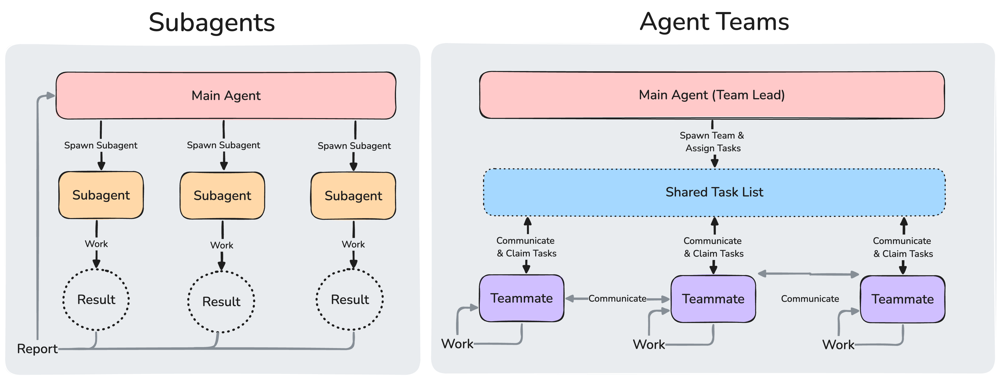
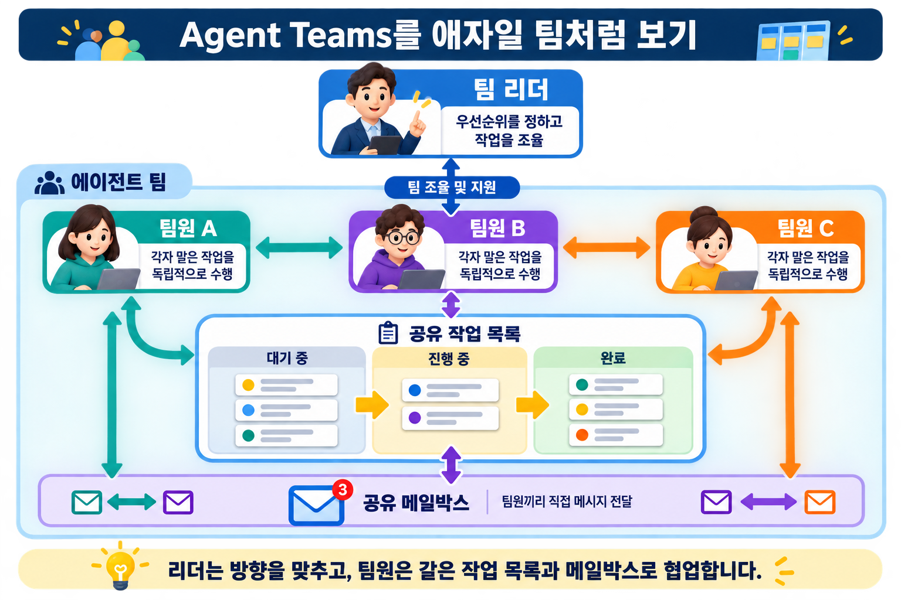
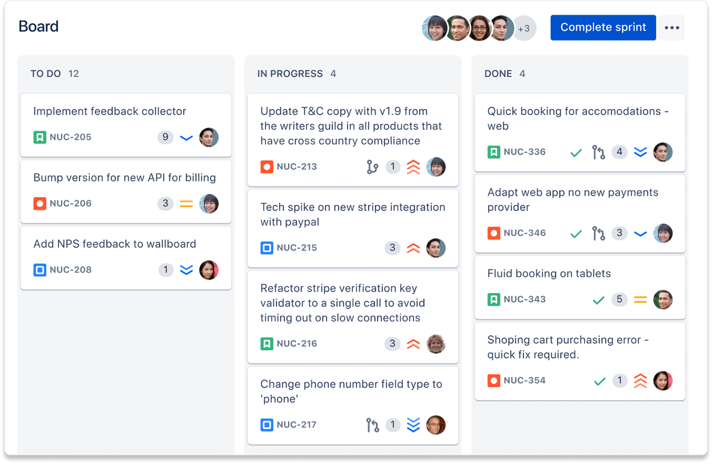

# Agent Teams

<p class="ailab-title-subtitle">- 팀 리더와 팀원이 함께 작동하는 여러 세션</p>

Agent Teams는 여러 Claude Code 세션이 하나의 작업 목록을 공유하며 서로 직접 메시지를 주고받는 협업 방식입니다.

한 세션이 **팀 리더**를 맡아 작업을 나누고 결과를 종합하며, 나머지 **팀원**들은 각자의 컨텍스트 윈도우에서 독립적으로 작동합니다.

## 왜 필요한가?

[subagent](what-is-subagent.md)는 메인 에이전트에게 작업의 결과물을 보고할 뿐, subagent 간 통신을 할 수 없습니다.

subagent 기능으로는 문제를 여러 각도에서 살펴보며 토론을 하며 결론을 내릴 수 없습니다.

반면 Agent Teams는 팀원끼리 직접 메시지를 주고받을 수 있습니다.

병렬 탐색/작업의 효과성이 강조되는 작업일수록 Agent Teams 의 기능이 어울립니다.

- **연구 및 검토** : 여러 팀원이 문제의 다양한 측면을 동시에 조사한 후 서로의 발견을 공유하고 도전할 수 있습니다
- **새로운 모듈 또는 기능** : 팀원들이 각각 별도의 부분을 소유하면서 서로 간섭하지 않을 수 있습니다
- **경쟁하는 가설로 디버깅하기** : 팀원들이 다양한 이론을 병렬로 테스트하고 더 빠르게 답에 수렴합니다
- **교차 계층 조율** : 프론트엔드, 백엔드, 테스트에 걸친 변경 사항으로, 각각 다른 팀원이 소유합니다

에이전트 팀은 팀원간 조율을 하는 작업이 들어가기 때문에 단일 세션보다 훨씬 더 많은 토큰을 사용합니다.

Agent Teams는 팀원들의 R&R을 독립적으로 구성했을시 가장 잘 작동합니다.

순차적 작업, 동일 파일 편집, 또는 많은 종속성이 있는 작업의 경우 단일 세션이나 [subagent](what-is-subagent.md)가 더 효과적입니다.

## Subagent와 무엇이 다른가



두 방식 모두 작업을 병렬로 나누지만, 워커끼리 통신해야 하는지가 갈림길입니다.

|           | Subagents                   | Agent Teams 팀                    |
| :-------- | :-------------------------- | :------------------------ |
| **컨텍스트**  | 자신의 컨텍스트 윈도우; 결과는 호출자에게 반환됨 | 자신의 컨텍스트 윈도우; 완전히 독립적     |
| **통신**    | 메인 에이전트에게만 결과 보고            | 팀원들이 서로 직접 메시지 전송         |
| **조율**    | 메인 에이전트가 모든 작업 관리           | 자체 조율을 통한 공유 작업 목록        |
| **최적 용도** | 결과만 중요한 집중된 작업              | 논의와 협업이 필요한 복잡한 작업        |
| **토큰 비용** | 낮음 : 결과가 메인 컨텍스트로 요약됨        | 높음 : 각 팀원이 별도의 Claude 인스턴스 |

## 구성 요소

에이전트 팀은 다음으로 구성됩니다.




Agent Teams 는 작업을 칸반으로 방식으로 관리합니다.

> 칸반(Kanban)이란? 업무 상태를 시각적으로 표현하고 관리하여 작업 효율성을 높이는 프로젝트 관리 방법론입니다.

> Atlassian 사의 kanban 이 대표적인 예 입니다.
> 

Agent Teams의 작업은 **대기 중 / 진행 중 / 완료** 중 하나의 상태를 가집니다.

작업끼리 의존 관계를 가질 수도 있어서, 앞 작업이 끝나지 않으면 뒤 작업을 요청할 수 없습니다.

## 활성화 방법

`CLAUDE_CODE_EXPERIMENTAL_AGENT_TEAMS` 환경 변수를 `1`로 설정하면 켜집니다.

shell 의 환경변수나 `settings.json` 설정 파일에 넣습니다.

```json
{
  "env": {
    "CLAUDE_CODE_EXPERIMENTAL_AGENT_TEAMS": "1"
  }
}
```

켠 뒤에는 자연어로 원하는 작업과 팀원 구성을 설명하면 됩니다.

```text
기업가치를 저평가/적정/고평가로 판정하려고 합니다.

세 팀원을 만들어 다른 각도에서 조사하세요:
- 정량 지표(재무제표·주가배수)를 분석하는 팀원
- 정성 자료 (애널리스트 리포트·뉴스)를 분석하는 팀원
- 두 팀원의 결론에 근거 부족을 파고들며 반박하는 팀원.
```

세 역할이 서로 기다리지 않고 독립적으로 조사할 수 있고, 마지막 팀원이 앞 두 팀원의 결론에 직접 반박하므로 이 예시가 잘 맞습니다.

## Agent Teams 사용시 참고할 점

### Agent Teams가 subagent보다 토큰 소모가 큽니다

팀원마다 별도의 컨텍스트 윈도우를 쓰므로 토큰 비용이 팀원 수만큼 늘어납니다.

일상적인 작업이라면 단일 세션이나 [subagent](what-is-subagent.md)가 더 경제적입니다.

### 팀원은 리더의 대화 기록(context)를 이어받을 수 있나요?

**팀원은 생성될 때 CLAUDE.md·MCP 서버·skill 같은 프로젝트 컨텍스트는 그대로 로드하지만, 리더가 그때까지 나눈 대화 기록은 넘겨받지 못합니다.**

그래서 팀원을 만드는 프롬프트에 작업에 필요한 세부 사항을 직접 적어 줘야 합니다.

### 세션 하나에 팀을 하나만 만들 수 있습니다.

세션은 하나의 팀만 구성이 가능하며, 리더만 팀원을 가질수 있고, 팀원은 자신만의 팀원을 만들지 못합니다.

즉, **계층적 위계 구조는 구조적으로 막아놓았습니다.**

물론, 이를 우회하여 계층적으로 위계 구조를 구성하는 것이 가능합니다만, 조직의 위계 구조가 깊어질 수록 계층간 의도 전달이 안되는 문제가 발생합니다.

### 팀 리더와 팀원간 메세지를 지속적으로 주고 받으려면?

agent teams 기능을 이용하여 팀 리더가 팀원을 spawn 한 이후, 팀원의 작업이 끝나면 팀원 세션은 비활성화 되고, 이후에 메세지를 수신할 수 없습니다.

이를 방지 하기 위해서는 팀 리더 / 팀원 모두 세션을 활성화 시킨 상태에서 작업을 하도록 해야 합니다.

이렇게 구성해 놓으면, 구성원 간 메일박스를 통해 송/수신한 모든 메세지들을 확인하는 것도 가능합니다.

## 제한 사항

Agent Teams는 실험적 기능이라 다음 제약이 남아 있습니다.

- 세션을 재개해도 팀원은 복원되지 않습니다. 리더에게 새 팀원을 다시 만들도록 요청해야 합니다.
- 팀원이 작업을 완료로 표시하지 못해 뒤 작업이 막힐 수 있습니다.
- 팀원 종료는 현재 턴이 끝난 뒤에 이뤄져 시간이 걸릴 수 있습니다.
- 리더는 세션이 끝날 때까지 고정됩니다. 팀원을 리더로 바꾸거나 리더십을 넘길 수 없습니다.

## 실습해보기

지금까지 설명한 개념을 직접 실습해 볼 수 있는 예제가 [`examples/agent-teams-practice/`](https://github.com/<GITHUB_OWNER>/<REPOSITORY>/tree/main/examples/agent-teams-practice)에 있습니다.

이 예제는 앞서 다룬 "경쟁하는 가설로 디버깅하기" 시나리오를 재현합니다. 서로 무관한 버그 세 개가 든 작은 Python 모듈을 두고, 팀원 세 명이 각자 다른 함수를 맡아 병렬로 원인을 조사합니다.

| 팀원 | 담당 | model | effort |
|---|---|---|---|
| A | 경계값 문제 | Haiku | low |
| B | 부동소수점 비교 문제 | Sonnet | medium |
| C | 상태 공유 문제 + A·B 결론 반박 | Opus | high |

model은 `.claude/agents/`에 미리 정의해 둔 팀원 유형의 `model` 필드로 지정합니다.

effort는 다릅니다 - 팀원은 생성 시점에 리더의 effort를 그대로 상속받고, 정의 파일이나 스폰 프롬프트로 개별 지정할 수 없습니다. 팀원마다 다른 effort를 쓰려면 팀원을 만든 뒤 각 팀원 세션에 직접 들어가 `/effort`로 이후 턴의 effort를 설정합니다.

자세한 실행 순서와 관찰 포인트는 `examples/agent-teams-practice/README.md`에서 다룹니다.

아래는 이 실습을 실제로 진행한 녹화본입니다.

<div class="ailab-asciinema" data-cast="../media/concepts/agent-team-demo2.cast" data-start-at="0:00"></div>
