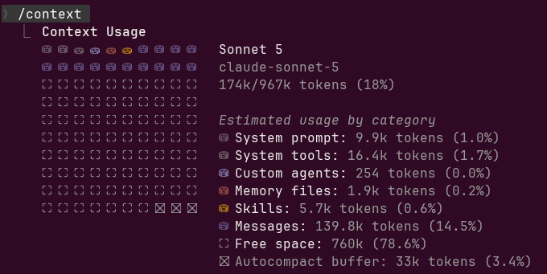

# Context 란?

Context는 AI 가 한 턴의 응답을 만들때 참고하는 내용을 말합니다.

> 사용자와의 대화 기록

> 사용자가 첨부한 파일

> AI 가 답변한 출력

> 작업 지침 파일(CLAUDE.md) 등, 자동 메모리, 로드된 skill, 시스템 지침

위 모든 것들이 context 에 해당 합니다.

그리고 그 context 들이 담긴 공간을 **Context Window**라 부릅니다.

## Context를 관리하는 것이 왜 중요한가

Context Window는 유한합니다. 작업이 진행될수록 이 공간은 채워집니다.

한계에 가까워지면 Claude Code는 먼저 이전 도구 출력을 지우고, 그래도 부족하면 대화를
요약(compact)합니다.

이 과정에서 요청과 핵심 코드는 남지만, **대화 초반의 자세한 지침은 사라질 수 있습니다.**

그래서 계속 지켜야 할 규칙은 대화에 두지 않고 파일에 넣습니다 -
[CLAUDE.md](../claude-code/claude-md-placement.md)가 그것입니다.

## 무엇이 들어가는가 - Context layer

Context는 사용 목적에 따라 나뉘어 관리됩니다.

Claude Code는 **로딩 시점과 비용에 따라 다른 레이어**로 컨텍스트를 나눠 관리합니다.

| 레이어 | 로딩 시점 | 컨텍스트 비용 | 용도 |
|---|---|---|---|
| **CLAUDE.md** | 세션 시작 | 매 요청마다 | 항상 지켜야 할 규칙 |
| **rules** | 규칙에 따라 시작 또는 조건부 | 조건에 따라 다름 | 경로별 규칙 |
| **Skill** | 요청 또는 자동 로드 | 필요할 때만 | 참조 자료, 워크플로우 |
| **Subagent** | 호출 시 | 격리된 별도 컨텍스트 | 대량 탐색 |
| **Hook** | 이벤트 발생 시 | 0 (출력 반환 시만) | 결정론적 강제 |
| **MCP** | 도구 호출 시 | 필요할 때 | 외부 데이터·시스템 연결 |

이 밖에 대화 이력과 도구 결과가 계속 쌓이게 되는데, 이것이([multi turn 대화](../claude-code/turn-concept.md#turn마다-컨텍스트가-쌓이는-방식)) Context Window를 실제로 채우는
가장 큰 몫을 차지합니다.

관련 개념은 [Skill](what-is-skill.md)과 [MEMORY.md](memory-md.md)에서 각각 이어집니다.

레이어를 언제/어디에/어떻게 배치할지는 [Context Engineering 심화](context-engineering.md)에서 다룹니다.

### 현재 세션에서 Context 확인하는 방법

- `/context` 명령을 통해 실제 context window 를 구성하는 요소들을 볼 수 있습니다.
- Sonnet5 를 기준으로, session 에 주어진 context window 는 967k 토큰임을 알 수 있습니다.
- 이 중 사용자가 제어할 수 있는 것과 제어할 수 없는 것을 구분하면 다음과 같습니다.

|          | 구성 요소 | 설명 |
|---|---|---|
| **제어 가능** | Custom agents (서브에이전트) | 사용자가 직접 정의·추가한 서브에이전트. 안 쓰면 비용 0 |
| | Memory files | CLAUDE.md, 자동 메모리 등 - 내용을 직접 작성·삭제 가능 |
| | Skills | 필요한 것만 로드되도록 구성 가능, 안 쓰는 skill은 제거 가능 |
| | Messages (대화·첨부파일) | 무엇을 물어보고 무엇을 붙여넣는지는 사용자 선택. `/compact`, `/clear`로 직접 정리도 가능 |
| **제어 불가능** | System prompt | Claude Code 자체 지침. 매 요청 고정 비용, 수정 불가 |
| | System tools | 기본 제공 도구의 이름·설명·스키마. 항상 로드됨 |
| | Autocompact buffer | 한계 도달 시 요약을 위해 Claude Code가 예약해두는 여유분. 크기 고정 |
| **간접적으로만 제어** | Free space | 위 항목들이 얼마나 채우는지에 따라 자동으로 정해지는 잔여 공간 (직접 조절 대상이 아니라 결과값) |

**System prompt·System tools·Autocompact buffer**는 Claude Code가 세션마다 고정으로 잡아두는 "고정비"

**Custom agents·Memory files·Skills·Messages**는 사용자가 무엇을 만들고 무엇을 대화에 넣는지에 따라 실시간으로 늘어나는 "가변비"입니다.

컨텍스트를 아낄 수 있는 방법은 후자(**Custom agents·Memory files·Skills·Messages**)를 관리하는 게 유일합니다.

토큰 절감 기법에 관한 사항은 [토큰 절약 기법](../reference/token-saving.md)에서 다룹니다.
