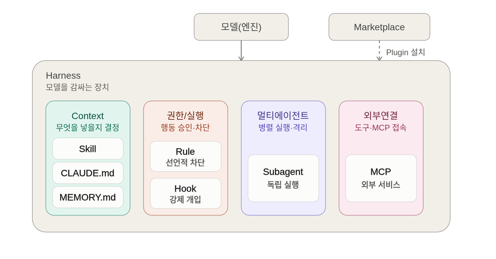

# Harness란 무엇인가?

하네스(Harness)는 말에게 채우는 마구(고삐·안장 등)를 의미합니다.

최근에는 인공지능(AI) 분야에서도 자주 쓰이는 용어가 되었는데, 인공지능 모델(LLM) 을 사용자가 원하는 방향으로 조작하기 위한 방법으로 이해하시면 됩니다.

## Harness 구성 요소

본 과정에서는 Claude Code 에서 제공하는 기능을 토대로 크게 4개 측면에서 개념을 익히고 이를 토대로 실습을 해보도록 하겠습니다.

## Claude Code 에서 다루는 하네스 범위

실제로 사용자가 통제하는 "하네스"들입니다.

상세는 [터미널 기능 총정리](../claude-code/terminal-features.md) 를 참고하세요.

| 작업 범위 | 구체적인 조작 |
|---|---|
| 조작 · 세션 | 실행/재개(`-c` / `-r`) · 포크, plan mode, 작업 폴더 경계 |
| 권한 · 샌드박스 | 권한 모드(default · acceptEdits · plan · bypass), 도구 on/off, 파일 · 네트워크 격리 |
| 모델 · 자원 | 모델 선택 · 폴백, effort level, 토큰 · 컨텍스트 예산(`/status` · `/context`), auto-compact |
| 확장 · 전파 | Plugin(skill · agent · hook · MCP 번들) · 마켓플레이스 |

## `.claude/` directory 미리 살펴 보기

[claude directory 구조 살펴보기 →](../claude-code/assets/dot-claude-directory-simulator.html){ .md-button .md-button--primary }
