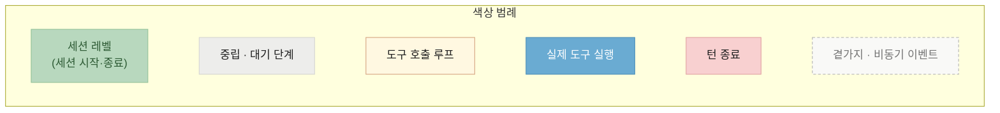
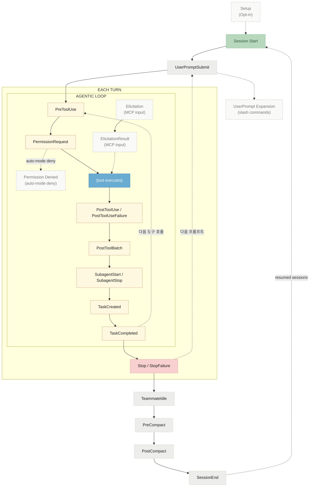
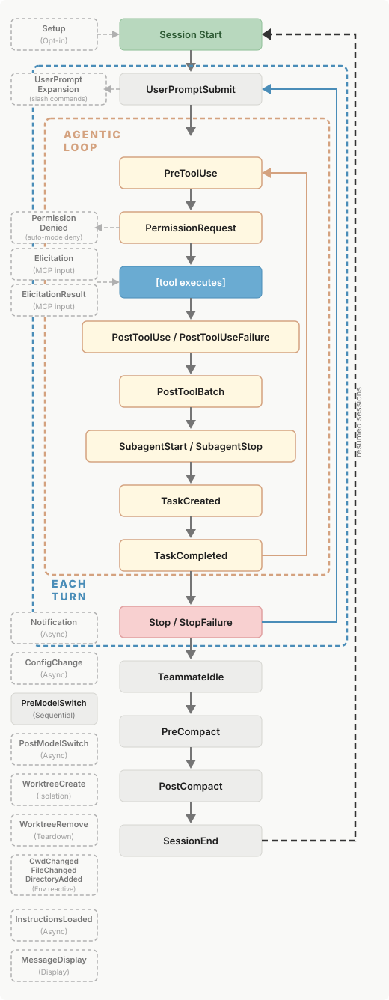
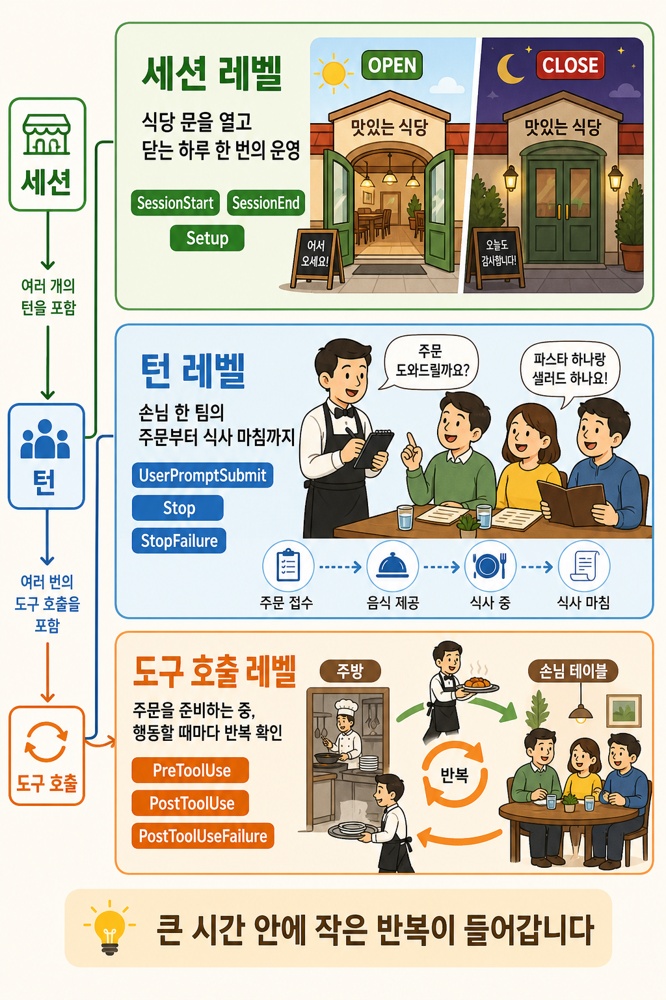
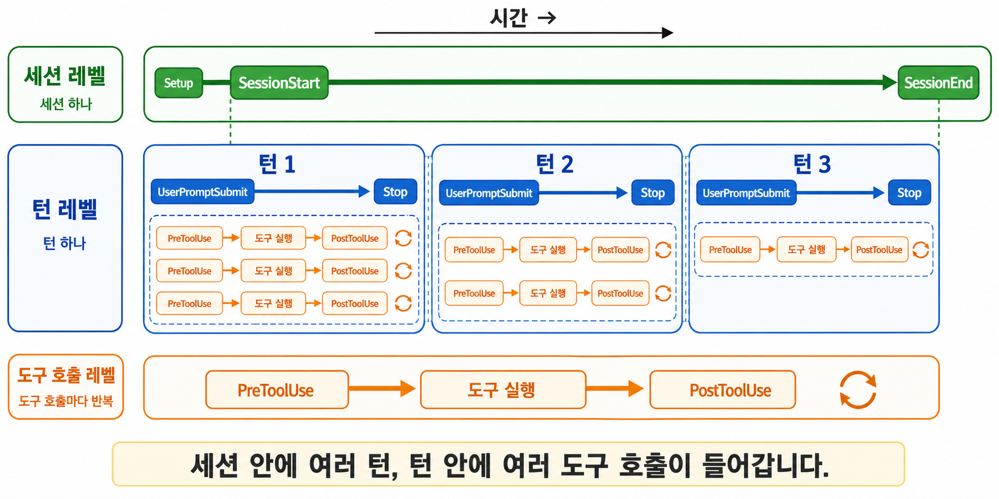
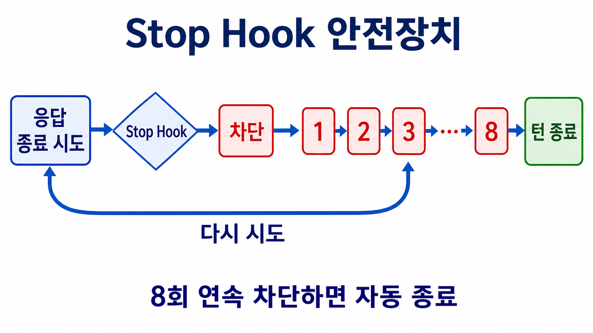

# Hook

<p class="ailab-title-subtitle">- 정해진 시점에 끼어드는 자동 실행</p>

Hook은 에이전트 수명주기의 정해진 시점에 자동으로 실행되는 스크립트입니다.

도구를 부르기 직전, 응답을 끝낼 때처럼 특정 시점이 오면 Claude Code가 등록된 훅을 실행합니다.

이 페이지는 훅의 정의와 이벤트 종류를 다룹니다.

## 왜 필요한가

모델의 능력에만 기대면 작업물의 방향은 의도치 않은 방향으로 흘러갈 수 있습니다.

hook은 그 규칙을 코드로 못 박아 실행 흐름에 끼워 넣습니다.

hook은 크게 세 가지 일을 합니다.

- **자동 검증** - 도구가 실행된 뒤 결과를 검사합니다. 포맷터나 테스트를 자동으로 돌립니다.
- **차단** - 위험한 도구 호출을 실행 전에 막습니다. 보호 대상 파일 편집을 거부합니다.
- **되먹임** - 검사에서 걸린 이유를 Claude 에게 돌려주어 스스로 고치게 합니다.

## hook lifecycle

색마다 무엇을 뜻하는지는 아래 범례에서 확인합니다.





위 그림은 hook의 실행 주기를 도식화 시킨 것입니다.

<details markdown="1">
<summary>원문 이미지 펼치기 - hooks-lifecycle.svg</summary>

</details>


## 이벤트 계층에 따른 hook 구분

hook은 특정 이벤트에 연결되어 그때만 실행됩니다

**어느 단위마다 반복되는가**를 기준으로 이벤트의 계층이 나뉩니다.



| 계층 | 반복 단위 | 대표 이벤트 |
|---|---|---|
| 세션 레벨 | 세션 시작·종료 시 한 번 | `SessionStart` · `SessionEnd` · `Setup` |
| 턴 레벨 | 사용자 프롬프트 하나당 한 번 | `UserPromptSubmit` · `Stop` · `StopFailure` |
| 도구 호출 레벨 | 턴 안 에이전트 루프에서 도구를 부를 때마다 | `PreToolUse` · `PostToolUse` · `PostToolUseFailure` |

## 계층 별 hook 호출 timeline



## 이 외 event 들

나머지 이벤트도 이 세 계층 어딘가, 또는 그 바깥의 더 세부적인 단위에 속합니다.

- **서브에이전트 레벨** - `SubagentStart` · `SubagentStop`. subagent 하나가 시작하거나 끝날 때 걸립니다.
- **태스크 레벨** - `TaskCreated` · `TaskCompleted`. TodoWrite로 만든 할 일 항목 하나가 생기거나 끝날 때 걸립니다.
- **환경 변화 이벤트** - `FileChanged` · `CwdChanged` · `ConfigChange` · `WorktreeCreate`/`WorktreeRemove` · `Notification` 등. 턴이나 도구 호출의 순서와 무관하게, 파일·작업 폴더·설정처럼 환경이 바뀌는 순간 비동기로 걸립니다.

교안 범위에서 전부 다루지는 않지만, 훅 이벤트가 세 개뿐이 아니라 계층별로 나뉜다는 점은 알아 두세요.

## 실제 동작하는 사례 보기

여러분들이 보고 계신 이 교안도 claude code로 작성했습니다. 작성을 하며 hook 이 필요한 시점이 있었는데요.

[1.저장소의 hook setting](https://github.com/<GITHUB_OWNER>/<REPOSITORY>/blob/main/.claude/settings.json)
과
[2.hook script](https://github.com/<GITHUB_OWNER>/<REPOSITORY>/tree/main/.claude/hooks)
에 관련 세팅이 들어가 있습니다.

코드를 설명 하면 다음과 같은 설정이 들어가 있음을 알 수 있습니다.
- `Edit|Write|MultiEdit|NotebookEdit` 등의 작업이 일어나면 `.claude/hooks/block-finalized.py` hook script 가 실행되도록 해라.
- `Edit|Write|MultiEdit` 등의 작업이 일어나면 `.claude/hooks/sync-finalized.py`  hook script 가 실행되도록 해라.

<details class="ailab-code" markdown="1">
<summary>설정 예시 펼치기 - .claude/settings.json</summary>

<div class="ailab-code-window">
<div class="ailab-code-titlebar">
<span class="ailab-code-dots"><span></span><span></span><span></span></span>
<span class="ailab-code-filename">.claude/settings.json</span>
</div>

```json
{
  "hooks": {
    "PreToolUse": [
      {
        "matcher": "Edit|Write|MultiEdit|NotebookEdit",
        "hooks": [
          {
            "type": "command",
            "command": "python3 \"$CLAUDE_PROJECT_DIR/.claude/hooks/block-finalized.py\""
          }
        ]
      }
    ],
    "PostToolUse": [
      {
        "matcher": "Edit|Write|MultiEdit",
        "hooks": [
          {
            "type": "command",
            "command": "python3 \"$CLAUDE_PROJECT_DIR/.claude/hooks/sync-finalized.py\""
          }
        ]
      }
    ]
  }
}
```

</div>
</details>

교안을 집필 하며 hook 을 왜 넣었을까요?

- github page 기반으로 교안 작업을 하며, 이미 검수/집필이 끝난 문서와 그렇지 않은 문서들이 있었습니다.

- 사용자(사람) 입장에서는 검수가 끝난 페이지는 더 이상 ai 가 건드리지 않았으면 좋겠는데 자꾸 건드리는 문제가 발생함.

- 위 상황을 막기 위해, 검수가 끝난 페이지는 별도로 관리하여(`FINALIZED.md`) 사용자(사람)가 검수를 끝내면 더 이상 해당 페이지를 AI 가 수정하지 못하도록 하길 원했습니다.

이후 hook 을 만들기 위해서 실제로 한 작업은 Claude Code 에서 다음과 같은 prompt 를 집어넣은게 전부입니다.

```
검수 끝난 문서를 AI 가 계속 다시 건드리는 문제가 있어. 이걸 방지하기 위한 hook 을 만들어줘.
프로젝트 내 모든 md 확장자 파일을 FINALIZED.md 에 남겨줘.
hook 은 FINALIZED.md 에 올라간 문서는 수정하지 못하게 막아줬으면 좋겠어.
```


## (심화) 훅을 실행하는 방식 - 다섯 가지 유형

!!! note "지금은 건너뛰어도 됩니다"
    훅으로 셸 스크립트 말고 다른 것도 실행하고 싶을 때 필요합니다. 처음에는 셸 명령 하나만 알면 충분합니다.

훅이 "언제" 걸리는지가 이벤트라면, "무엇을 실행하는지"에도 종류가 있습니다.

가장 흔한 것은 셸 명령을 돌리는 방식입니다.

하지만 그 밖에도 실행할 수 있는 대상이 있어, 모두 다섯 가지 유형이 있습니다.

- **셸 명령**(`command`) - 컴퓨터에 직접 명령을 내리는 방식입니다. 스크립트 한 줄을 돌립니다.
- **HTTP 요청**(`http`) - 외부 서버에 신호를 보내는 방식입니다. 예를 들어 사내 시스템에 알림을 띄웁니다.
- **MCP 도구**(`mcp_tool`) - Claude Code 에 연결해 둔 외부 도구를 불러 쓰는 방식입니다.
- **프롬프트 평가**(`prompt`) - 상황을 문장으로 물어보고 그 판단으로 거를지 정하는 방식입니다.
- **서브에이전트 판단**(`agent`) - 별도의 보조 에이전트에게 판단을 맡기는 방식입니다.

이름과 괄호 안 값은 설정 파일에 그대로 적는 식별자입니다.

## (심화) Stop 훅이 무한 반복에 빠지지 않는 이유

!!! note "지금은 건너뛰어도 됩니다"
    `Stop` 훅을 직접 만들어 턴을 막아 볼 때 알아 두면 되는 안전장치입니다.

`Stop` 훅은 응답을 끝내려 할 때마다 걸려 턴을 막을 수 있습니다.

그러면 "막을 때마다 다시 막혀서 작업이 영영 안 끝나는 것 아니냐"는 걱정이 생깁니다.

Claude Code 에는 이를 막는 안전장치가 있습니다.

`Stop` 훅이 아무 진전 없이 8번 연속 차단하면 Claude Code 가 자동으로 훅을 무시하고 턴을 끝냅니다.

이 8번이라는 상한을 더 올리고 싶으면 `CLAUDE_CODE_STOP_HOOK_BLOCK_CAP` 환경변수로 값을 바꾸세요.

환경변수란 프로그램이 참고하는 설정값을 컴퓨터에 미리 적어 두는 것을 말합니다.

한 가지 더 있습니다.

훅 스크립트는 `stop_hook_active` 라는 신호를 확인할 수 있습니다.

이 신호는 "지금 Stop 훅 때문에 다시 멈춘 상황"임을 알려 줍니다.

훅이 이 신호를 보고 스스로 일찍 물러나면, 8번을 다 쓰기 전에 빠르게 포기해 불필요한 반복을 줄입니다.



## (심화) 세션을 이어갈 때 훅은 어떻게 동작하는가

!!! note "지금은 건너뛰어도 됩니다"
    세션을 이어가거나(`--continue`·`--resume`) 분기(fork)할 때 어떤 훅이 다시 걸리는지 헷갈릴 때 필요합니다.

계층에 따라 재실행 여부가 갈립니다.

턴 중간에 걸리는 이벤트(`PostToolUse`, `UserPromptSubmit` 등)는 다시 실행되지 않고, 저장해 둔 값을 그대로 재생합니다.

반면 `SessionStart` 훅은 세션을 이어가거나 분기할 때 다시 실행됩니다.

세션 레벨 이벤트와 턴·도구 호출 레벨 이벤트가 재시작 시 서로 다르게 취급된다는 것은, 이 둘이 애초에 다른 계층이라는 뜻입니다.

## 더 보기

- [Loop Engineering](loop-engineering.md) - Hook 과 에이전트 루프를 심화로 다룹니다.
- [Rule](what-is-rule.md) - 훅과 함께 규칙을 강제하는 또 다른 수단입니다.
- [권한 모드와 슬래시 명령](../claude-code/permissions-and-commands.md) - 훅이 맞물리는 권한 체계입니다.
