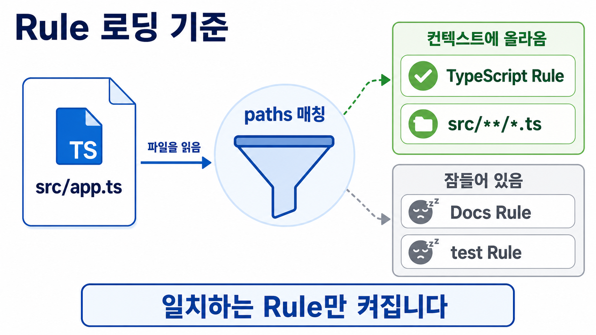

# Rule

<p class="ailab-title-subtitle">- 조건에 맞을 때 적용되는 지침</p>

Rule은 조건이 맞을 때만 컨텍스트에 올라오는 지침입니다.

Rule 을 사용하기 위해서는 사용자는 지침 파일들을 `.claude/rules/` 폴더 안에 주제별 Markdown 파일로 나눠 두어야 합니다.

[CLAUDE.md](../claude-code/claude-md-placement.md)는 항상 로드되는 지침이고, Rule은 **특정 상황에서만** 적용할 지침을 따로 떼어 두는 자리입니다.

## 왜 필요한가

사용자가 지침을 전부 CLAUDE.md에 넣으면 파일이 길어집니다.

파일이 길어지면 컨텍스트 비용도 매 요청마다 늘어납니다.

그런데 어떤 규칙은 특정 파일에서만 의미가 있습니다.

예를 들어

- 테스트 작성 규칙은 사용자가 테스트 파일을 만질 때만 필요합니다.
- 계약서 검토 규칙은 법무 담당자가 계약서 파일을 만질 때만 필요합니다.
- 광고 카피 톤 규칙은 마케터가 캠페인 문구를 만질 때만 필요합니다.
- 견적서 작성 규칙은 영업 담당자가 견적서 파일을 만질 때만 필요합니다.
- 채용 공고 문구 규칙은 HR 담당자가 채용 공고 파일을 만질 때만 필요합니다.
- 발표 자료 서식 규칙은 기획자가 슬라이드 파일을 만질 때만 필요합니다.

사용자가 이런 규칙을 Rule로 옮기면, 그 상황이 아닐 때는 규칙이 컨텍스트를 차지하지 않습니다.

즉 Rule은 **"항상 필요하지는 않은 지침"을 조건부로 관리하는 수단**입니다.

## CLAUDE.md와 무엇이 다른가

CLAUDE.md와 Rule은 둘 다 지침 파일이지만, 로드되는 시점이 다릅니다.


| | CLAUDE.md | Rule (`.claude/rules/`) |
|---|---|---|
| 로딩 | 세션 시작 시 항상 | 조건에 따라 다름 |
| 범위 | 프로젝트 전체 | `paths`로 특정 파일·상황에 한정 가능 |
| 용도 | 모든 세션에서 지켜야 할 사실 | 특정 파일을 만질 때만 필요한 규칙 |

## 요약

- paths 없는 Rule → CLAUDE.md처럼 세션 시작 시 무조건 로드됩니다.
- paths 있는 Rule → 세션 시작 시엔 context window 에 로드 되지 않습니다. Claude가 그 패턴에 매칭되는 파일을 실제로 열 때만 그 시점에 컨텍스트로 들어옵니다.


## (심화) `paths` 유무에 따른 로딩 시점

!!! note "지금은 건너뛰어도 됩니다"
    이 절은 사용자가 Rule을 "특정 파일을 만질 때만" 켜지도록 세밀하게 조절하고 싶을 때 필요합니다.

    개념만 익히는 단계라면 이 절은 건너뛰어도 됩니다.

Rule 파일 맨 위에는 그 파일의 설정을 적어 두는 칸이 있습니다.

**이 칸을 frontmatter라고 부릅니다.**

- frontmatter 예시

```yaml
---
paths:
  - "src/**/*.{ts,tsx}"
---
```

사용자가 frontmatter에 `paths`라는 항목을 적었는지 아닌지에 따라, context loading 조건이 갈립니다.

`paths`가 없는 Rule은 세션 시작 시 무조건 로드됩니다.

이런 Rule은 항상 켜져 있으므로, 사용자가 CLAUDE.md를 여러 파일로 쪼갠 것과 같은 효과를 냅니다.

`paths`가 있는 Rule은 Claude가 거기 적힌 파일을 읽을 때만 켜집니다.

사용자는 `paths:` 아래에 "어떤 파일에 적용할지"를 파일 경로의 패턴으로 적습니다.

사용자는 이때 쓰는 패턴 문법을 glob이라고 부릅니다.

예를 들어 `*`는 "이름 아무거나"를 뜻하고, `**`는 "몇 단계든 하위 폴더"를 뜻합니다.



중괄호 `{ts,tsx}`는 "이 안의 것 중 아무거나"라는 표기입니다. 사용자가 `{ts,tsx}`라고 쓰면 이 표기는 `.ts` 파일과 `.tsx` 파일을 모두 가리킵니다.

위 예시의 `src/**/*.{ts,tsx}`는 "`src` 폴더 아래(몇 단계든)에 있는 `.ts`·`.tsx` 파일 전부"를 뜻합니다.

그래서 Claude는 이 Rule을 `src` 아래 TypeScript 파일을 읽을 때만 컨텍스트에 올립니다.

사용자는 사용자 수준 규칙을 `~/.claude/rules/`에 둡니다.

이 위치는 프로젝트 폴더가 아니라 개발자 컴퓨터의 개인 폴더이며, 사용자가 그 컴퓨터에서 여는 모든 프로젝트에 함께 적용됩니다.

지침이 실제로 어떻게 적용되는지, 권한과 명령의 관계는 [권한 모드와 슬래시 명령](../claude-code/permissions-and-commands.md)에서 이어집니다.
