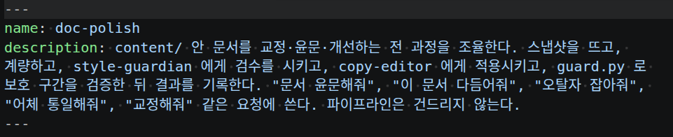
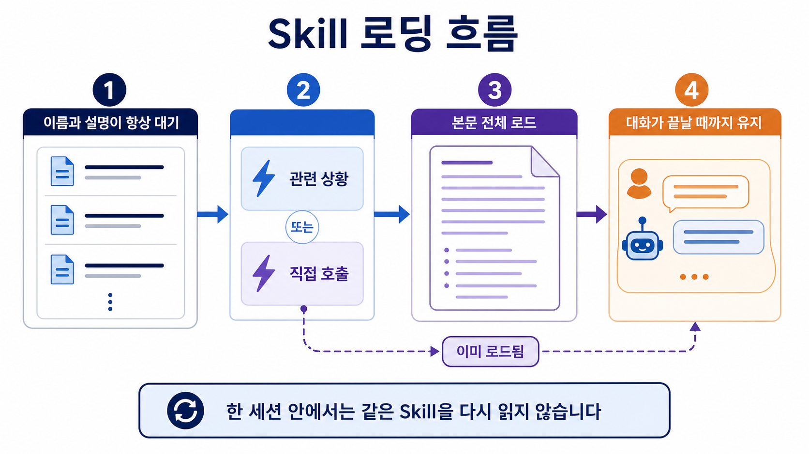

# Skill 개념

<p class="ailab-title-subtitle">- 필요할 때 불러오는 능력</p>

Skill은 특정 작업을 더 잘 수행하도록 Claude에게 미리 정리된 노하우와 절차를 담아준 문서 묶음으로, 문서 작성이나 데이터 분석처럼 반복되는 업무 방식을 표준화해둔 것입니다.

예를 들어 **주간보고 PPT 만들기** Skill을 만들어두면, Claude가 매번 처음부터 방법을 고민하지 않고 그 안에 적힌 규칙(글씨체, 슬라이드 구성 순서 등)을 그대로 따라 작업합니다.

만드는 절차는 이 문서의 [파일 구성과 배치 위치](#파일-구성과-배치-위치)와 [만드는 절차](#만드는-절차)에서 다룹니다.


## 왜 필요한가

지침을 전부 항상 컨텍스트에 올려 두면 토큰이 낭비됩니다.

긴 참조 자료일수록 낭비가 큽니다.

Skill은 본문을 **사용할 때만 로드**합니다.

그래서 긴 참조 자료도 필요할 때까지는 비용이 거의 들지 않습니다.

또 하나의 이유는 재사용입니다.

자주 반복하는 작업 절차를 Skill로 묶으면, 매번 지침을 다시 적지 않아도 됩니다.

이름으로 부르거나 Claude가 알아서 꺼내 씁니다.

## 무엇으로 이루어지는가

Skill의 핵심은 `SKILL.md` 파일 하나입니다.

이 파일에 무엇을 하는 절차인지 지침으로 적습니다.

같은 디렉터리에 참조 파일(`template.md`, `examples/`, `scripts/` 등)을 둘 수 있습니다.

이 참조 파일들은 본문과 분리되어, 필요할 시에만 로드됩니다.

`SKILL.md`의 머리말에는 `description`을 적습니다.

`description`은 이 Skill이 무엇을 하고 언제 쓰는지를 밝힙니다.

Claude는 이 설명을 근거로 Skill을 자동으로 적용할지 판단합니다.

즉 `description`이 곧 트리거 역할을 합니다.

[교육생분들이 보고 계신 이 교안도 claude code 를 통해 만들었습니다. 만들면서 재사용되는 작업 흐름들은 skill 화 시켜놓았습니다.](https://github.com/<GITHUB_OWNER>/<REPOSITORY>/tree/main/.claude/skills)

이 중 `doc-polish` 라는 skill 이 있는데, 윤문을 하는 작업을 수행합니다.



## 언제 로드되는가

Skill 목록(이름과 설명)은 컨텍스트에 상시 존재합니다.

관련 상황이 오면, 또는 `/skill-name`으로 직접 부르면 그때 본문 전체가 로드됩니다.

skill 이 호출된 후 전체 파일이 로드 된 이후에 어떻게 돌아가는지는 아래 심화에서 자세히 다룹니다.

## 파일 구성과 배치 위치

Skill은 폴더 하나로 이뤄집니다.

`SKILL.md`만 필수이고, 참조 자료·스크립트는 지원 파일로 분리해 필요할 때만 로드하게 합니다.

```
skill-name/
  SKILL.md        # 필수 - 지침 본문
  template.md     # 선택 - 지원 파일
  examples/       # 선택
  scripts/        # 선택
```

배치 위치에 따라 적용 범위가 달라집니다.

| 위치 | 경로 | 적용 대상 |
|---|---|---|
| Enterprise | 관리 설정 | 조직 전체 |
| Personal | `~/.claude/skills/<name>/SKILL.md` | 모든 프로젝트 |
| Project | `.claude/skills/<name>/SKILL.md` | 이 프로젝트만 |
| Plugin | `<plugin>/skills/<name>/SKILL.md` | 플러그인 활성 위치 |

같은 이름이 겹치면 상위 배치 위치가 하위를 **Enterprise > Personal > Project** 순으로 재정의합니다.

사용자 정의 명령어(custom command)도 Skill로 병합되었습니다.

`.claude/commands/deploy.md`와 `.claude/skills/deploy/SKILL.md`는 똑같이 `/deploy`를 만듭니다.

## 만드는 절차

1. 배치 위치를 고릅니다. 이 프로젝트에서만 쓰면 `.claude/skills/<name>/`, 모든 프로젝트에서 쓰면 `~/.claude/skills/<name>/`에 폴더를 만듭니다.
2. 그 폴더에 `SKILL.md`를 만듭니다.
3. frontmatter에 `description`을 적습니다. Skill이 무엇을 하고 언제 쓰는지 쓰면 됩니다. Claude는 이 문구를 보고 자동 적용 시기를 판단합니다.
4. 본문에 따라 할 절차를 적습니다. 긴 참조 자료·스크립트는 지원 파일로 분리합니다.
5. `/skill-name`으로 직접 불러 동작을 확인합니다.

!!! important "`SKILL.md`는 500줄 이하로 쓰는 편이 좋습니다."

## 프롬프트로 간단히 만들기

위에 서술한 절차에 따라 skill 을 만들어도 되지만,

작업을 하며 반복되는 작업 흐름이 있다면,

```bash
내가 방금 한 작업을 skill 화 시켜줘
```

라고 프롬프팅을 해도 자동으로 만들어 줍니다.


## Subagent와의 차이

Skill은 기본적으로 주 대화 컨텍스트 안에서 인라인으로 실행됩니다.

격리된 컨텍스트에서 요약만 돌려받는 Subagent와 다른 지점입니다.

**재사용할 prompt나 workflow를 주 대화 안에서 쓰고 싶으면 Skill을**

**main context에 필요 없는 긴 출력을 따로 실행하고 싶다면 Subagent를 사용합니다.**

둘은 완전히 배타적이지 않습니다.

물론 Skill의 frontmatter 에 `context: fork`를 주면 Skill도 격리된 Subagent 컨텍스트에서 실행됩니다.

Subagent를 만드는 방법은 [Subagent 개념](what-is-subagent.md)을 보세요.


## (심화) SKILL 로딩은 내부적으로 어떻게 동작하는가

!!! note "건너뛰어도 무방합니다"
    이 절은 Skill이 언제, 얼마나 컨텍스트를 차지하는지 세부 동작이 궁금할 때만 읽으세요. 앞서 다룬 "언제 로드되는가"만으로도 개념 이해에는 충분합니다.

이 절에서는 Skill이 컨텍스트 윈도우(context window)에 들어오고 나가는 과정을 좀 더 들여다봅니다.



!!! important "Skill 목록은 항상 컨텍스트 윈도우에 로드되지만, 크기에는 상한이 있습니다."

    Skill 목록은 각 Skill의 이름(name)과 짧은 설명(description)을 이어 붙여 구성됩니다.

    시스템은 이렇게 이어 붙인 텍스트를 1,536자에서 잘라냅니다.

    이 문자 수 상한 덕분에, Skill 개수가 아무리 많아도 목록이 컨텍스트 윈도우를 끝없이 차지하지 않습니다.

    시스템은 정해진 토큰 예산 안에서 목록을 관리합니다.

!!! important "한 번 로드된 Skill 본문은 해당 세션이 끝날 때까지 컨텍스트 윈도우에 유지됩니다.""

    모델은 Skill 본문을 한 번 로드하면, 그 본문을 세션 내내 컨텍스트 윈도우에 유지합니다.

    책을 펼쳐 책상에 올려두면 대화가 끝날 때까지 펼쳐진 채로 있는 것과 같습니다.

    이 유지 방식 덕분에, 모델은 같은 세션 안에서 동일한 Skill을 다시 읽어 들일 필요가 없습니다.

!!! important "모델이 같은 Skill을 다시 호출해도 본문은 중복으로 쌓이지 않습니다.""

    모델이 한 세션 안에서 동일한 Skill을 재호출하면, 시스템은 본문 전체를 다시 컨텍스트 윈도우에 넣지 않습니다.

    대신 시스템은 "이미 로드됨"이라는 짧은 표시만 추가합니다.

    이 처리 방식은 동일한 내용이 컨텍스트 윈도우에 중복 적재되는 것을 방지합니다.

!!! important "자동 압축이 일어나면 Skill 본문은 일부만 남습니다"

    자동 압축(대화가 길어져 Claude가 오래된 내용을 요약해 자리를 비우는 과정) 시에는 각 Skill의 가장 최근 호출에서 처음 5,000토큰을 다시 붙입니다.

    이 과정은 다시 붙는 Skill들에 25,000토큰의 결합 예산을 나눠 배정하고, 예산을 넘는 오래된 것부터 버립니다.


## (심화) frontmatter 필드

- 아래 필드는 자동 호출을 막거나 쓸 도구를 좁히는 등 세밀하게 조정하고 싶을 때만 필요합니다.

frontmatter는 `SKILL.md` 맨 위에 두는 설정 칸입니다.

필드는 모두 선택이며, `description`만 권장입니다.

| 필드 | 하는 일 |
|---|---|
| `description` | Skill이 무엇을 하고 언제 쓰는지. Claude가 자동 적용 시기를 판단하는 근거입니다. 생략하면 본문 첫 문단을 쓰고, 1,536자에서 잘립니다. |
| `name` | Skill 이름 |
| `when_to_use` | 트리거 예시를 덧붙임 |
| `disable-model-invocation` | `true`면 Claude 자동 호출을 막고 사용자만 `/name`으로 호출 |
| `user-invocable` | `false`면 `/` 메뉴에서 숨겨 Claude만 호출 |
| `allowed-tools` · `disallowed-tools` | 쓸 수 있는 도구 제한 |
| `context: fork` | 격리된 Subagent 컨텍스트에서 Skill 실행 |
| `agent` | `context: fork` 시 쓸 Subagent 유형. 생략 시 `general-purpose` |
| `paths` | 경로 기반 자동 활성화 |
| `model` · `effort` · `hooks` · `arguments` · `argument-hint` | 모델·비용·훅·인자 제어 |

`disable-model-invocation: true`는 "Claude가 알아서 부르지 말고 내가 부를 때만 실행하라"는 뜻입니다.

`allowed-tools`는 이 Skill이 손댈 수 있는 도구를 몇 개로 좁히는 안전장치입니다.

대부분은 이런 필드 없이 `description`만으로 충분합니다.

이 필드들을 실제로 조합하면 어떤 모습인지, 예시 하나를 통째로 펼쳐 봅니다.

<details class="ailab-code" markdown="1">
<summary>코드 예시 펼치기 - pr-summary SKILL.md</summary>

<div class="ailab-code-window">
<div class="ailab-code-titlebar">
<span class="ailab-code-dots"><span></span><span></span><span></span></span>
<span class="ailab-code-filename">.claude/skills/pr-summary/SKILL.md</span>
</div>

```
---
name: pr-summary
description: 현재 PR의 변경 사항을 요약하고 리스크를 짚어준다. PR 리뷰 준비, diff 확인, 커밋 메시지 작성 시 사용.
when_to_use: >
  "이 PR 요약해줘", "뭐가 바뀌었어?", "리뷰 전에 diff 정리해줘" 같은 요청에서 트리거.
  파일 변경사항이 있는 git 저장소 안에서만 의미 있음.
disable-model-invocation: false
user-invocable: true
allowed-tools: Bash(gh *), Bash(git diff *), Read, Grep
disallowed-tools: Bash(git push *), Bash(git commit *)
context: fork
agent: Explore
paths: ["src/**/*.ts", "src/**/*.tsx"]
model: sonnet
effort: high
argument-hint: "[pr-number]"
arguments: [pr_number]
hooks:
  PreToolUse:
    - matcher: Bash
      hooks:
        - type: command
          command: echo "PR 요약 스킬 실행 중..."
---

## PR 컨텍스트

- PR diff: !`gh pr diff $pr_number`
- 변경된 파일: !`gh pr diff $pr_number --name-only`

## 작업 지시

위 diff를 바탕으로 PR #$pr_number 를 리뷰어 관점에서 요약하라:

1. **무엇이 바뀌었나** - 2~3문장 요약
2. **왜 바뀌었나** - PR 설명에서 동기 추출
3. **영향받는 파일** - 관심사별 그룹핑
4. **리스크 영역** - 꼼꼼히 봐야 할 파일/패턴
```

</div>
</details>


## (심화) 호출 권한과 로드 시점

!!! note "지금은 건너뛰어도 됩니다"
    "누가 이 Skill을 부를 수 있는가"를 나눠 정하고 싶을 때만 필요합니다. 기본값은 사용자와 Claude 모두 부를 수 있습니다.

앞의 몇몇 frontmatter 필드는 "누가 호출할 수 있는지"를 세분합니다.

조합에 따라 사용자만, Claude만, 또는 둘 다 부를 수 있게 나뉩니다.

표의 "컨텍스트 로드 시점"은 Skill의 설명·본문이 Claude의 작업 화면(컨텍스트)에 언제 올라오는지를 뜻합니다.

| frontmatter | 사용자 호출 | Claude 호출 | 컨텍스트 로드 시점 |
|---|---|---|---|
| (기본값) | 예 | 예 | 설명은 항상 컨텍스트에, 호출 시 전체 로드 |
| `disable-model-invocation: true` | 예 | 아니오 | 설명도 컨텍스트에 없음, 사용자가 호출할 때만 전체 로드 |
| `user-invocable: false` | 아니오 | 예 | 설명은 항상 컨텍스트에, 호출 시 전체 로드 |
