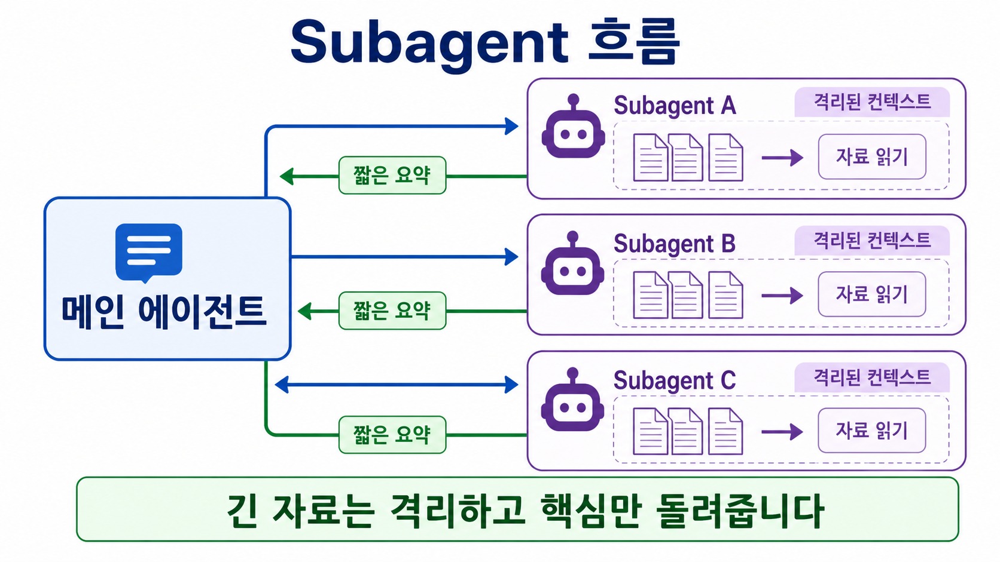
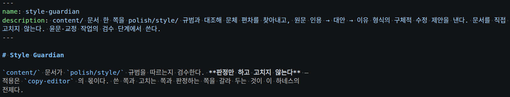

# Subagent 개념

- 격리된 병렬 일꾼

Subagent는 특정 유형의 작업을 **자신만의 격리된 컨텍스트에서 처리하고 결과를 반환합니다.**

메인 에이전트가 일감을 넘기면, subagent는 별도 컨텍스트에서 작업하고 결과 요약만 반환합니다.

장황한 중간 출력은 subagent 쪽에 남고 메인 대화로는 넘어오지 않습니다.

이 페이지는 subagent가 무엇이고 왜 필요한지를 다룹니다.

## 왜 필요한가

두 가지 이유가 핵심입니다 - **병렬 실행**과 **컨텍스트 격리**입니다.

**병렬 실행**

- task의 성격이 서로 독립적이라면 여러 subagent를 만들어 동시에 돌릴 수 있습니다.
- 한 명이 순서대로 처리하는 대신 여러 일꾼이 나눠 맡으면 전체 시간이 줄어듭니다.

**컨텍스트 격리**

- 대량 문서를 subagent가 읽고 요약만 반환하면 메인 컨텍스트가 오염되지 않습니다.
- 방대한 자료를 아랫사람이 대신 읽고 요약본 한 장만 올려주는 것과 같습니다.
- 컨텍스트 격리는 메인 에이전트의 컨텍스트를 아끼는 가장 강력한 레버 중 하나입니다.

## 언제 만드는가

메인 대화의 컨텍스트를 오염시키지 않고 검토·조사 같은 작업을 떼어 맡기고 싶을 때 subagent를 만듭니다.

선택 기준은 다음과 같습니다.

- **메인 대화에서 그대로 진행** - 여러 단계가 상당한 컨텍스트를 공유하는 경우.
- **subagent로 분리** - 작업이 메인 컨텍스트에 필요하지 않은 자세한 출력을 생성하는 경우.

즉 중간 과정의 장황한 출력이 메인 대화에 쌓이는 게 문제라면 subagent가 답입니다.

## md 파일을 두는 곳

subagent는 Markdown 파일 하나로 정의됩니다.

하나의 프로젝트에서만 쓸 subagent라면 프로젝트 디렉토리의 `.claude/agents/`에 subagent 을 만듭니다.

모든 프로젝트에서나 쓸 subagent 라면

Windows에서는 `%USERPROFILE%\.claude\agents\` 입니다.

즉 정리하면:

| OS | 경로 |
|---|---|
| Linux/Mac | `~/.claude/agents/` |
| Windows | `%USERPROFILE%\.claude\agents\` (예: `C:\Users\<사용자명>\.claude\agents\`) |

에 만듭니다.

같은 이름의 md 파일이 여러 곳에 있으면 우선순위가 높은 쪽이 이깁니다.

전체 위치와 우선순위는 아래 심화 항목에서 다룹니다.

## subagent 파일 구조

subagent의 md 파일 구조는 두 부분으로 나뉩니다.

교육생분들이 보고 계신 이 교안을 만들때 활용한 subagent 를 살펴보도록 하겠습니다.

[ai-advanced-lab subagents 보러가기 →](https://github.com/<GITHUB_OWNER>/<REPOSITORY>/tree/main/.claude/agents){ .md-button .md-button--primary }

이 중, [style-guardian.md](https://github.com/<GITHUB_OWNER>/<REPOSITORY>/blob/main/.claude/agents/style-guardian.md) 을 보면

파일 맨 위에는 기본 설정을 적는 frontmatter가 있고, 그 아래 본문에는 subagent에게 시킬 일을 설명하는 시스템 프롬프트를 씁니다.

frontmatter는 파일 첫머리에서 `---` 두 줄 사이에 적는 설정 영역입니다.

꼭 채워야 하는 항목은 `name`과 `description` 둘뿐입니다.

- `name` - subagent의 이름입니다.
- `description` - 이 subagent가 무엇을 하고 언제 쓰는지 적습니다.

`description`은 특히 중요합니다.

Claude가 이 문장을 읽고 작업을 맡길지 판단하기 때문입니다.

"무엇을 하는지"와 "언제 부르면 좋은지"를 구체적으로 적을수록 정확히 위임됩니다.

### (참고) tools 필드

이 외에도 frontmatter 부분에 `tools` 라는 필드가 있습니다.

해당 필드는 subagent 가 사용할 수 있는 도구들을 기술할 수 있습니다.

기본적으로 `tools`에 아무것도 적지 않으면, 메인 대화가 쓸 수 있는 모든 도구를 그대로 물려받습니다.

만약 subagent 를 **읽기 전용** subagent 로만 만들고 싶다면 `tools: Read, Grep, Glob`처럼 읽기 도구를 직접 적어야 합니다.

물론 모든 과정은 prompt 만으로 지시하여 생성할 수 있습니다.

## 만드는 절차

1. 위치를 정합니다. 이 프로젝트 전용이면 `.claude/agents/`, 공용이면 `~/.claude/agents/`에 `<이름>.md` 파일을 만듭니다.
2. frontmatter를 작성합니다. `name`과 `description`을 채웁니다. 적극적으로 위임되길 원하면 `description`에 **use proactively**(혹은 주도적으로, 적극적으로) 와 같은 문구를 넣습니다.
3. 도구 권한을 정합니다. 읽기 전용으로 묶을 거라면 `tools`를 명시합니다. 생략하면 전체 도구를 상속한다는 점을 기억합니다.
4. 시스템 프롬프트를 씁니다. frontmatter 아래 본문에 이 subagent가 할 일과 판단 기준을 적습니다.
5. 호출해 확인합니다. 아래 방법으로 불러 실제로 원하는 대로 동작하는지 봅니다.

## 부르는 방법 - 자동 위임과 명시적 호출

Claude는 요청의 작업 설명, subagent의 `description` 필드, 현재 컨텍스트를 근거로 알아서 작업을 위임합니다.

`description`이 잘 쓰여 있을수록 정확히 위임됩니다.

특정 subagent를 직접 지목하는 방법은 세 가지입니다.

- **자연어 지시** - "Use the code-reviewer subagent to..."처럼 이름을 부릅니다. 위임 여부는 Claude가 최종 판단합니다.
- **`@-mention` 기능 이용** - 프롬프트 창에서 `@<SUBAGENT 이름> 을 이용하여 ... XX` 와 같이 해당 subagent가 실행되도록 보장합니다.
- **세션 시작시 subagent 로 시작 전체** - claude 시작시 `claude --agent <subagent 이름>` 플래그나 `.claude/settings.json`의 `agent` 필드로 메인 스레드 자체가 그 subagent의 시스템 프롬프트·도구·모델을 쓰게 합니다.

## Skill과 subagent 중 무엇을 고를까

둘의 기본 차이는 실행 위치입니다.

**subagent는 격리된 컨텍스트에서 실행**되고, **[Skill](what-is-skill.md)은 메인 대화 컨텍스트에서 실행**됩니다.

재사용할 프롬프트나 워크플로우를 메인 대화 안에서 그대로 돌리고 싶다면 subagent 대신 Skill을 고려합니다.

둘이 완전히 배타적이지는 않습니다.

Skill에 `context: fork`를 주면 Skill도 격리된 컨텍스트에서 실행할 수 있고, subagent의 `skills` 필드로 skill 전문을 미리 주입할 수도 있습니다.

컨텍스트를 어떻게 나눌지는 [Context Engineering](context-engineering.md)에서 더 다룹니다.

## (심화) 무엇이 격리되고 무엇이 공유되는가

!!! note "지금은 건너뛰어도 됩니다"
    이 절은 subagent가 정확히 무엇을 물려받고 무엇을 못 보는지 따질 때 필요합니다.

subagent는 **새로운 격리된 컨텍스트 윈도우**로 시작합니다.

여기서 "컨텍스트 윈도우"란 에이전트가 한 번에 기억하고 있는 대화의 범위입니다.

"격리"는 대화 기록에 한정된 말이지, 프로젝트 규칙까지 못 본다는 뜻이 아닙니다.

무엇이 넘어오고 무엇이 넘어오지 않는지 독자가 구분해 두어야 오해가 없습니다.

| 구분 | 항목 |
|---|---|
| **격리됨 (못 봄)** | main context대화 기록, main context가 이미 호출한 skill, main context가 이미 읽은 파일 |
| **로드됨 (공유)** | subagent 자신의 시스템 프롬프트, 위임(작업) 메시지, CLAUDE.md 및 메모리 계층 전부, Git 상태(부모 세션 시작 시점 스냅샷) |

## (심화) md 파일을 두는 모든 위치와 우선순위

!!! note "지금은 건너뛰어도 됩니다"
    같은 이름의 subagent를 여러 곳에 두어 어느 것이 쓰일지 헷갈릴 때만 필요합니다.

subagent md 파일은 아래 다섯 곳에 둘 수 있습니다.

만약 subagent 의 이름이 동일하다면, 우선순위가 낮은 곳에 있는 subagent 가 높은 곳에 있는 subagent 내용보다 우선합니다.

| 위치 | 범위 | 우선순위 |
|---|---|---|
| 관리되는 설정(Enterprise) | 조직 전체 | 1(최고) |
| `--agents` CLI 플래그 | 현재 세션 | 2 |
| `.claude/agents/` | 현재 프로젝트 | 3 |
| `~/.claude/agents/` | 모든 프로젝트 | 4 |

## (심화) frontmatter 전체 필드

!!! note "지금은 건너뛰어도 됩니다"
    `name`·`description`만으로 부족해 모델·권한·도구 같은 것을 세밀하게 정하고 싶을 때 봅니다.

frontmatter에 넣을 수 있는 항목 전체입니다.

필수는 `name`과 `description` 둘뿐이고, 나머지는 필요할 때만 씁니다.

| 필드 | 뜻 |
|---|---|
| `name` | subagent 이름 (필수) |
| `description` | 무엇을 하는 subagent인지, 언제 쓰는지 (필수) |
| `tools` | 쓸 수 있는 도구 목록. **생략하면 모든 도구를 상속** |
| `disallowedTools` | 금지할 도구 |
| `model` | 사용할 모델. 기본값 `inherit` |
| `permissionMode` | 권한 모드 |
| `maxTurns` | 최대 턴 수 |
| `skills` | 시작 시 컨텍스트에 미리 주입할 skill |
| `mcpServers` | 붙일 MCP 서버 |
| `hooks` | 훅 설정 |
| `memory` | 교차 세션 기억 |
| `isolation` | `worktree` 지정 시 별도 워크트리에서 작업 |
| `background` / `effort` / `color` / `initialPrompt` | 실행·표시 옵션 |
