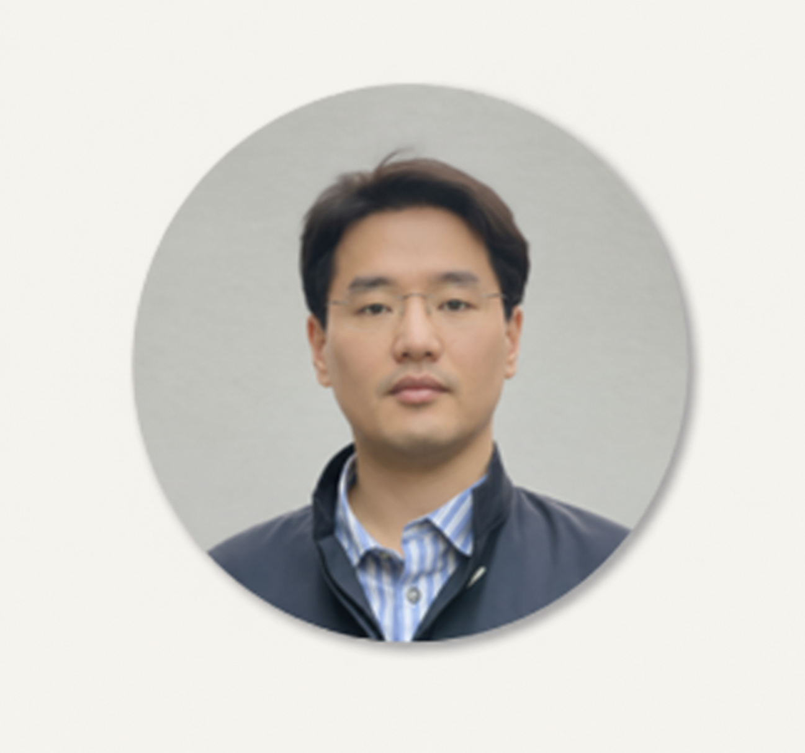
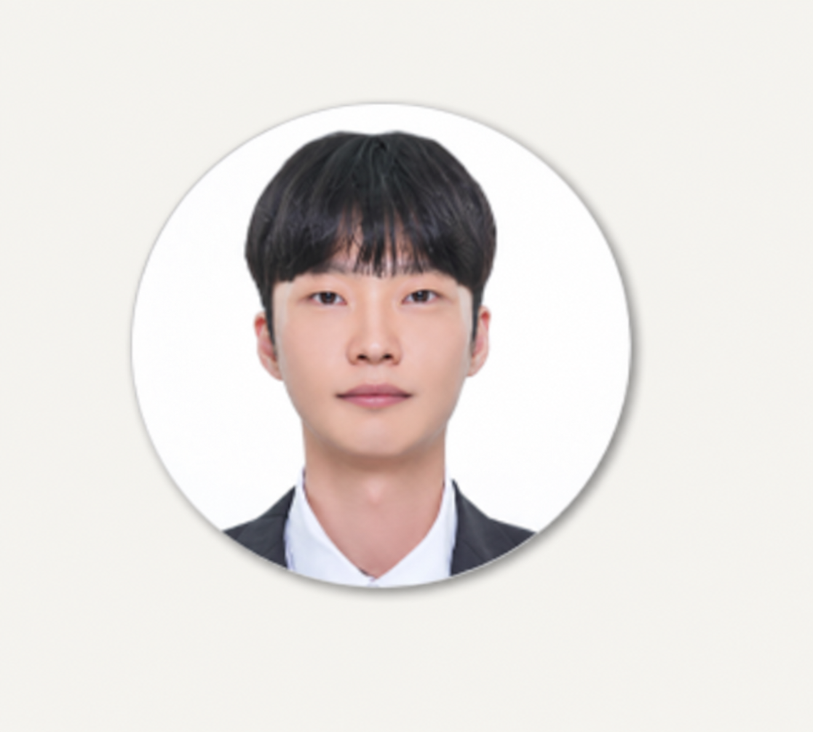

# 강사 소개

이 과정을 진행하는 강사와 조교를 소개합니다.

## 육창수 (csss.youk) · 강사

{ width="180" }

- Startup ('13~'17) - Mobile Gaming Application
- Network 사업부 Cloud Management Lab ('18~'21) - Cloud OS 과제
- Robot Biz T/F, Team ('21~'25) - Wearable Robot Device 양산 과제
- N/W AI 사내 강사 ('25~)

## 이원준 (woony6.lee) · 조교

{ width="180" }

- H사 ('25) - MES 과제 수행
- Network 사업부 ('26) - N/W AI 과정 조교
