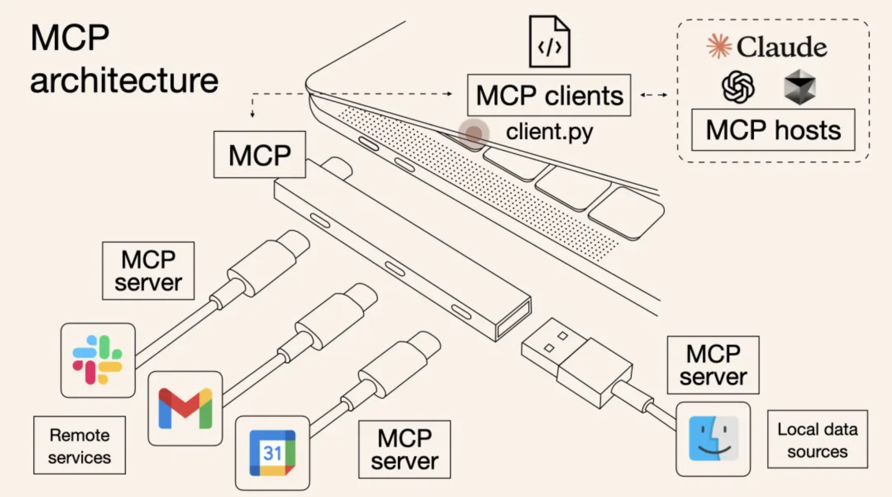
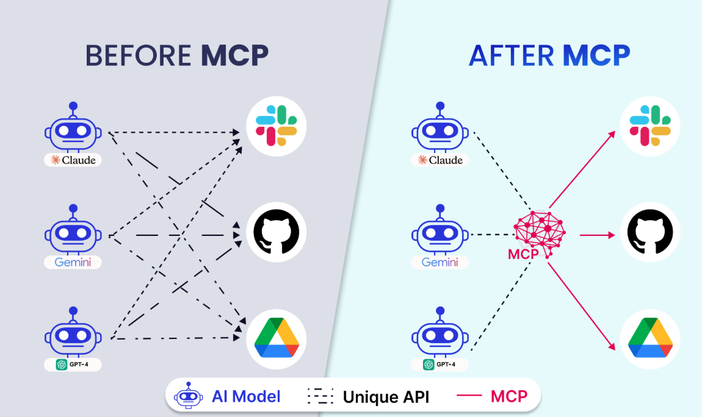
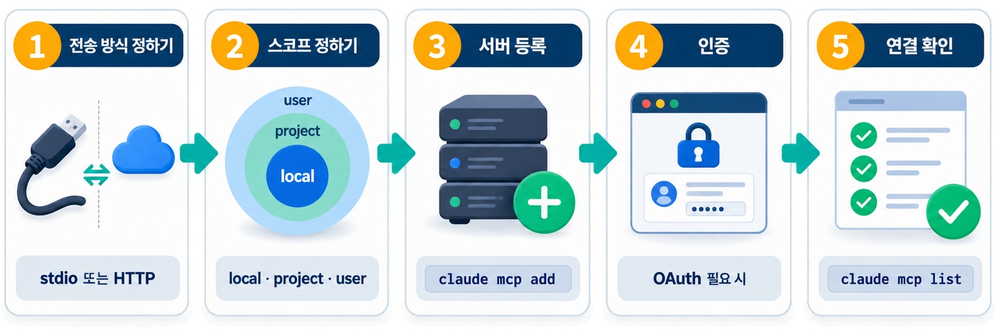
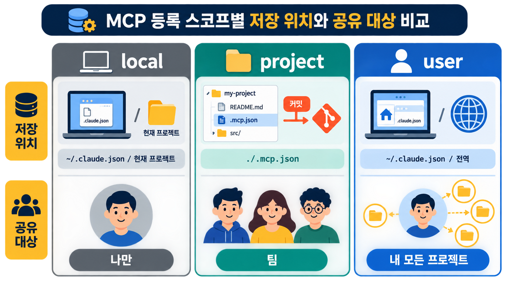
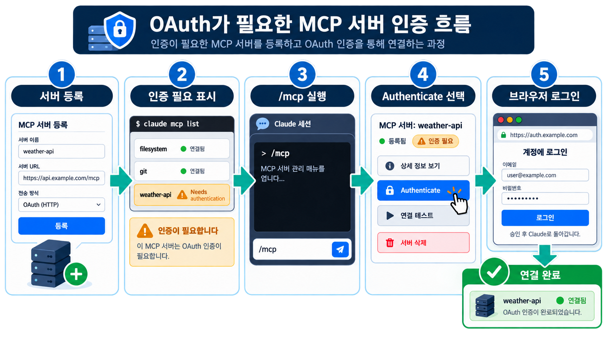

# MCP 로 외부 데이터 연결하기

MCP(Model Context Protocol)는 에이전트가 **외부 데이터 · 도구에 접근하는 표준 연결 방식**입니다.

MCP 는 [Context Engineering](../concepts/context-engineering.md) 의 6레이어 중 하나이며, CLAUDE.md 나
rules 처럼 매 요청마다 상주하지 않고 **도구를 호출할 때만 Context Window 를 차지하게 됩니다.**

쉽게 비유하면, MCP 는 에이전트에 꽂는 **표준 어댑터**입니다.

전자기기마다 충전 단자가 제각각이면 불편하듯, 데이터베이스 · 사내 API · 외부 서비스에 붙는 방식이 저마다 다르면 연결이 번거롭습니다.

MCP 는 그 연결 방식을 하나로 통일해, 에이전트가 어떤 외부 자원이든 같은 규격으로 붙게 합니다.



## MCP 는 어떤 목적에서 만들어 졌나?

MCP 는 Anthropic(Claude 개발사)가 [2024년 11월 말 공개 및 오픈소스로 발표했습니다.](https://www.anthropic.com/news/model-context-protocol)

**핵심 목표**
USB-C처럼 표준화된 프로토콜로 AI 모델과 외부 리소스의 상호작용 인터페이스를 통일해 *한 번 통합하면 어디서나 실행*을 가능하게 하는 것입니다.

데이터 사일로로 인해 AI 모델의 잠재력이 제한되는 문제를 완화하고, AI 애플리케이션이 로컬/원격 데이터를 안전하게 접근/조작하도록 돕습니다.



## MCP 서버 구축에서 연결까지



### 1단계 - 전송 방식 정하기

서버를 어떻게 실행하느냐에 따라 전송 방식이 갈립니다.

전송 방식은 Claude Code가 MCP 서버와 요청·응답을 주고받는 통신 규약입니다.

2가지 방식이 있습니다.

| 전송 방식 | 언제 쓰나 | 등록 방법 |
|---|---|---|
| stdio | 로컬에서 subprocess 로 실행하는 서버 | `--transport` 생략 시 기본값 |
| HTTP | URL로 접속하는 원격 상시 서버 | `--transport http` |

정리하면,
- 내 컴퓨터에서 프로그램으로 직접 띄우는 서버라면 stdio
- 인터넷 주소(URL)로 접속하는 원격 서버라면 HTTP를 씁니다


### 2단계 - 스코프 정하기

스코프는 **이 서버를 누구까지 쓸 수 있게 할지** 정하는 공유 범위입니다. 같은 서버라도
등록 스코프에 따라 어디까지 공유되는지가 달라집니다. 스코프는 세 가지입니다.

| 스코프 | 저장 위치 | 공유 범위 |
|---|---|---|
| local (기본값) | `~/.claude.json` 의 현재 프로젝트 항목 아래 | 개인 전용 |
| project | 프로젝트 루트의 `.mcp.json` | 저장소에 커밋해 팀과 공유 |
| user | `~/.claude.json` 최상위 `mcpServers` | 한 사용자의 모든 프로젝트 |

- 나만 쓰려면 local
- 팀원과 함께 쓰려면 project
- 내 모든 프로젝트에서 모두 쓰려면 user

라고 기억하면 됩니다.

등록할 때 `claude mcp add --scope {local|project|user}` 로 지정하며, 생략하면 local입니다.



### 3단계 - 서버 등록하기

로컬 stdio 서버는 `--` 뒤에 실행 명령을 붙입니다.

```bash
claude mcp add playwright -- npx -y @playwright/mcp@latest
```

원격 HTTP 서버는 `--transport http` 와 URL을 넘깁니다.

```bash
claude mcp add --transport http claude-code-docs https://code.claude.com/docs/mcp
```

### (심화) 4단계 - 인증하기

인증이 필요 없는 서버는 이 단계를 건너뛰세요.

대부분의 서버는 **OAuth** 로 인증합니다.

웹사이트에 로그인하듯 브라우저에서 로그인하는 방식이라 가장 간단합니다.

호스팅 서버(Sentry·Notion 등)를 URL로 등록하면 `claude mcp list` 에 `! Needs authentication` 으로 표시됩니다.

세션 안에서 `/mcp` 를 실행하고 서버를 고른 뒤 `Authenticate` 를 선택하면 브라우저 로그인으로 이어집니다.

발급받은 키나 토큰을 직접 넣어야 하는 서버도 있는데, 이 방식은 맨 아래 심화 섹션에서 다룹니다.



### 확인 방법

`claude mcp list` 로 등록된 서버와 연결 상태를 봅니다.

```bash
claude mcp list
```

상태 표시는 세 가지입니다.

- `✓ Connected` - 연결 성공. 세션에서 서버가 노출한 도구를 쓸 수 있습니다.
- `! Needs authentication` - 등록은 됐지만 인증이 남았습니다. 4단계로 돌아가세요.
- `✗ Failed to connect` - 연결 실패. 실행 명령이나 URL을 다시 확인하세요.

### 실패했을 때

- `✗ Failed to connect` 이면 stdio 서버는 `--` 뒤 실행 명령이, HTTP 서버는 URL이 맞는지
  확인하세요.
- 인증이 걸린 서버가 `! Needs authentication` 에 머물러 있으면 세션에서 `/mcp` 로 다시
  인증하세요.
- 서버를 지우고 다시 등록하려면 이름으로 제거하세요.

```bash
claude mcp remove claude-code-docs
```

## (심화) 연결·관리 명령

!!! note "지금은 건너뛰어도 됩니다"
    MCP 서버를 직접 등록 · 관리할 때 쓰는 명령입니다. 이미 연결된 서버를 쓰기만 한다면 몰라도 됩니다.

전송 방식별 등록 명령에 환경변수 · 인증 헤더까지 함께 넘기는 예시입니다.

```bash
# stdio 방식 등록 (로컬 프로세스를 직접 띄움)
claude mcp add <name> <command>

# HTTP 방식 등록 (상시 실행되는 공유 서버)
claude mcp add --transport http <name> <url> -s user

# 환경변수 · 인증 헤더
claude mcp add <name> <command> -e API_KEY=xxx
claude mcp add --transport http <name> <url> --header "Authorization: Bearer xxx"
```

| 명령 | 용도 |
|---|---|
| `claude mcp add-json` | JSON 정의로 한 번에 등록 |
| `claude mcp list` / `get` / `remove` | 목록 · 상세 · 삭제 |
| `claude mcp login` / `logout` | OAuth 인증 관리 |
| `/mcp [reconnect\|enable\|disable]` | 세션 안에서 연결 상태 제어 |

## (심화) 컨텍스트 비용과 최적화

!!! note "지금은 건너뛰어도 됩니다"
    MCP 를 여러 개 붙였을 때 토큰(비용)을 아끼는 방법입니다. 연결이 몇 개뿐이면 신경 쓰지 않아도 됩니다.

- MCP 툴 정의는 기본적으로 **deferred(지연 로딩)** - 평소엔 툴 이름만 컨텍스트에 올려두고,
  실제 호출하는 순간에만 상세 설명서(스키마)를 불러옵니다. 손님이 올 때만 상세 메뉴판을 펴는 것과 같습니다.

- 그럼에도 `gh` · `aws` · `gcloud` 같은 **CLI 도구가 MCP 보다 컨텍스트 효율이 좋습니다.**
  CLI 도구는 툴 목록 자체를 추가하지 않기 때문입니다.

- 안 쓰는 서버는 `/mcp` 로 비활성화하세요. 자세한 계산은
  [토큰 절약 기법](../reference/token-saving.md) 을 참고하세요.

## (심화) API 키·토큰으로 직접 인증하기

!!! note "지금은 건너뛰어도 됩니다"
    브라우저 로그인(OAuth) 대신 미리 발급받은 키를 직접 넣어야 하는 서버에서만 필요합니다.

4단계의 OAuth는 브라우저에서 로그인하는 방식이라 따로 값을 입력하지 않습니다.

반면 미리 발급받은 키나 토큰을 직접 넣어야 하는 서버도 있습니다.

이때는 서버를 등록할 때 그 값을 함께 넣어 줍니다.

- HTTP 서버는 `--header "Authorization: Bearer <token>"` 로 넣습니다.
- stdio 서버는 `--env KEY=value` 로 넣습니다.
