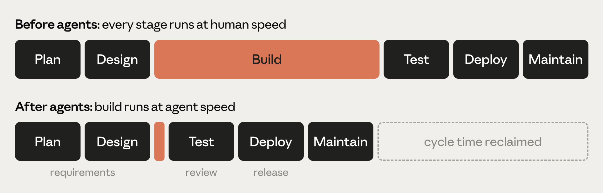

# AI-Native SDLC Playbook

Claude Academy의 [**The AI-Native SDLC Playbook**](https://academy.claude.com/courses/ai-native-sdlc-playbook) 코스 중 Lesson 1(Introduction)과 Lesson 2(Capture as intent.md)를 정리했습니다.

**AI SDLC(AI 기반 소프트웨어 개발 생명주기)** 란?

기획-설계-개발-테스트-배포-운영으로 이어지는 소프트웨어 개발 전 과정에 AI를 단계마다 결합시켜, 사람이 순차적으로 넘기던 흐름을 AI가 계속 관여하는 순환 구조로 재구성한 프로세스를 뜻합니다.

## 1. 문제의식: 왜 SDLC를 재구성해야 하는가?

핵심 전제는 조직들이 1년 전만 해도 상상할 수 없던 속도로 AI를 활용해 코드를 작성하게 됐지만, 코드를 둘러싼 프로세스는 그만큼 빠르게 바뀌지 않았다는 겁니다.

많은 엔지니어링 팀이 여전히 동일한 승인 게이트, 리뷰, 인수인계, 정책을 유지하고 있어서 에이전틱 코딩 도구가 만들어낸 생산성 향상이 정체되고 있다는 거죠.

전통적 SDLC는 기획, 설계, 빌드, 테스트, 배포, 유지보수의 6단계로 구성되며, 각 단계는 서로 다른 역할이 소유하는 별개의 국면이었습니다.

PM이 요구사항을 쓰고, 아키텍트가 설계로 옮기고, 엔지니어가 구현하고, QA가 검증하고, 릴리스팀이 배포하고, 운영팀이 모니터링하는 식이며, 문서·티켓·승인(sign-off)을 통해 단계 간 작업이 전달됩니다.

문제는 이 구조가 가장 시간과 비용이 많이 드는 단계가 '코드 작성·구현'이던 시절에 맞춰 설계된 프로세스라는 점입니다.

코드 작성이 더 이상 병목이 아니게 되면 (빌드 단계가 전통적 SDLC보다 훨씬 빨라지면) 세 가지 현상이 나타난다고 설명합니다:



1. 병목이 빌드 앞뒤 단계, 즉 기획/리뷰·테스트/배포 쪽으로 옮겨가며, 이 단계들은 여전히 사람 속도로 돌아간다
2. 기존 통제 장치가 현실과 안 맞게 되어 감당이 안 된다 - 사람이 짠 코드를 한 줄씩 리뷰하는 건 말이 됐지만, 에이전트가 diff 대부분을 작성하면 따라갈 수 없다
3. 거버넌스 비용이 늘어난다 - 예외 처리가 여전히 주/월 단위로 열리는 회의와 위원회를 거쳐야 하기 때문

즉, **빌드 단계만 빨라지고 앞뒤 단계(기획/리뷰/배포)는 그대로**라서 병목이 이동한다는 게 핵심 그림입니다.

## 2. AI-native SDLC란

기존 통제 목표(control objectives)는 유지하되 새로운 방식으로 집행(enforcement)하는 재구성된 프로세스입니다.

선형 흐름이 아니라 루프(loop)가 되고, 각 지점에 AI가 내재화되어 있으며, 단계 간 인수인계를 자동으로 트리거한다는 게 특징입니다.

### 전통 SDLC vs AI-native SDLC 비교표

|단계|전통 SDLC|AI-native SDLC|
|---|---|---|
|Plan|위원회가 요구사항을 모으고, 워크숍과 승인을 거쳐 수작업으로 정리|Claude가 소스에서 직접 페인포인트를 종합해 `intent.md`로 포착 - 사람이 읽을 수 있으면서 기계가 실행 가능한 형태|
|Design|분석가가 스펙을 쓰고 디자이너가 파싱|요구사항과 설계가 에이전트와의 한 세션으로 압축되며, 스킬로 인코딩된 표준을 따르고 Git으로 버전 관리|
|Build|테스트와 코드를 수작업으로 작성하고, 문서화는 개발이 끝난 뒤에 작성|테스트와 코드를 AI가 생성하고, 조직 지식은 버전 관리되는 기계가독 `CLAUDE.md` 파일과 스킬로 유지|
|Test|단계 경계마다 QA 게이트|구현 과정 전체에 연속적인 평가(eval)가 엮여 들어감|
|Deploy|사람이 모든 코드 라인을 리뷰하고, 거버넌스는 (종종 일관성 없이) 리뷰 사이클에서 발생|에이전틱 리뷰가 여러 겹으로 이뤄지고 사람 리뷰는 규제/critical 코드에만 집중, 거버넌스는 AI가 행동하는 순간 훅(hook)을 승인 게이트로 삼아 집행|
|Maintain|사람이 프로덕션을 지켜보며 버그를 찾음|에이전트가 실서비스를 모니터링, 통제 기준을 벗어나면 진단해서 새로운 `intent.md`로 루프에 다시 써넣음|

이 표에서 가장 중요한 개념은 **커밋된 아티팩트(committed artifact)**입니다.

각 단계는 version control에 아티팩트를 커밋하며 끝나고(intent.md, spec.md, plan.md, diff와 그 테스트, PR과 리뷰 결과, 인시던트 기록 등), 다음 단계는 그 아티팩트를 읽는 것으로 시작합니다.

초반 단계에서는 .md 파일이 주된 아티팩트인데, 제품 오너와 에이전트가 같은 파일을 읽고 행동할 수 있기 때문이며, Build 단계부터는 아티팩트가 코드와 그 기록 자체입니다.

커밋 체인이 곧 감사 추적(audit trail) 역할을 해서 누가 무엇을 요청했고, 에이전트가 무엇을 만들었고, 누가 승인했는지를 보여줍니다.

중요한 건 사람은 판단이 필요한 모든 결정에 대해 여전히 책임을 지며, 다만 사람의 주의(attention)가 리뷰해야 할 아티팩트를 따라 이동한다는 점 - 즉 사람이 없어지는 게 아니라 개입 지점이 바뀐다는 겁니다.

### 12개 플레이(Play)의 의존관계

플레이북은 Plan, Design, Build, Test, Deploy, Maintain의 6개 비선형 단계로 그룹화된 플레이들로 구성되며, 각 플레이는 무엇이 바뀌는지, 시작하는 법, 구체적 구현 단계, 거버넌스 고려사항, 성공 측정법을 다룹니다.

의존 그래프 구조(선행조건 없음 → 후속 플레이 트리거):

- **선행조건 없음**: Capture intent, CLAUDE.md, Skills, Feedback loop, Hooks, Plan mode
- **2단계**: Subagents(CLAUDE.md 필요), Evals(CLAUDE.md + Feedback loop 필요)
- **3단계**: Requirements and design(Capture intent + Skills 필요), PR review(Evals + Subagents 필요)
- **4단계**: CI/CD(PR review + Hooks 필요)
- **5단계**: Closing the loop(CI/CD + Capture intent 필요)

한 단계는 아티팩트를 커밋하며 끝나고, 그 커밋이 다음 단계를 시작시킵니다 - 승인된 intent.md가 요구사항·설계 단계를 트리거하고, 승인된 spec.md가 plan mode를 트리거하고, 머지된 PR이 파이프라인을 트리거하고, 프로덕션에서 통제 기준 위반이 다음 intent.md를 씁니다.

---

## 3. intent.md 상세 (Stage 1: Plan)

### 개념

`intent.md`는 SDLC 루프를 시작시키는 첫 아티팩트로, 사람이 아이디어를 낸 경우, 티켓이 등록된 경우, 인시던트가 알림으로 표면화된 경우 등 서로 다른 경로로 진입할 수 있습니다.

사람에게 아이디어가 있을 때는 Claude와 브레인스토밍을 해서 Markdown 형태의 초안 스펙(proto-spec)을 만들어냅니다.

전통 SDLC라면 같은 사람이 제품팀 구성원을 설득해서 그 아이디어를 대신 문서화하게 만들어야 했던 것과 대비됩니다.

이렇게 나온 초안은 사람이 읽을 수 있고, 버전 관리되며, 다음 단계에서 바로 소비 가능하고, 이게 `intent.md`로 저장됩니다.

인텐트가 이벤트 트리거에서 왔든 사람에서 왔든, 제품 오너가 에이전트가 작성한 intent.md를 검토하고 수정한 뒤 커밋한다는 절차는 동일합니다.

### 무엇이 달라지는가

|전통 방식|AI-native 방식|
|---|---|
|아이디어가 백로그 항목, 유저 스토리, 스토리 포인트, 리파인먼트 미팅을 거치며 각 인수인계마다 소유권이 바뀌어, 엔지니어링에 도달할 때쯤엔 원래 의도에서 여러 단계 멀어져 있음|아이디어를 낸 사람이 Claude와 브레인스토밍해서 자기 언어로 intent.md를 직접 작성 - 무엇을, 왜, 어떤 제약 하에 원하는지가 담기며 반복되는 프로세스는 스킬로 인코딩|

### 시작하는 법 (Getting started)

- **선행조건**: 없음
- **필요 인프라**: 비개발자도 쓸 수 있는 Claude 접근(claude.ai 또는 Cowork), 합의된 intent.md 템플릿, 제품 오너가 지켜보는 공유·버전관리되는 intent 저장 위치. 단일 제품이라면 가장 단순한 방법은 제품 저장소 안의 intent/ 폴더 - 이렇게 하면 아티팩트 체인이 파생된 코드 바로 옆에 위치하게 됩니다. 별도의 intent 전용 저장소는 인텐트가 여러 저장소에 걸칠 때만 그 오버헤드가 정당화되며, 모노레포에서는 그냥 디렉토리 하나면 충분합니다.
- 이 설정은 플랫폼/엔지니어링 팀이 한 번만 하면 되는 작업이며, 기술 팀원이 intent 저장 위치를 만들고 누가 쓸 수 있는지 정해야 함 - 조직 전반에서 다양한 사람이 기여하게 되므로.
- 저장소가 만들어지면, Git 경험이 없는 기여자도 직접 Git을 쓸 필요가 없음 - GitHub 같은 버전관리 시스템 커넥터를 통해 Claude가 claude.ai나 Cowork에서 대신 Markdown 파일을 커밋해줍니다.

### 실행 절차 (How to execute)

1. 아이디어를 낸 사람이 자기 말로 문제를 Claude에게 설명 - 오늘 못하는 것, 영향받는 사람, 더 나은 상태, 범위 밖인 것 등을 서술. 형식적 언어는 필요 없음
2. 아이디어가 구체화될 때까지 브레인스토밍 - Claude가 분석가라면 물어볼 질문(범위, 사용자, 제약, 성공 기준)을 물음
3. 조직의 템플릿(기술 팀원이 스킬로 인코딩하고 리드가 승인한 것)을 사용해 결과를 intent.md로 작성해달라고 요청 - 문제, 제안된 결과, 영향받는 사용자/시스템, 제약, 미해결 질문 등을 포함 가능
4. Claude가 잘못 이해한 부분을 원작자가 수정
5. 공유 저장 위치에 intent.md를 커밋 - 작성자와 타임스탬프가 기록에 함께 남고, 여기서부터 제품 오너가 아이디어를 이어받음

### 예시 (intent.md 실제 형태)

<details class="ailab-code" markdown="1">
<summary>코드 예시 펼치기 - intent.md 실제 형태</summary>

<div class="ailab-code-window">
<div class="ailab-code-titlebar">
<span class="ailab-code-dots"><span></span><span></span><span></span></span>
<span class="ailab-code-filename">intent.md</span>
</div>

```markdown
# 인텐트: 청구 상태 셀프서비스
작성자: 오정우 (청구 운영팀). 상태: 초안.

## 문제
고객이 자기 청구 건이 어디까지 진행됐는지 물어보려고 콜센터에 전화합니다.
상담원이 통화 시간의 3분의 1가량을 상태 조회 문의에만 씁니다.

## 제안된 결과
고객이 포털에서 청구 상태, 다음 단계, 예상 일자를 직접 확인합니다.

## 영향받는 사용자/시스템
청구 처리 담당자, 포털 팀, claims-core API.

## 제약
포털 세션에 새로운 개인정보(PII)를 추가하지 않습니다. 기존 인증만 사용합니다.

## 미해결 질문
제3자 손해사정인(loss adjuster)에게도 접근 권한이 필요한가?
```

</div>
</details>

구조는 **문제(Problem) → 제안된 결과(Proposed outcome) → 영향받는 사용자/시스템 → 제약 → 미해결 질문** 순서로, 형식적인 유저 스토리가 아니라 실무자의 자연스러운 언어로 쓴다는 게 포인트입니다.

### 거버넌스

증거는 커밋된 intent.md 자체 - 작성자, 타임스탬프, 전체 수정 이력이 남으며 intent 저장 위치의 Git 히스토리에 기록됩니다.

제품 오너가 승인하며, Stage 2: Design으로 넘어가는 accept/reject 결정은 머지 또는 리뷰 종료로 기록됩니다.

### 측정 지표

- **선행 지표(Leading indicator)**: 첫 대화부터 intent.md 커밋까지 걸린 시간 - intent 저장 위치의 Git 히스토리에서 작성자와 타임스탬프로 읽음. 기대치는 몇 주짜리 요구사항 수집·정제 사이클이 몇 시간으로 줄어드는 것
- **후행 지표(Lagging indicator)**: 생존율(survival rate) - 제품 오너가 Stage 2: Design으로 승인해 넘긴 intent.md의 비율(거절해서 닫은 것 대비). accept/reject 결정은 아티팩트 머지 또는 리뷰 종료로 기록되며, 추가로 같은 변경 건에 대해 첫 spec.md 커밋 이후 intent.md에 가해진 수정 횟수도 카운트
