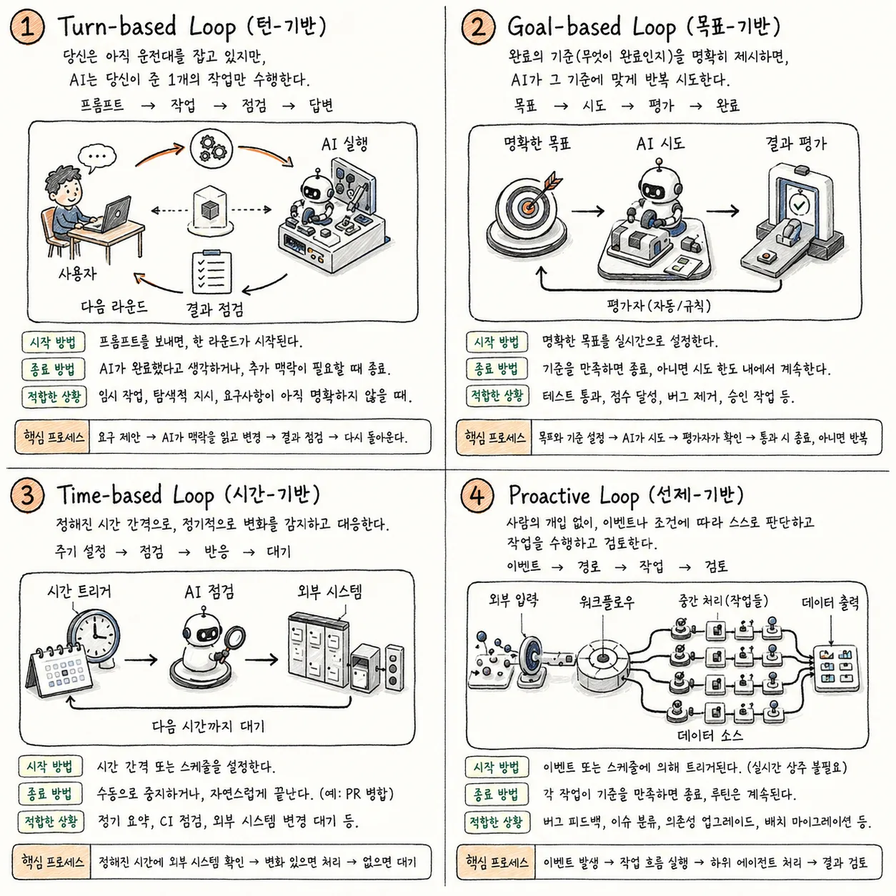
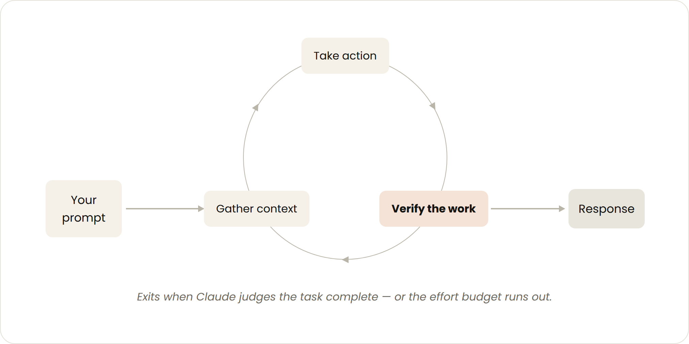

# Loop Engineering

[본 문서는 Anthropic 공식 블로그 글을 정리하였습니다.](https://claude.com/blog/getting-started-with-loops)

본 실습 과정에서는 Goal Based loop 을 만드는 방법을 배웠습니다.

하지만, 이외에도 다른 형태의 loop 이 있습니다.

Anthropic 에서 제시한 4가지 종류의 loop 을 사용하는 방법을 소개 합니다.

## Loop 비교

| Loop       | 무엇을 넘기는가              | 언제 사용하는가              | 사용할 기능                                              |
|---|---|---|---|
| Turn-based | 확인(Check)             | 탐색하거나 결정 중일 때         | 직접 만든 검증 Skill                                      |
| Goal-based | 멈춤 조건(Stop condition) | 완료 상태가 명확할 때          | /goal                                               |
| Time-based | 실행 시점(Trigger)        | 작업이 외부 일정에 따라 발생할 때   | /loop, /schedule                                    |
| Proactive  | 프롬프트(Prompt) 자체       | 작업이 반복적이고 잘 정의되어 있을 때 | schedule, goal, Skill, workflow, worktree, reviewer |

## 작업 성격에 대한 질문

### Closed Loop vs Open Loop

Loop를 고를 때는 먼저 닫힌 루프인지 열린 루프인지부터 생각하면 좋습니다.

Closed loop는 목표가 고정된 반복입니다.

- 테스트가 모두 통과할 때까지 고친다.

- JSON schema에 맞을 때까지 출력을 다시 만든다.

- 체크리스트가 모두 채워질 때까지 문서를 보완한다.

같은 일은 **Closed loop** 입니다.

목표와 멈춤 조건이 분명해서 비교적 안전하고 비용도 예측하기 쉽습니다.

**Open loop는 탐색이 필요한 반복** 작업에 쓰입니다.

- 새 아이디어를 찾거나

- 여러 접근을 비교하거나

- 아직 정답이 정해지지 않은 문제를 조사할 때 사용합니다.

사람의 의사결정이 들어가기도 하고, open-ended question 문제 이기 때문에, 예산과 시간이 커지기 쉽고, 사람의 검토 지점도 더 촘촘해야 합니다.

Closed loop는 정답지가 있는 문제를 끝까지 푸는 일이고, Open loop는 여행 계획을 짜는 일에 가깝습니다.

여행 계획에는 정답이 하나만 있지 않습니다.

그래서 예산, 일정, 취향 같은 경계를 먼저 정해야 길을 잃지 않습니다.

## Turn based loop

사용자가 프롬프트 하나를 보낼 때마다 한 사이클이 도는, 가장 기본적인 상호작용 방식입니다.

Claude가 코드를 읽고 고치고 테스트를 실행하는 일련의 작업을 한 턴 안에서 마친 뒤 결과를 사용자에게 돌려줍니다.

예를 들어 `좋아요 버튼을 만들어줘`라고 요청하면, 기존 코드를 살펴 수정하고 테스트까지 돌려 본 뒤 완성된 결과를 보여줍니다.

Claude가 스스로 다 됐다고 판단하거나 추가 정보가 필요하면 멈추고, 다음 턴은 사용자의 새 메시지가 있어야 시작됩니다.

검증을 사람이 눈으로 직접 하는 구조라, SKILL.md 같은 파일로 검증 절차 자체를 정해 두면 매번 반복 설명하지 않아도 됩니다.

## Goal based loop

통과·실패를 가릴 수 있는 목표를 미리 정해 두고, 그 기준을 넘을 때까지 Claude가 스스로 반복하게 만드는 방식입니다.

`/goal` 명령으로 목표와 최대 시도 횟수를 함께 주면, 매 시도 뒤 평가 모델이 기준 충족 여부를 확인하고 미달이면 다시 시도하도록 지시합니다.

예를 들어 `홈페이지 Lighthouse 점수를 90점 이상으로 올려라, 최대 5회까지 시도`처럼 수치로 딱 떨어지는 목표를 줍니다.

> Lighthouse? 웹 앱과 웹 페이지를 분석하여 성능, 접근성, SEO, 모범사례 네 영역의 점수와 개선 권고를 제공하는 Google의 오픈소스 도구입니다.

목표를 달성했거나 정해 둔 최대 시도 횟수에 닿으면 루프가 끝납니다.

테스트 통과 개수·점수 임계값처럼 셀 수 있는 기준일수록 이 방식이 잘 맞습니다.

이 실습에서 stage4~5에 걸쳐 만든 hook·subagent 검증 loop이 바로 이 유형입니다.

## Time based loop

정해진 시간 간격마다 같은 작업을 반복하거나, 외부 상황 변화에 맞춰 대응하는 방식입니다.

`/loop`은 내 컴퓨터에서, `/schedule`은 클라우드에서 일정 주기로 자동 실행됩니다.

예를 들어 `매일 아침 대화를 요약하거나, Pull Request에 달린 리뷰 댓글을 주기적으로 확인하고 대응하는 작업`에 씁니다.

사용자가 직접 취소하거나, PR이 병합되거나 처리할 큐가 비는 등 작업이 자연스럽게 끝날 때까지 계속 돕니다.

간격을 너무 좁게 잡으면 토큰을 불필요하게 많이 쓰므로, 주기를 늘리거나 이벤트가 있을 때만 반응하도록 조절하는 편이 좋습니다.

## Proactive loop

사람이 매번 옆에서 지켜보지 않아도, 정해진 이벤트나 일정에 따라 알아서 돌아가는 루프입니다.

버그 제보처럼 반복적이고 패턴이 뚜렷한 작업 스트림을 스스로 분류·처리·응답까지 마칩니다.

예를 들어 `매시간 피드백을 모아 버그를 분류하고, 여러 해결책을 병렬로 탐색한 뒤 별도의 판정 에이전트가 그중 가장 나은 방식을 골라내는 과정 전체`가 사람 승인 없이 진행됩니다.

각 작업은 목표를 달성하면 끝나지만, 루틴 자체는 사용자가 명시적으로 멈추기 전까지 계속 돌아갑니다.

`여러 에이전트를 동시에 굴리는 대규모 오케스트레이션에 적합`하며, `네 유형 중 사람 개입이 가장 적은 자동화 단계`입니다.

## 정리

**가장 단순한 루프에서 시작하고, 필요할 때만 한 단계씩 올라가세요.**

Loop의 종류를 고르는 기준은 간단합니다.

- 확인 절차를 넘기고 싶다면 Turn-based loop에서 `Skill`을 강화합니다.

- 완료 조건이 명확하다면 `/goal`을 씁니다.

- 정해진 주기로 특정 작업을 해야 한다면 `/loop`나 `/schedule`을 씁니다.

- 반복 작업 흐름 전체를 맡기고 싶다면 Proactive loop로 확장합니다.

## 참고 문서

- [Wiki Docs](https://wikidocs.net/377850)
- [Anthropic - Loop engineering: Getting started with loops](https://claude.com/blog/getting-started-with-loops)
