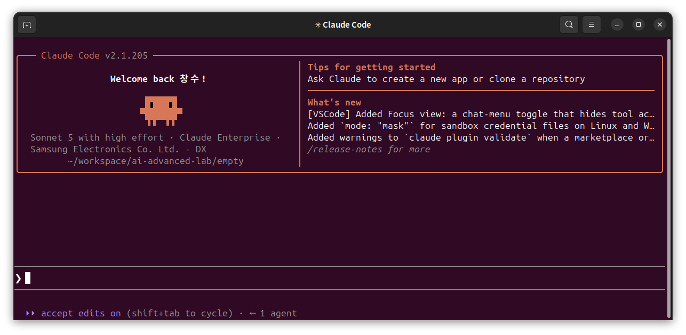
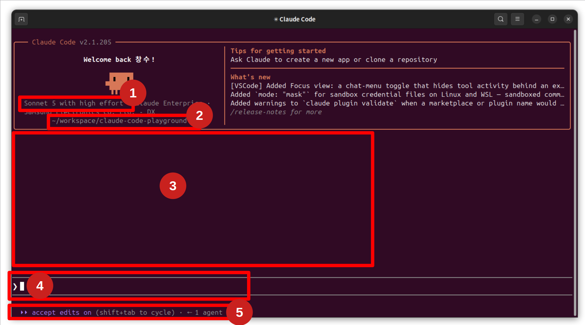
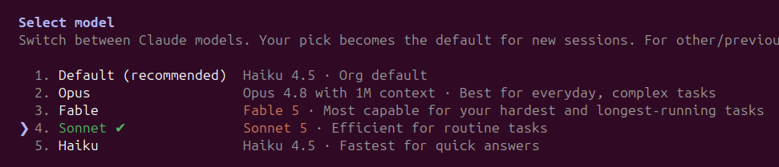
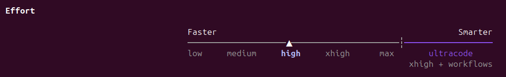
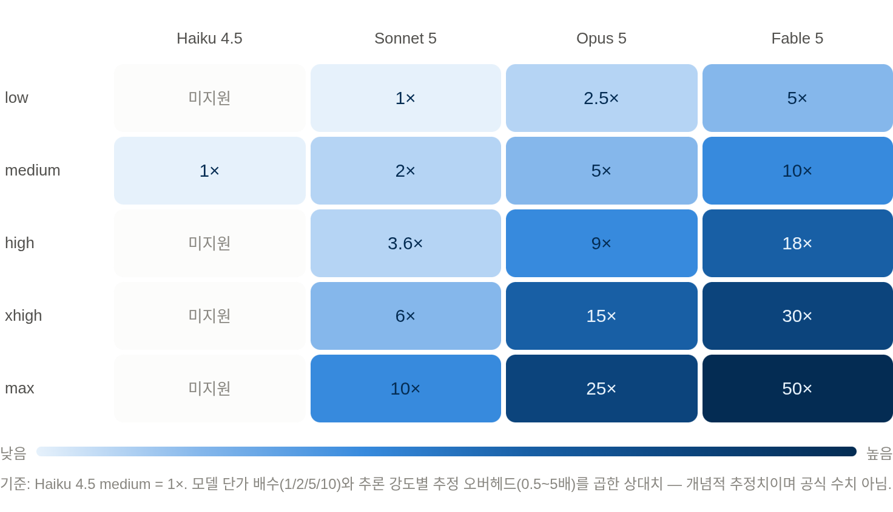

# Claude Code 첫 실행

> Claude Code란?

> Anthropic에서 출시한 Coding Agent로, 코딩/문서/자동화 작업을 할 수 있습니다.

> 터미널 환경에서 동작하는 것을 전제로 설계되었습니다.

> 본 교안은 Claude 버전 **2.1.205** 을 기준으로 작성하였습니다.


## 이 단계를 끝내면

- 세션을 시작·종료하고,
- 자연어로 지시하고,
- 권한 prompt에 승인·거부로 답하고,
- 권한 모드(`default` / `acceptEdits` / `plan`)를 바꾸고,
- 작업 폴더 경계를 확인하고,
- 세션을 `resume` / `fork` / `rewind` 할 수 있습니다.

## 세션을 시작하고 종료합니다

먼저 세션을 여는 법과 닫는 법부터 손에 익힙니다.

1. `claude --version`로 claude 가 이미 깔려 있는지 확인하세요.

    ```powershell
    $ claude --version
    2.1.205 (Claude Code)
    ```

2. 연습용 폴더로 이동한 뒤 `claude`로 대화형 세션을 시작하세요. 프롬프트 박스가 지시를 기다립니다.

    ```powershell
    $ mkdir claude-code-playground
    $ cd claude-code-playground
    $ claude
    ```

    

3. `Ctrl+D` 혹은 `/exit` 을 타이핑 하여 세션을 종료하세요.
프롬프트 박스가 사라지고 셸로 돌아옵니다.

    !!! important "Ctrl + C vs Ctrl + D 차이"
        `Ctrl+C`는 세션을 끝내지 않습니다.

        진행 중인 **턴**(지금 하는 작업)만 중단하고 세션은 그대로 열려 있습니다.

        턴과 세션의 구분은 [turn 개념](../claude-code/turn-concept.md)에서 봅니다.

    세션은 종료해도 사라지지 않고 저장됩니다.

    다시 여는 방법은 아래 [세션 관리](./claude-code-start.md#세션-관리) 절에서 다룹니다.

## 세션 창 구성



1. 현재 선택한 모델(`/model`)과, 추론 수준(`/effort`) 를 보여줍니다.
2. 현재 Claude Code 가 실행된 경로를 보여줍니다.
3. Claude Code 가 답변한 내용들이 출력되는 창
4. 프롬프트 창
5. 권한 조정 / subagent / background task 가 보이는 창

### 선택가능한 모델

교안 작성 시점(26.09.01)을 기준으로 현재 선택 가능한 모델은 아래와 같습니다.



| 모델 | 특징 / 포지셔닝 | 토큰 소모량 (Haiku 대비, 입력/출력 동일 배수) | 적합한 작업 |
|---|---|---|---|
| **Haiku 4.5** | 가장 빠르고 저렴. $1 / $5 (백만 토큰) | **1x** (기준) | 대량 처리, 분류/추출, 서브에이전트, 지연시간 민감 작업, 단순 반복 작업 |
| **Sonnet 5** | 속도-지능 균형, 대부분 업무의 기본값. $2 / $10 | **2x** | 일상적인 코딩, 문서 작성, 에이전트 워크플로우, 대부분의 실무 자동화 (예: Claude Code 기본값급 작업) |
| **Opus 5** | 고난도 추론·장기 에이전틱 코딩. $5 / $25 | **5x** | 복잡한 아키텍처 설계, 어려운 디버깅, 긴 컨텍스트를 요하는 리서치, 판단력이 중요한 엔터프라이즈 작업 |
| **Fable 5** | 최상위 티어, 가장 창의적·긴 호흡 작업. $10 / $50 | **10x** | 최고 난도의 지식노동, 스타일 민감한 장문 창작, 초장기 에이전틱 작업 (비용 정당화될 때만) |

### 선택가능한 추론 수준

교안 작성 시점(26.09.01)을 기준으로 현재 선택 가능한 추론수준은 아래와 같습니다.




| 레벨 | 추론 깊이 | 세션 지속성 | 적합한 작업 |
|---|---|---|---|
| **low** | 최소한의 사고, 속도 우선 | 세션 내내 유지 | 짧고 가벼운 단순 작업, 반복적 처리 |
| **medium** (기본값) | 표준 추론 | 세션 내내 유지 | 일상적인 코딩/작업, 비용 관리가 필요한 경우 |
| **high** | 깊은 추론 시작점 | 세션 내내 유지 | 지능이 중요한 대부분의 작업 (API 기본값이 high) |
| **xhigh** | 본격적인 확장 사고 | 세션 내내 유지 | 코딩·에이전틱 탐색 작업의 출발점 (Opus/Sonnet 등 고성능 모델 위주 지원) |
| **max** | 최고 강도, 오래 고민 | **세션 한정** (환경변수로 고정 가능) | 정말 어려운 문제만-evals상 xhigh 대비 확실한 개선이 보일 때만 사용 |

**+ 두 가지 특수 키워드/모드 (효과 레벨과는 별개)**

| 이름 | 정체 | 스코프 | 용도 |
|---|---|---|---|
| **ultrathink** | 프롬프트에 넣는 키워드 (`ultrathink about...`) | **1회성**, 세션 effort 설정은 안 바뀜 | 특정 한 턴에서만 깊게 생각하게 하고 싶을 때 - "정밀 수술" |
| **ultracode** | `/effort ultracode` - Claude Code 전용 세션 설정 | **세션 전체**, xhigh 고정 + 멀티에이전트 오케스트레이션 자동 활성화 | 코드베이스 전체를 훑어야 하는 대규모 작업 - "굴착기" |

### 모델/추론 수준 선택에 따른 토큰 소모량



---

## 권한 모드를 바꿔 봅니다

`Shift+Tab`으로 모드를 순환합니다.

각 모드별로 사용자의 승인을 묻는 시점이 다릅니다.

Claude Code 공식 문서 기준으로 정리하면:

| 모드 | 파일 편집 | 셸 명령 / 도구 실행 | 승인 주체 | 언제 쓰나 |
|---|---|---|---|---|
| **manual mode** (기본) | 매번 승인 요청 | 매번 승인 요청 (읽기 전용 작업은 자유) | 사용자 100% | 처음 보는 코드베이스, 신뢰 안 되는 레포, 위험도 높은 변경 |
| **accept edits on** | **자동 승인** - 파일 수정 + 기본 파일시스템 명령(mkdir, touch, mv, cp, rm 등, 작업 디렉토리 내로 한정) | 그 외 Bash 명령(설치, 네트워크 접근 등)은 여전히 승인 필요 | 부분 자동 | 반복적인 코드 수정 작업, 빠른 이터레이션 |
| **plan mode on** | **편집 불가** (읽기 전용) | 탐색용 명령은 자동 검토·허용 (`useAutoModeDuringPlan` 설정), 실제 변경 명령은 실행 안 함 | 계획 승인 시점에 결정 | 멀티파일 리팩터링, 복잡한 기능 착수 전 "먼저 생각하고 나중에 만들기" |
| **auto mode on** | **자동 승인** - 별도 classifier 모델이 매 행동을 사전 검토 | 위험한 행동(강제 삭제, force push, `curl \| bash` 등)만 차단, 나머지는 조용히 실행 | classifier (사용자 아님) | 신뢰할 수 있는 반복 작업, 장시간 자율 실행 세션 |


### 참고할 점
- **accept edits ≠ auto**

이름 때문에 헷갈리기 쉬운데, accept edits는 "파일 편집만" 자동 승인하고 다른 Bash/PowerShell 명령은 그대로 물어봅니다.

auto는 사용자의 프롬프트를 분류하는 분류기(classifier)가 모든 종류의 행동을 판단해서 훨씬 넓게 자동 승인합니다.

- **plan mode**

계획이 완성되면 Claude가 "auto로 시작할지 / 수동으로 하나씩 볼지"를 물어보고, 선택에 따라 그 모드로 전환됩니다.

- **auto mode 사용 조건**

Pro/Max/Team 플랜이면 기본 시작 모드로 제공되지만, API/엔터프라이즈 환경에서는 특정 모델(Opus 4.6 이상, Sonnet 4.6 이상, 또는 Fable 5)이 필요합니다.


## 사용자의 의사 결정을 요구하는 prompt (권한 prompt)

아래 프롬프트를 실행해 봅시다.

```powershell
부모 디렉토리에 어떤 파일들이 있는지 확인해줘
```
위와 같은 명령은 현재 작업하고 있는 디렉토리 외 다른 작업영역을 건드리는 작업이기 때문에 권한 prompt 가 뜹니다.

권한 prompt가 뜨면 보통 세 갈래로 답합니다.

- **Yes** - 이번 한 번만 승인합니다.

- **Yes, and don't ask again for this session** - 이번 세션에서 같은 종류의 요청을 다시 묻지 않습니다.

- **No, tell Claude what to do differently** - 거부하고 다르게 하도록 되돌립니다.


!!! important "나는 yes 누르기 싫은데 어떻하죠?"
    사외의 경우 claude 실행시 `claude  --dangerously-skip-permissions` 와 같이 권한을 우회 옵션을 붙이면, yes 를 안누를 수 있습니다.

    하지만, 조직 정책상 현재 사내에서 해당 옵션은 사용이 불가합니다.(옵션을 붙여도 권한을 요구하도록 합니다.)

    이를 해결하기 위한 별도 tool 을 소개합니다.

    [yesman](https://github.com/<TOOL_OWNER>/<TOOL_REPOSITORY>) 이라는 툴로, wezterm 터미널에서 동작하는 툴입니다.

## 세션 관리

세션은 종료해도 저장되어 나중에 다시 이어 쓸 수 있습니다.

여기서는 입문에 필요한 기능들만 다루고, 선택기 단축키·저장 위치 같은 세부는 [세션 이름짓기·재개](../claude-code/session-lifecycle.md)에서 봅니다.


### ⭐⭐⭐세션 이름 붙이기

이름을 붙여 두면 나중에 이름으로 찾아 재개할 수 있습니다.

- 세션 도중 `/rename` 혹은 `/rename <세션 이름> 으로 이름을 붙입니다.

### ⭐⭐재개

이전 세션을 그대로 이어 갑니다. 타임라인이 하나입니다.

- `Ctrl+D` 혹은 `/exit` 으로 세션을 종료합니다.
- 같은 폴더에서 아래 명령중 하나를 실행하여 세션을 재개 합니다.
    - `claude -c` : 직전의 작업을 이어서 재개
    - `claude --continue` : 직전의 작업을 이어서 재개
    - `claude -r` : 여러개의 세션이 있을 시 선택
    - `claude --resume` : 여러개의 세션이 있을 시 선택

- `-c`는 가장 최근 것, `-r`은 고르는 것입니다.

### 포크

현재까지의 대화를 복사해 새 갈래를 만듭니다. 원본 세션은 건드리지 않고 그대로 남습니다.

- 재개할 때 `--fork-session`을 붙이면 새 세션 ID로 분기합니다. 세션 안에서는 `/branch`로 분기합니다.

- 포크된 세션에서 "이번엔 todo.md를 영어로 다시 써봐"처럼 실험해도 원본 세션은 그대로 남습니다.
