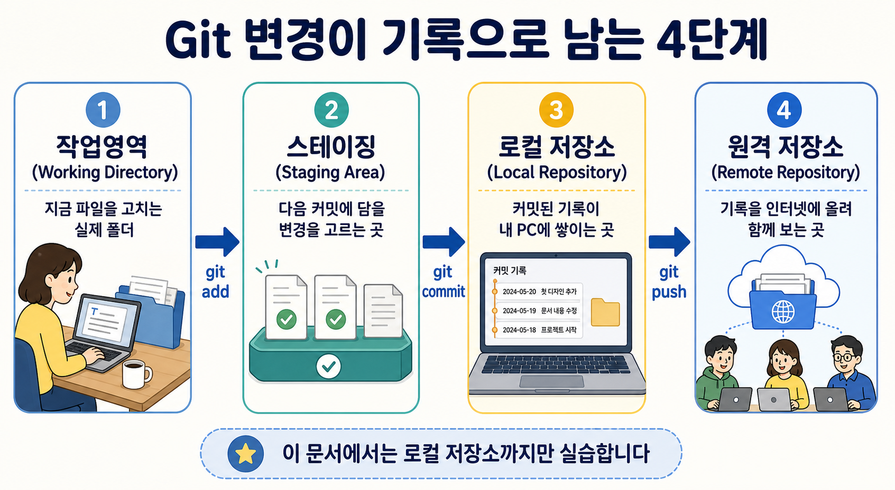

# Git

<p class="ailab-title-subtitle">- 기록을 추적하는 도구</p>

Git(git)은 소스코드나 문서의 변경 이력을 시간 순서대로 기록하고 관리하는 버전 관리 시스템(version control system)입니다.

여러 사람이 같은 기획서나 코드를 동시에 수정하는 상황을 가정해 봅시다.

Git을 쓰면 누가 언제 무엇을 바꿨는지 추적할 수 있습니다.

동시 편집으로 인한 문제가 생기면 이전 버전으로도 쉽게 되돌릴 수 있습니다.

시중에 나와있는 많은 문서 협업 도구(Notion, Obsidian, Google Docs 등)의 버전 관리 개념도 Git의 아이디어에서 영향을 받아 만들어졌습니다.

## 이 문서를 끝내면

내 PC에서 파일 변경을 작업영역 → 스테이징 → 로컬 저장소 순서로 기록하고, `git log`로 지금까지
쌓인 히스토리를 스스로 되짚을 수 있습니다.

## 전제 조건

- Git이 설치되어 있어야 합니다. 윈도우 터미널에서 `git --version` 을 입력했을 때 버전 숫자가 출력되면 준비된 것입니다.
- 처음 한 번은 커밋에 남길 이름과 이메일을 등록하세요. 교육장 PC에 이미 설정돼 있으면
  건너뜁니다.

```bash
git config --global user.name "<자신의 영문 id를 넣어주세요>"
git config --global user.email "<github login 때 사용한 계정 이메일을 입력해주세요>"
```

## 개념

### Git은 왜 쓰나 - 기록 추적

파일을 고치다 보면 늘 같은 질문이 생깁니다.

> 어제 뭘 바꿨더라?

> 이 줄 왜 지웠지?

> 파일을 되돌리고 싶다

현업에서 문서의 버전 관리를 어떻게 하시나요?

사본을 `보고서_최종_v2_진짜최종.docx`처럼 파일이름에 버전기록을 작성하는 방식으로 보통 버전 관리를 하고 계십니다.

버전이 몇개 안될때는 문제 안되지만, 문서가 많아지기 시작하면 관리하기 점점 힘들어 집니다.

버전별로 무엇이 달라졌는지 알 수 없기 때문입니다.

**Git은 이 문제를 풀려고 나온 도구입니다.**

파일이 바뀔 때마다 그 순간의 상태를 스냅샷으로 찍어, 언제·누가·무엇을·왜 바꿨는지 기록으로 남깁니다.

이 스냅샷 하나를 **커밋(commit)**이라고 부릅니다.

쌓인 커밋을 되짚고, 특정 시점으로 되돌리고, 두 시점을 비교하는 것이 Git의 핵심입니다.

한마디로 Git은 프로젝트의 **타임머신**입니다.

### 네 개의 작업 영역 - 변경이 기록으로 굳는 길



Git에서는 변경을 관리하는 4개의 개념이 있습니다.

- **작업영역(Working Directory)** - 지금 내가 파일을 고치는 실제 폴더입니다. 편집기로 열어
  보는 그 파일들이 여기에 있습니다.
- **스테이징(Staging Area)** - 다음 커밋에 담을 변경만 골라 올려 두는 대기 무대입니다.
  `git add`로 여기에 올립니다.
- **로컬 저장소(Local Repository)** - 커밋된 스냅샷이 쌓이는 내 PC 안의 히스토리입니다.
  `git commit`이 스테이징의 내용을 여기에 기록합니다.
- **원격 저장소(Remote Repository)** - 그 히스토리를 인터넷에 올려 공유하는 사본입니다.
  `git push`로 올립니다. 이 문서에서는 로컬 저장소까지만 다룹니다.

보통 작업 흐름은 아래와 같이 진행이 됩니다.

```
작업영역 ──(git add)──▶ 스테이징 ──(git commit)──▶ 로컬 저장소 ──(git push)──▶ 원격 저장소
```

## 실습 자료

[실습용 저장소](https://github.com/net-edu/git-practice)

이 파일을 포함한 전체 실습·시각화 자료 목록은 [강의 진행 자료](../curriculum/index.md)에 있습니다.

## 손으로 해보기

아래를 한 번에 한 줄만 치고, 결과를 눈으로 확인하며 따라 하세요.
"저장소 만들기 → 파일 만들기 → 작업영역 확인 → 스테이징 → 커밋 → 다시 수정 → 비교 →
커밋 → 히스토리 확인" 순서로, Git으로 기록을 남기는 최소 한 바퀴를 돕니다.

아래 실습을 마친 저장소를 그대로 내려받아, 실제 커밋 이력이 담긴 폴더를 먼저 열어 볼 수도
있습니다. 압축을 풀고 그 폴더에서 `git log --oneline` 이나 `git blame report.md` 를 실행하면,
아래 절에서 설명하는 명령이 실제로 어떻게 동작하는지 바로 확인할 수 있습니다.

1. 실습용 폴더를 만들고 그 안으로 들어가세요.

    ```bash
    mkdir git-practice
    cd git-practice
    ```

2. 이 폴더를 로컬 저장소로 만드세요. 이제 Git이 이 폴더의 변경을 추적합니다.

    ```bash
    git init
    ```

3. 기록할 파일을 하나 만드세요.

    ```bash
    echo "# 시장 조사 메모" > report.md
    ```

4. 지금 작업영역이 어떤 상태인지 확인하세요. `report.md`가 아직 추적 안 됨(Untracked)으로
   나옵니다.

    ```bash
    git status
    ```

5. 이 변경을 스테이징에 올리세요.

    ```bash
    git add report.md
    ```

6. 다시 상태를 확인하세요. 이번엔 커밋될 변경(staged)으로 나옵니다.

    ```bash
    git status
    ```

7. 첫 스냅샷을 로컬 저장소에 기록하세요.

    ```bash
    git commit -m "Add market research memo"
    ```

8. 파일에 한 줄을 더 추가하세요. `>>`는 기존 내용 뒤에 이어 붙입니다.

    ```bash
    echo "- 경쟁사: A사, B사" >> report.md
    ```

9. 마지막 커밋과 무엇이 달라졌는지 비교하세요.

    ```bash
    git diff
    ```

10. 이 변경도 스테이징에 올리고 커밋하세요.

    ```bash
    git add report.md
    git commit -m "Add competitor list to memo"
    ```

11. 지금까지 쌓인 히스토리를 되짚으세요.

    ```bash
    git log --oneline
    ```


## 실행결과

아래는 위 실습을 Windows PowerShell에서 그대로 따라 한 실제 실행 기록입니다. 자신의 결과와 견줘 보세요.

<details class="ailab-terminal">
<summary>실행 로그 펼치기 - git-practice</summary>

<div class="ailab-term-window">
<div class="ailab-term-titlebar">
<span class="ailab-term-title">Windows PowerShell</span>
<span class="ailab-term-controls">
<span class="ic ic-search"></span>
<span class="ic ic-menu"></span>
<span class="ic ic-min"></span>
<span class="ic ic-max"></span>
<span class="ic ic-close"></span>
</span>
</div>
<pre class="ailab-term-body"><span class="t-user">PS C:\Users\edu.network&gt; mkdir test</span>


<span class="t-dim">    Directory: C:\Users\edu.network</span>


<span class="t-dim">Mode                 LastWriteTime         Length Name</span>
<span class="t-dim">----                 -------------         ------ ----</span>
<span class="t-dim">d-----        2026-08-31   오후 2:47                test</span>


<span class="t-user">PS C:\Users\edu.network&gt; mkdir git-practice</span>


<span class="t-dim">    Directory: C:\Users\edu.network</span>


<span class="t-dim">Mode                 LastWriteTime         Length Name</span>
<span class="t-dim">----                 -------------         ------ ----</span>
<span class="t-dim">d-----        2026-08-31   오후 2:49                git-practice</span>


<span class="t-user">PS C:\Users\edu.network&gt; cd git-practice</span>
<span class="t-user">PS C:\Users\edu.network\git-practice&gt; git init</span>
Initialized empty Git repository in C:/Users/edu.network/test-directory/git-practice/.git/
<span class="t-user">PS C:\Users\edu.network\git-practice&gt; echo "# 시장 조사 메모" &gt; report.md</span>
<span class="t-user">PS C:\Users\edu.network\git-practice&gt; git add report.md</span>
<span class="t-user">PS C:\Users\edu.network\git-practice&gt; git status</span>
On branch master

No commits yet

Changes to be committed:
<span class="t-dim">  (use "git rm --cached &lt;file&gt;..." to unstage)</span>
        new file:   report.md

<span class="t-user">PS C:\Users\edu.network\git-practice&gt; git commit -m "Add market research memo"</span>
[master (root-commit) 9600c29] Add market research memo
 1 file changed, 0 insertions(+), 0 deletions(-)
 create mode 100644 report.md
<span class="t-user">PS C:\Users\edu.network\git-practice&gt; echo "- 경쟁사: A사, B사" &gt;&gt; report.md</span>
<span class="t-user">PS C:\Users\edu.network\git-practice&gt; git diff</span>
<span class="t-dim">diff --git a/report.md b/report.md</span>
<span class="t-dim">index 979cb7a..faea3e7 100644</span>
<span class="t-dim">Binary files a/report.md and b/report.md differ</span>
<span class="t-user">PS C:\Users\edu.network\git-practice&gt; git add report.md</span>
<span class="t-user">PS C:\Users\edu.network\git-practice&gt; git commit -m "Add competitor list to memo"</span>
[master 9865f44] Add competitor list to memo
 1 file changed, 0 insertions(+), 0 deletions(-)
<span class="t-user">PS C:\Users\edu.network\git-practice&gt; git log --oneline</span>
9865f44 (HEAD -&gt; master) Add competitor list to memo
9600c29 Add market research memo</pre>
</div>

</details>

## 커밋 메시지 잘 쓰기

커밋 메시지는 미래의 내가 히스토리를 되짚을 때 읽는 글입니다. `이 커밋만 보고도 무엇을·왜
바꿨는지 알 수 있게` 써야 합니다.


| 나쁜 예 | 좋은 예 | 왜 좋은가 |
|---|---|---|
| `수정함` | `시장 조사 근거 자료 변동으로 인한 리포트 출처 수정` | 무엇을 추가했는지 명확합니다 |
| `업데이트` | `경쟁사 매출 단위 불일치로 수정 (억원 → 원 통일)` | 왜 고쳤는지가 드러납니다 |
| `asdf`, `wip` | `연 평균 성장률 재계산으로 인한 결론부 수정` | 결론이 바뀐 이유까지 드러납니다 |

영어 명령형 대신 "OO 섹션에 OO 추가", "OO 오류 수정(원인)" 같은 한국어 문장도 실무에서 흔히
씁니다.

## `.gitignore`

`.gitignore`는 커밋되면 안 되는 파일(민감정보·용량 큰 파일·자동 생성물)을 Git이 아예
추적하지 않도록 걸러 주는 목록 파일입니다. 저장소 안에 다음과 같이 한 줄에 하나씩 적습니다.

```
# 민감정보 / 인증
.env
credentials.json
*.token

# 자동 생성물
node_modules/
__pycache__/
*.pyc

# OS
.DS_Store
Thumbs.db
```

기록으로 남기지 말아야 할 파일을 처음부터 빼 두면, 히스토리가 깨끗하게 유지됩니다.


## Git으로 무엇을 할 수 있나

커밋이 쌓이면, 기록을 다루는 여러 일이 한 줄로 끝납니다. 아래는 자주 쓰는 예시입니다.
지금 다 외울 필요는 없습니다. `이런 것도 되는구나` 정도만 눈에 담고 넘어가세요.

### 지금까지의 기록을 되짚기

커밋 목록을 최신순으로 한 줄씩 봅니다. 프로젝트가 어떻게 흘러왔는지 한눈에 들어옵니다.

```bash
git log --oneline
```

### 무엇이 바뀌었는지 비교하기

마지막 커밋 이후 작업영역에서 무엇이 달라졌는지 줄 단위로 보여 줍니다.

```bash
git diff
```

### 이 줄을 누가 언제 바꿨는지 찾기

파일의 각 줄이 어느 커밋에서 왔는지 표시합니다. `이 코드 왜 이렇게 됐지`를 추적할 때 씁니다.

```bash
git blame report.md
```

### 특정 시점의 상태로 되돌리기

원하는 커밋 시점의 파일 상태로 작업영역을 되돌립니다. 실수를 통째로 무를 수 있습니다.

```bash
git checkout <커밋해시> -- report.md
```

## 다음 단계 - 원격 저장소에 올리기

여기까지는 모든 기록이 내 PC 안에만 있습니다.

이 히스토리를 인터넷에 올려 동료와 공유하는 사본이 원격 저장소입니다.

커밋을 쌓은 뒤 아래 한 줄이면 원격 저장소가 최신 상태로 맞춰집니다.

```bash
git push
```

이 교육에서 쓰는 원격 저장소는 사내 GitHub의
이전 사내 공용 저장소 대신, 각 참가자가 만든 공개 `git-practice` 저장소를 사용합니다.

로그인해야 열리는 비공개 저장소입니다. 익명으로는 열람도 복제도 되지 않습니다.

clone부터 push까지 실제로 한 바퀴 도는 실습은 [GitHub 기초](github-basics.md)에서
이어집니다.
