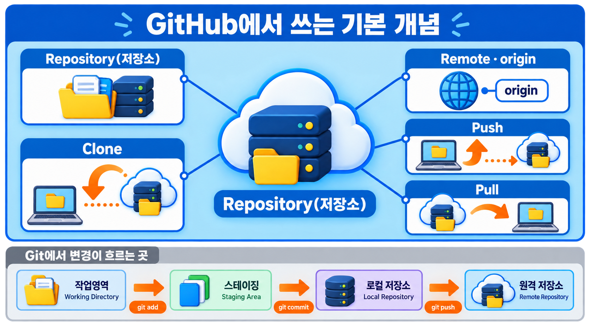
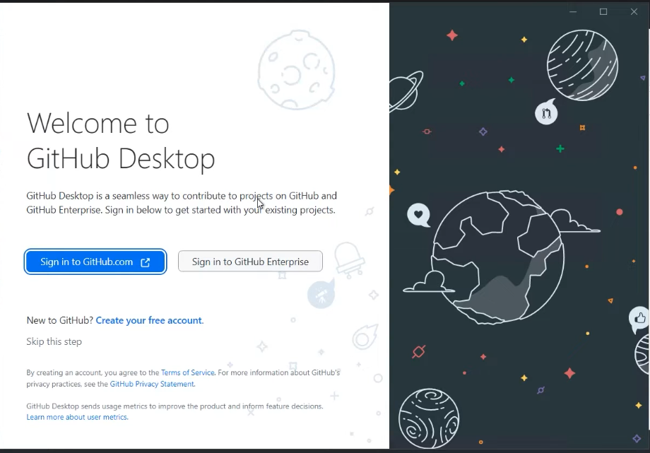
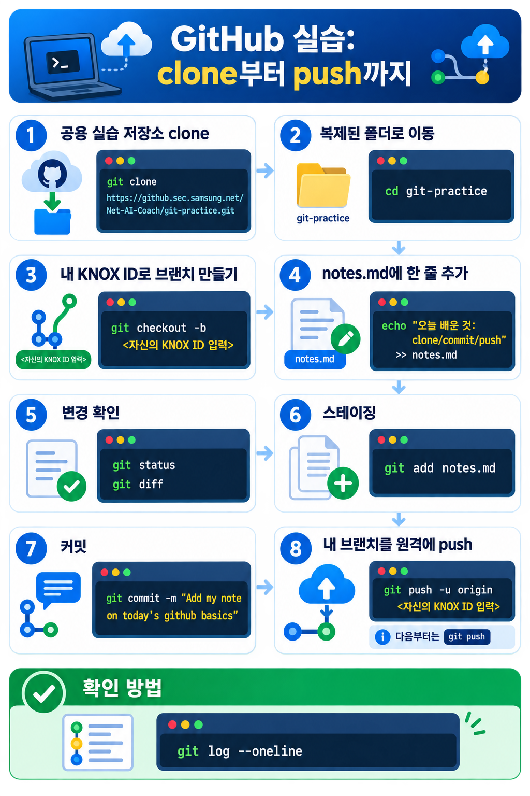

# GitHub 기초

<p class="ailab-title-subtitle">- 기록을 공유하는 창고</p>

내 PC에 쌓은 Git 히스토리를 GitHub에 올려, 동료와 같이 보고 기록들을 합치는 연습을 해봅니다.

강사가 미리 만들어 둔 공용 실습 저장소를 clone해서, 파일 하나를 고치고 커밋해 원격에 올려 봅니다.

## 이 문서를 끝내면

GitHub 저장소를 내 PC로 clone하고, 변경을 커밋해 push해서, 원격 저장소에 내
변경이 올라간 것을 웹에서 확인할 수 있습니다.

## 전제 조건

- [공용 실습 저장소](https://github.com/net-edu/git-practice)에 쓰기 권한이 부여된 상태여야 합니다.
- HTTPS로 작업할 PAT 또는 SSH 키를 등록한 상태입니다(아래 "인증" 절 참고). 계정만으로는 push가 되지 않습니다.

## 개념

### GitHub은 원격 저장소입니다

[앞 문서(Git 기초 - 기록 추적)](./git-basics.md)에서 커밋은 내 PC 안 로컬 저장소에만 쌓이게 됩니다.

그 히스토리를 인터넷에 올려 공유하는 복사본이 **원격 저장소**이고, 그것을 호스팅하는 서비스가 GitHub입니다.

원격 저장소가 생기면 기록 추적의 범위가 넓어집니다.

혼자 되짚던 히스토리를 이제 팀 전체가 같이 되짚을 수 있습니다.

누가 언제 무엇을 왜 바꿨는지가 팀의 공유 기록이 됩니다.

Git이 만든 타임머신을 여럿이 함께 타는 셈입니다.


### 실습에서 쓰는 용어와 개념



- **Repository(저장소)** - 프로젝트를 저장하는 단위입니다.
- **Clone** - 원격 저장소를 내 PC로 복제하는 과정을 뜻합니다. 이 과정에서 작업 기록(히스토리)까지 같이 복사됩니다.
- **Remote(원격) · origin** - clone하면 원본 원격이 `origin`이라는 이름으로 자동 등록됩니다.
- **Push** - 로컬 히스토리를 원격(`origin`)에 올립니다.
- **Pull** - 다른 사람이 원격에 올린 변경을 내 PC로 받아옵니다.

`git push origin main`은 "`origin`이라는 원격의 `main` 가지로 내 로컬 히스토리를 올려라"는
뜻입니다.

## 인증

**push** 작업은 사내 github 에 로그인된 사람만 할 수 있습니다.

원격 저장소에 작업한 내용을 업로드(push) 하고 싶을 때는 2가지 방식 중 하나를 선택하여
HTTPS로 작업할 때는 비밀번호 대신 인증 수단을 씁니다.

방식은 두 가지이고 둘 다 `github.com` 계정 화면에서 등록할 수 있습니다.

- **PAT(Personal Access Token)**
    -  HTTPS로 git 작업을 할 때 비밀번호 대신 쓰는 토큰입니다.
    - 계정에 2FA가 켜져 있으면 사실상 필수입니다.
    - PAT는 HTTPS 전용이라, 원격 URL이 SSH 형식이면 HTTPS로 바꿔야 합니다.
- **SSH**
    - 로컬에서 공개키·개인키 한 쌍을 만들고 공개키를 계정에 등록해 씁니다.
    - 최초 설정이 PAT보다 손이 더 갑니다(키 생성 → 공개키 복사 → 계정 등록 → 연결 테스트).

!!! important "비개발자 분들께는 Github Desktop 을 이용하여 관리 하는 것을 추천합니다."

    GitHub Desktop은 Git 명령어를 터미널에 직접 입력하지 않고,

    마우스 클릭과 화면 위 버튼으로 코드 변경 내역을 저장(commit)하고 서버에 올리는(push) 작업을 할 수 있게 해주는 GUI 프로그램입니다.

    

    [Github Desktop 다운로드](https://desktop.github.com/download/){ .md-button .md-button--primary }

## 손으로 해보기

아래 명령을 한 번에 한 줄씩 입력하고 결과를 눈으로 확인하면서 따라 해보세요

"clone → 이동 → 내 브랜치 만들기 → 파일 수정 → 확인 → 스테이징 → 커밋 → push → 웹 확인"
순서로 로컬 히스토리를 원격에 올리는 전체 흐름을 익힙니다.

{ .foldable }

1. 공용 실습 저장소를 clone하세요. 이 교육에서는 `Net-AI-Coach/git-practice`를 씁니다.

    ```bash
    git clone https://github.com/net-edu/git-practice.git
    ```

!!! important "계정 정보 입력을 요구하는 경우 아래와 같이 조치하세요"
    아래와 같이 터미널 화면이 나오면 **<  >** 부분에 자신의 id/ 비밀 번호를 입력하여 인증하세요.
    ```bash
    git clone https://github.com/net-edu/git-practice.git
    Cloning into 'git-practice'...
    Username for 'https://github.com': <자신의 knox id 입력>
    Password for 'https://<자신의 knox id>@github.com': <자신의 계정 비밀 번호 입력>
    ```

2. 복제된 폴더로 이동하세요.

    ```bash
    cd git-practice
    ```

3. 나만의 브랜치를 만들어 그 위로 옮겨 가세요. 브랜치 이름은 남과 겹치지 않게 본인 KNOX
   ID로 정합니다.

    ```bash
    git checkout -b <자신의 KNOX ID 입력>
    ```

4. `notes.md`에 한 줄을 추가하세요. 편집기로 열어 써도 되고 터미널로 하려면 다음처럼 합니다.

    ```bash
    echo "오늘 배운 것: clone/commit/push" >> notes.md
    ```

5. 무엇이 바뀌었는지 확인하세요.

    ```bash
    git status
    git diff
    ```

6. 변경을 스테이징에 올리세요.

    ```bash
    git add notes.md
    ```

7. 커밋하세요. 메시지는 이 커밋만 보고도 무엇을 바꿨는지 알 수 있게 씁니다.

    ```bash
    git commit -m "Add my note on today's github basics"
    ```

8. 내 브랜치를 원격에 push하세요. 브랜치 이름은 3단계에서 만든 것과 같아야 합니다.

    ```bash
    git push -u origin <자신의 KNOX ID 입력>
    ```

    `-u`는 앞으로 이 브랜치가 원격의 같은 브랜치를 기본으로 바라보게 묶어 둡니다.

    다음부터는 `git push` 한 줄이면 됩니다.

### 확인 방법

- 로컬 히스토리에 방금 쓴 커밋이 맨 위에 있는지 확인하세요.

    ```bash
    git log --oneline
    ```

- [연습 저장소](https://github.com/net-edu/git-practice.git) 를 웹으로 열어, 브랜치
  선택 메뉴에서 내 브랜치를 고르세요.

- 기본 브랜치(`main`)이 아니라 내 녹스 아이디로 만든 브랜치에서 `notes.md`가 보이고, 웹 화면과 내 PC가 같은 내용이 있으면 성공입니다.
