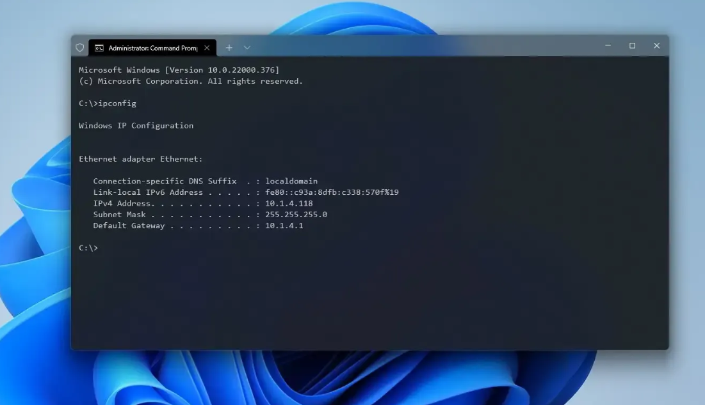

# 터미널·PowerShell 기초

> 이번 섹션은 윈도우/리눅스 터미널에서 명령어를 치며 간단한 조작을 해보는 시간입니다.

> 손으로 직접 쳐 보며 터미널과 친숙해지는 시간을 가집니다.

## 전제 조건

- Windows Terminal(또는 PowerShell 창)이 설치되어 있어야 합니다.
- Window11 에서는 windows terminal 과 powershell 이 기본 설치되어 있습니다.

## 터미널이란?



**터미널(터미널 에뮬레이터)**은 텍스트 명령어를 입력해서 컴퓨터에게 직접 작업을 지시하는 프로그램입니다.

PowerShell, cmd, bash, zsh 같은 것들이 여기 해당하고, 정확히는:

- **터미널**: 텍스트를 입력하고 출력을 보여주는 "창" (예: Windows Terminal, iTerm2)
- **셸(Shell)**: 그 안에서 명령어를 해석하고 실행하는 프로그램 (예: PowerShell, bash)

보통은 이 둘을 묶어서 그냥 "터미널"이라고 부릅니다.

## 왜 필요한가?

**1. GUI로는 안 되거나 번거로운 일을 할 수 있음**

파일 1000개의 이름을 규칙적으로 바꾸거나, 특정 조건의 로그만 걸러내는 작업은 마우스 클릭으로는 사실상 불가능합니다.

하지만 터미널에서는 명령어 한 줄이면 끝납니다.

**2. 반복 작업의 자동화**

클릭으로 하는 작업은 스크립트로 저장할 수 없지만, 터미널 명령어는 스크립트 파일로 저장해서 몇 번이고 재사용할 수 있습니다.

**3. 개발/AI 도구들의 기본 인터페이스**

Git, Docker, Claude Code 같은 도구는 애초에 GUI가 아니라 터미널을 기본 인터페이스로 설계되어 있습니다.

터미널 기반 작업 방식을 모르면 이런 도구의 절반도 활용하기 어렵습니다.

**4. 정확성과 재현성**

GUI 기반 SW는 버전마다 UI가 다릅니다. 이로 인해 매번 문서를 갱신해줘야 하는 문제가 생깁니다.

하지만 명령어는 텍스트 그대로 복사-붙여넣기 하면 누구에게나 똑같이 재현됩니다.

매뉴얼, 문서, AI 어시스턴트가 작업을 안내할 때 명령어를 쓰는 이유이기도 합니다.


[비교 시뮬레이터 열기 →](./assets/terminal-file-explorer-simulator.html){ .md-button .md-button--primary }

이 시뮬레이터를 포함한 전체 실습·시각화 자료 목록은 [강의 진행 자료](../curriculum/index.md)에 있습니다.


!!! important

    **터미널은 "그림으로 클릭"하는 대신 "글로 말해서" 컴퓨터를 다루는 방식**이고, 클릭보다 느려 보여도 자동화·정확성·확장성에서는 압도적으로 유리합니다.

## 절대 & 상대 경로 / 홈 디렉토리 / PATH 변수


**절대경로 (Absolute Path)**

- 루트(드라이브 문자)부터 시작하는 전체 경로입니다.
- 현재 작업 디렉터리(CWD)와 무관하게 항상 동일한 위치를 가리킵니다.
- 예: `C:\Users\edu.network\Downloads`

**상대경로 (Relative Path)**

- 현재 작업 디렉터리를 기준으로 한 경로입니다.
- `..`는 부모 디렉터리, `.`은 현재 디렉터리를 의미합니다.
- CWD가 바뀌면 같은 상대경로라도 실제로 가리키는 위치가 달라집니다.

**홈 디렉터리 (Home Directory)**

- 사용자 계정에 할당된 기본 디렉터리입니다.
- 윈도우에서는 `%USERPROFILE%` 환경변수에 저장되며 보통 `C:\Users\계정명`입니다.
- PowerShell에서는 `$HOME` 또는 `~`로 참조합니다.
- 터미널 세션 시작 시 기본 CWD로 설정됩니다.

**PATH**

- 운영체제가 실행 파일을 검색하는 디렉터리 목록을 담은 환경변수입니다.
- 세미콜론(`;`)으로 구분된 문자열이며, 명령어를 입력하면 셸이 `PATH`에 등록된 디렉터리들을 순서대로 탐색해 일치하는 실행 파일을 찾습니다.
- `python`처럼 경로 없이 실행되는 SW도 있는데, 그 이유는 `python.exe`가 있는 디렉터리가 `PATH`에 등록되어 있기 때문입니다.

| 개념 | 정의 | 기준점 | 확인 명령 (PowerShell) |
|---|---|---|---|
| 절대경로 | 루트부터의 전체 경로 | 없음 (고정) | `(Get-Item .).FullName` |
| 상대경로 | 현재 위치 기준 경로 | 현재 작업 디렉터리(CWD) | `Get-Location` |
| 홈 디렉터리 | 사용자 계정의 기본 디렉터리 | 로그인 계정 | `echo $HOME` 또는 `echo $env:USERPROFILE` |
| PATH | 실행 파일 검색 대상 디렉터리 목록 | 시스템/사용자 환경변수 | `$env:Path -split ';'` |

## 시뮬레이터에서 연습

[시뮬레이터 바로 가기 →](../warmup/assets/terminal-file-explorer-simulator.html){ .md-button .md-button--primary }

## 터미널 간단 실습

아래 명령어를 터미널에서 실행하고, 결과를 눈으로 확인하며 따라 하세요.

1. 지금 내가 어느 경로에 있는지 확인하세요.

    ```powershell
    pwd
    ```

2. 지금 폴더에 무엇이 있는지 확인하세요.

    ```powershell
    dir
    ```

3. 실습에 쓸 샘플 파일을 지금 폴더에 만드세요. `>` 는 왼쪽 명령의 출력을 화면 대신
   파일로 보내라는 뜻입니다.

    ```powershell
    echo "test" > sample-notes.txt
    ```

4. 폴더를 만들어 보세요

    ```powershell
    mkdir sample-folder
    ```

5. 만든 폴더 안으로 들어가세요.

    ```powershell
    cd sample-folder
    ```

6. 방금 만든 샘플 파일을 상대경로로 복사해 오세요. `..\` 은 한 단계 위 폴더, `.` 은 지금
   이 폴더를 뜻합니다.

    ```powershell
    copy ..\sample-notes.txt .
    ```

7. 파일이 들어왔는지 다시 확인하세요.

    ```powershell
    dir
    ```

8. 파일 내용을 화면에서 바로 읽으세요.

    ```powershell
    type sample-notes.txt
    ```

9. 연습용 사본이니 정리하세요.

    ```powershell
    del sample-notes.txt
    ```

### 확인 방법

- 6번 뒤 7번의 `dir` 결과에 `sample-notes.txt` 가 보이면 복사가 된 것입니다.
- 8번에서 파일 안의 글이 화면에 그대로 나오면 성공입니다.
- 9번 뒤 `dir` 을 한 번 더 쳐서 `sample-notes.txt` 가 사라졌으면 정리까지 끝난 것입니다.


## 터미널로 어떤 작업들을 할 수 있나

### 특정 확장자 파일을 폴더 전체에서 찾기

지금 폴더와 그 아래 모든 하위 폴더를 뒤져 `.md` 파일을 전부 찾습니다.
`-Recurse` 가 하위 폴더까지 파고들라는 뜻입니다.

```powershell
Get-ChildItem -Recurse -Filter *.md
```

### 찾은 파일이 몇 개인지 세기

위 명령을 괄호로 감싸고 `.Count` 를 붙이면 목록 대신 개수만 나옵니다.

```powershell
(Get-ChildItem -Recurse -Filter *.txt).Count
```

### 파일 안에서 특정 단어가 든 줄 찾기

파일을 하나씩 열어 보지 않고, `TODO` 가 적힌 줄을 파일명·줄번호와 함께 한 번에 뽑습니다.

```powershell
Select-String -Path *.md -Pattern "TODO"
```

### 용량이 큰 파일부터 보기

파일을 크기순으로 정렬해 위에서 몇 개만 봅니다. 무엇이 디스크를 차지하는지 바로 드러납니다.

```powershell
Get-ChildItem -Recurse -File | Sort-Object Length -Descending | Select-Object -First 5
```

### 오늘 고친 파일만 골라내기

마지막으로 고친 시각이 오늘인 파일만 추립니다. **오늘 무슨 파일들을 수정했는지 알고 싶을때** 씁니다.

```powershell
Get-ChildItem -Recurse -File | Where-Object { $_.LastWriteTime -ge (Get-Date).Date }
```
